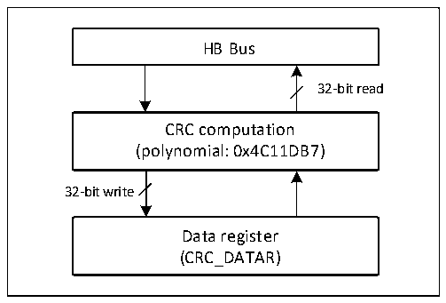

<!-- source-page: 40 -->

[← p.39](0039.md) · [index](../README.md) · [PDF p.40](https://ch32-riscv-ug.github.io/CH32X315/datasheet_en/CH32X315RM.PDF#page=40) · [p.41 →](0041.md)

<!-- header: CH32X315/X305 Reference Manual https://wch-ic.com -->

# Chapter 5 Cyclic Redundancy Check (CRC)

The cyclic redundancy check (CRC) computation unit is used to obtain the result of the CRC computation for any  
32-bit data based on a fixed generating polynomial. It is generally used in the field of data storage and data  
communication to verify the correctness of data. The system provides hardware CRC calculation unit which can  
greatly save CPU and RAM resources to improve efficiency.  

Figure 5-1 CRC structure diagram  
 <!-- rendered from the PDF; verify at https://ch32-riscv-ug.github.io/CH32X315/datasheet_en/CH32X315RM.PDF#page=40 -->

🖼 Text parsed from the figure above

HB Bus  
32-bit read  
CRC computation  
(polynomial: 0x4C11DB7)  
32-bit write  
Data register  
(CRC_DATAR)  

## 5.1 Main Features

● CRC32 polynomial (0x4C11DB7): X32+X26+X23+X22+X16+X12+X11+X10+X8+X7+X5+X4+X2+X+1;  
● Same 32-bit register as input for data and output for CRC32 calculation  
● Single conversion time: 4 HB clock cycles (HCLK)  

## 5.2 Function Description

● CRC unit reset  
To start a CRC calculation for a new data set, the CRC calculation unit needs to be reset. Writing a 1 to the RST  
bit of the control register CRC_CTLR will reset the data register by the hardware, restoring the initial value  
0xFFFFFFFF.  
● CRC calculation  
The CRC unit calculates the CRC result of the previous CRC calculation and the CRC result of the newly  
involved data. The CRC_DATAR data register, for which a write operation will feed new data to the hardware  
calculation unit; and a read operation will get the value of the latest round of CRC calculation. The hardware  
calculation interrupts the system write operation, so new values can be written continuously.  
<em>Note: The CRC unit calculates the entire 32-bit data, not byte-by-byte.</em>  
● Independent data buffer  
The CRC unit provides an 8-bit independent data register, CRC_IDATAR, which is used for the application code  
to temporarily store 1 byte of data independent of the CRC unit reset.  
<!-- image: p40-draw-image-00001 bbox=[511.32, 783.48, 530.76, 793.8] -->
<!-- footer: V1.1 38 -->
