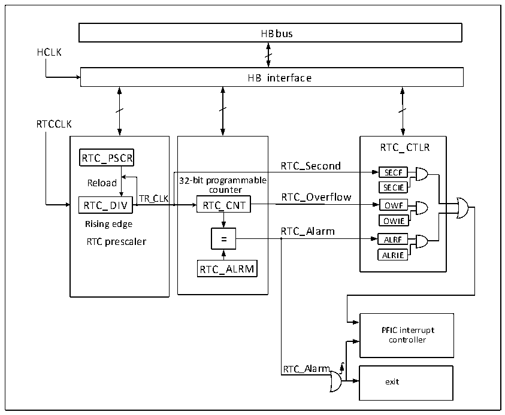

<!-- source-page: 43 -->

[← p.42](0042.md) · [index](../README.md) · [PDF p.43](https://ch32-riscv-ug.github.io/CH32X315/datasheet_en/CH32X315RM.PDF#page=43) · [p.44 →](0044.md)

<!-- header: CH32X315/X305 Reference Manual https://wch-ic.com -->

# Chapter 6 Real Time Clock (RTC)

The Real Time Clock (RTC) is a standalone timer module with a programmable counter up to 32 bits, which can  
be used with software to realize the real time clock function, and the counter value can be modified to reconfigure  
the current time and date of the system. The RTC module is in the backup power supply area, and the system reset  
and wake-up from Standby mode do not have any effect on it.  

## 6.1 Main Features

● Prescaler coefficients up to 220  
● 32-bit programmable counter  
● Multiple clock sources, interrupts  
● Independent reset  

## 6.2 Function Description

### 6.2.1 Overview

Figure 6-1 RTC structure diagram  
 <!-- rendered from the PDF; verify at https://ch32-riscv-ug.github.io/CH32X315/datasheet_en/CH32X315RM.PDF#page=43 -->

🖼 Text parsed from the figure above

HBbus  
HCLK  
HB interface  
RTCCLK  
-  32-bit programmable counter RTC_CNTRTC_ALRM  
RTC_CTLR  
RTC_PSCR  
RTC_Second  
SECF  
counter SECIE  
Rising edge OWIE  
RTC_Alarm  
ALRIE  
PFIC interrupt  
controller  
RTC_Alarm  
exit  

As shown in Figure 6-1, the RTC module is mainly composed of three parts: HB bus interface, frequency divider  
and counter, and control and status register. After RTCCK is input into the divider (RTC_DIV), it is divided into  
TR_CLK. It is worth noting that the internal part of the frequency divider (RTC_DIV) is a self-decreasing counter.  
When it decrements to overflow, it will output a TR_CLK, and then take the preset value from the reload value  
<!-- image: p43-draw-image-00001 bbox=[511.32, 783.48, 530.76, 793.8] -->
<!-- footer: V1.1 41 -->
