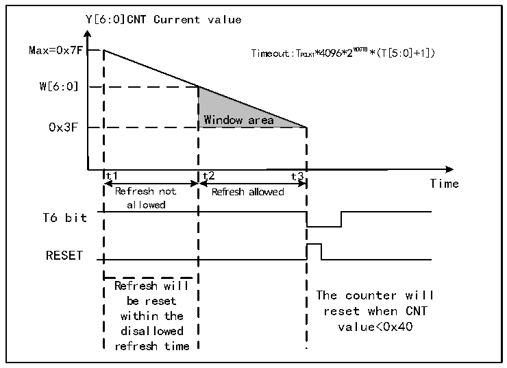

<!-- source-page: 55 -->

[← p.54](0054.md) · [index](../README.md) · [PDF p.55](https://ch32-riscv-ug.github.io/CH32X315/datasheet_en/CH32X315RM.PDF#page=55) · [p.56 →](0056.md)

<!-- header: CH32X315/X305 Reference Manual https://wch-ic.com -->
● Watchdog configuration  
Inside the watchdog is a 7-bit counter running in a continuous cycle, which supports read and write access. To use  
the watchdog reset function, you need to perform the following actions:  
1) Counter time base: The WDGTB[1:0] bits in the WWDG_CFGR register. Note to switch on the WWDG  
module clock of the RCC unit.  
2) Window counter: Set the W[6:0] bits in the WWDG_CFGR register. This counter is used to be compared with  
the current counter by hardware, the value is configured by the user software and will not change. It serves as  
the maximum value of window time.  
3) Watchdog enable: The WDGA bit in the WWDG_CTLR register is set to 1 by software, and the watchdog  
function is enabled to reset the system.  
4) Feed dog: Refresh the current counter value and configure the T[6:0] bits in the WWDG_CTLR register. This  
action needs to be executed in the periodic window time after the watchdog function is enabled. Otherwise, the  
watchdog reset action occurs.  
● Feed dog window time  
As shown in Figure 8-2, the gray area is the detector window area of the window watchdog. Its maximum timeout  
(t2) corresponds to the time point when the current counter value reaches the window value W[6:0]. Its minimum  
timeout (t3) corresponds to the time point when the current counter value reaches 0x3F. Within this area time  
(t2&lt;t&lt;t3), the feed dog operation can be performed (write T[6:0]) to refresh the current counter value.  

Figure 8-2 Counting mode of window watchdog  
 <!-- rendered from the PDF; verify at https://ch32-riscv-ug.github.io/CH32X315/datasheet_en/CH32X315RM.PDF#page=55 -->

🖼 Text parsed from the figure above

Y[6:0]CNT Current value  
Max=0x7F Timeout:TPCLK1*4096*2 WD GT B*(T[5:0]+1])  
W[6:0]  
Window area  
0x3F  
t1 t2 t3  
Time  
Refresh not Refresh allowed  
allowed  
T6 bit  
RESET  
Refresh will  
The counter will  
be reset  
reset when CNT  
within the  
disallowed value&lt;0x40  
refresh time  

● Watchdog reset:  
1) When the feed dog operation is not performed in time, the value of the T[6:0] counter changes from 0x40 to  
0x3F, a &#x27;Window Watchdog Reset&#x27; occurs, and a system reset occurs. I.e., when T6-bit is detected as 0 by  
hardware, the system reset occurs.  
<em>Note: The application program can write 0 to the T6-bit by software to implement system reset, which is</em>  
<em>equivalent to software reset function.</em>  
<!-- image: p55-draw-image-00001 bbox=[511.32, 783.48, 530.76, 793.8] -->
<!-- footer: V1.1 53 -->
