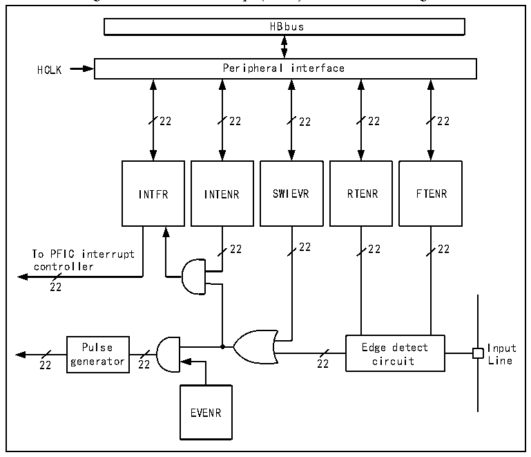

<!-- source-page: 60 -->

[← p.59](0059.md) · [index](../README.md) · [PDF p.60](https://ch32-riscv-ug.github.io/CH32X315/datasheet_en/CH32X315RM.PDF#page=60) · [p.61 →](0061.md)

<!-- header: CH32X315/X305 Reference Manual https://wch-ic.com -->

> ⬆ **Table continued** — rendered in full at [page 58](0058.md). <!-- p60-table-001 -->

## 9.4 External Interrupt and Event Controller (EXTI)

### 9.4.1 Overview

Figure 9-1 External interrupt (EXTI) interface block diagram  
 <!-- rendered from the PDF; verify at https://ch32-riscv-ug.github.io/CH32X315/datasheet_en/CH32X315RM.PDF#page=60 -->

🖼 Text parsed from the figure above

HBbus  
HCLK Peripheral interface  
22 22 22 22 22  
INTFR INTENR SWIEVR RTENR FTENR  
22 22 22 22  
To PFIC interrupt  
controller  
22  
Pulse Edge detect Input  
22 generator 22 22 circuit Line  
EVENR  

As can be seen from figure 9-1, the trigger source of the external interrupt can be either a software interrupt  
(SWIEVR) or an actual external interrupt channel, and the signal of the external interrupt channel is first screened  
by the edge detection circuit. As long as one of the software interrupts or external interrupt signals is generated, it  
will be output to both event enabling and interrupt enabling circuits through the OR gate circuit in the diagram. As  
long as an interrupt is enabled or an event is enabled, an interrupt or event will occur. The six registers of EXTI  
are accessed by the processor through the HB interface.  

### 9.4.2 Wakeup Event

The system can wake up sleep patterns caused by WFE instructions through wake-up events. Wake-up events are  
<!-- image: p60-draw-image-00001 bbox=[511.32, 783.48, 530.76, 793.8] -->
<!-- footer: V1.1 58 -->
