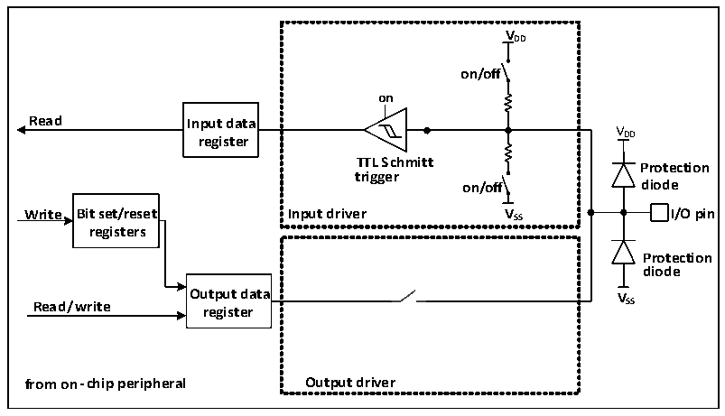

<!-- source-page: 100 -->

[← p.99](0099.md) · [index](../README.md) · [PDF p.100](https://ch32-riscv-ug.github.io/CH32X315/datasheet_en/CH32X315RM.PDF#page=100) · [p.101 →](0101.md)

<!-- header: CH32X315/X305 Reference Manual https://wch-ic.com -->
conflicts between peripherals sharing the same I/O pins.  
Each I/O pin has a multiplexer that takes up to 16 multiplexed function inputs (AF0 to AF15), which are  
configurable through the GPIOx_AFLR and GPIOx_AFHR registers:  
After reset, the multiplexer is selected as Alternate Function 0 (AF0). Configure I/O through the  
GPIOx_CFGLR/GPIOx_CFGHR register in multiplexed mode.  
The specific alternate function assignment of each pin is detailed in the CH32X315DS0.  
<strong>Alternate function configuration</strong>  
● To use the alternate function of the input direction, the port must be configured in the alternate input mode.  
The pull-down settings can be set according to actual needs.  
● To use the alternate function in the output direction, the port must be configured in the alternate output mode.  
Push-pull or open-drain can be set according to the actual situation.  
● For bidirectional alternate function, the port must be configured as alternate output mode, then the driver is  
configured as floating input mode  
The same IO port may have multiple peripherals alternate to this pin. Therefore, in order to maximize the space  
for each peripheral, in addition to the default alternate pins, the alternate pins of the peripherals can also be  
remapped to other pins to avoid occupied pins.  

### 10.2.5 Locking Mechanism

The locking mechanism can lock the configuration of the IO port. After a specific write sequence, the selected IO  
pin configuration is locked and cannot be changed until the next reset.  

### 10.2.6 Input Configuration

Figure 10-2 Input configuration structure block diagram of GPIO module  
 <!-- rendered from the PDF; verify at https://ch32-riscv-ug.github.io/CH32X315/datasheet_en/CH32X315RM.PDF#page=100 -->

🖼 Text parsed from the figure above

VDD on/off on  TTL Schmitt trigger on/off Input driver VSS  
<strong>VDD</strong>  
<strong>Read Input data</strong>  
V  
<strong>registers</strong>  
<strong>Protection</strong>  
<strong>diode</strong>  
<strong>Output data V</strong>  
<strong>Read/write register SS</strong>  
<strong>from on-chip peripheral Output driver</strong>  

When the IO port is configured in input mode, the output driver is disconnected, the input pull-up and pull-down  
is optional, and the alternate function and analog input are not connected. The data on each IO port is sampled to  
<!-- image: p100-draw-image-00001 bbox=[511.32, 783.48, 530.76, 793.8] -->
<!-- footer: V1.1 98 -->
