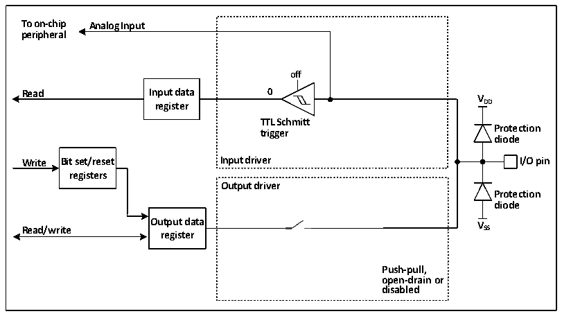

<!-- source-page: 102 -->

[← p.101](0101.md) · [index](../README.md) · [PDF p.102](https://ch32-riscv-ug.github.io/CH32X315/datasheet_en/CH32X315RM.PDF#page=102) · [p.103 →](0103.md)

<!-- header: CH32X315/X305 Reference Manual https://wch-ic.com -->
sampled to the input data register at each HB clock. In open-drain mode, reading the input data register will get  
the current state of the IO port. In push-pull mode, reading the output data register will get the last written value.  

### 10.2.9 Analog Input Configuration

Figure 10-5 Configuration structure block diagram of GPIO module as analog input  
 <!-- rendered from the PDF; verify at https://ch32-riscv-ug.github.io/CH32X315/datasheet_en/CH32X315RM.PDF#page=102 -->

🖼 Text parsed from the figure above

<strong>To on-chip Analog Input</strong>  
<strong>peripheral</strong>  
<strong>off</strong>  
<strong>Read Input data 0</strong>  
<strong>V</strong>  
<strong>register DD</strong>  
<strong>TTL Schmitt</strong>  
<strong>Protection</strong>  
<strong>trigger</strong>  
<strong>diode</strong>  
<strong>Write Bit set/reset Input driver I/O pin</strong>  
<strong>registers</strong>  
<strong>Output driver</strong>  
<strong>Protection</strong>  
<strong>diode</strong>  
<strong>Output data V</strong>  
<strong>Read/write SS</strong>  
<strong>register</strong>  
<strong>Push-pull,</strong>  
<strong>open-drain or</strong>  
<strong>disabled</strong>  

When the analog input is enabled, the output buffer is disconnected, the input of the Schmitt trigger in the input  
driver is disabled to prevent consumption on the IO port, the pull-up resistor is prohibited, and the read input data  
register will always be 0.  

### 10.2.10 Peripheral GPIO Setting

The following table recommends the corresponding GPIO port configuration of each peripheral pin.  

<!-- p102-table-001 (table-10-1@1) -->
<table><caption>Table 10-1 Advanced-control timer (TIM1)</caption><tr><th>TIM1</th><th>Configuration</th><th>GPIO configuration</th></tr><tr><td rowspan="2">TIM1_CHx</td><td>Input capture channel x</td><td>Floating input</td></tr><tr><td>Output compare channel x</td><td>Push-pull alternate output</td></tr><tr><td>TIM1_CHxN</td><td>Complementary output channel x</td><td>Push-pull alternate output</td></tr><tr><td>TIM1_BKIN</td><td>Break input</td><td>Floating input</td></tr><tr><td>TIM1_ETR</td><td>External trigger clock input</td><td>Floating input</td></tr></table>

<!-- p102-table-002 (table-10-2@1) -->
<table><caption>Table 10-2 General-purpose timer (TIM2/3/4)</caption><tr><th>TIM2/3/4 pin</th><th>Configuration</th><th>GPIO configuration</th></tr><tr><td rowspan="2">TIM2/3/4_CHx</td><td>Input capture channel x</td><td>Floating input</td></tr><tr><td>Output compare channel x</td><td>Push-pull alternate output</td></tr><tr><td>TIM2/3/4_ETR</td><td>External trigger clock input</td><td>Floating input</td></tr></table>

<!-- p102-table-003 (table-10-3@1) pages 102-103 -->
<table><caption>Table 10-3 Universal Synchronous/Asynchronous Receiver Transmitter (USART1/2/3/4)</caption><tr><th>USART pin</th><th>Configuration</th><th>GPIO configuration</th></tr><tr><td rowspan="2">USARTx_TX</td><td>Full-duplex mode</td><td>Push-pull alternate output</td></tr><tr><td>Half-duplex synchronous mode</td><td>Open-drain alternate output</td></tr><tr><td rowspan="2">USARTx_RX</td><td>Full-duplex mode</td><td>Floating input or pull-up input</td></tr><tr><td>Half-duplex synchronous mode</td><td>Not used</td></tr><tr><td>USARTx_CK</td><td>Synchronous mode</td><td>Push-pull alternate output</td></tr><tr><td>USARTx_RTS</td><td>Hardware flow control</td><td>Push-pull alternate output</td></tr><tr><td>USARTx_CTS</td><td>Hardware flow control</td><td>Floating input or pull-up input</td></tr></table>

<!-- image: p102-draw-image-00001 bbox=[515.76, 783.48, 535.2, 793.8] -->
<!-- footer: V1.1 100 -->
