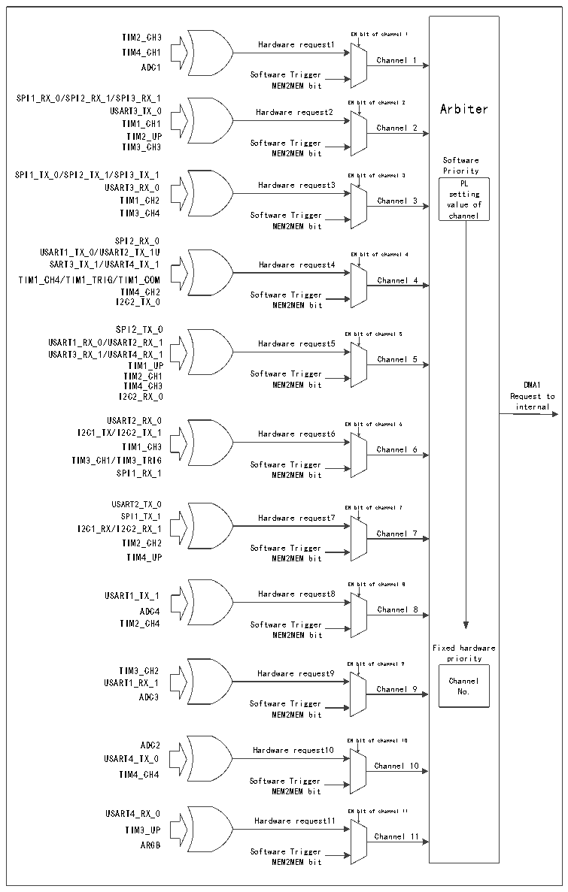

<!-- source-page: 118 -->

[← p.117](0117.md) · [index](../README.md) · [PDF p.118](https://ch32-riscv-ug.github.io/CH32X315/datasheet_en/CH32X315RM.PDF#page=118) · [p.119 →](0119.md)

<!-- header: CH32X315/X305 Reference Manual https://wch-ic.com -->

Figure 11-1 DMA request mapping  
 <!-- rendered from the PDF; verify at https://ch32-riscv-ug.github.io/CH32X315/datasheet_en/CH32X315RM.PDF#page=118 -->

🖼 Text parsed from the figure above

TIM2_CH3 EN bit of channel 1  
Hardware request1  
TIM4_CH1  
Channel 1  
ADC1  
Software Trigger  
MEM2MEM bit  
SPI1_RX_0/SPI2_RX_1/SPI3_RX_1  
USART3_TX_0 Hardware request2 EN bit of channel 2 Arbiter  
TIM1_CH1  
Channel 2  
TIM2_UP  
TIM3_CH3 Software Trigger  
MEM2MEM bit  
Software  
SPI1_TX_0/SPI2_TX_1/SPI3_TX_1 EN bit of channel 3 Priority  
USART3_RX_0 Hardware request3 PL  
setting  
TIM1_CH2 Channel 3 value of  
TIM3_CH4 Software Trigger channel  
MEM2MEM bit  
SPI2_RX_0  
USART1_TX_0/USART2_TX_1U EN bit of channel 4  
SART3_TX_1/USART4_TX_1 Hardware request4  
TIM1_CH4/TIM1_TRIG/TIM1_COM Channel 4  
TIM4_CH2 Software Trigger  
I2C2_TX_0 MEM2MEM bit  
SPI2_TX_0  
EN bit of channel 5  
USART1_RX_0/USART2_RX_1 Hardware request5  
USART3_RX_1/USART4_RX_1  
Channel 5  
TIM1_UP  
TIM2_CH1 Software Trigger  
TIM4_CH3 MEM2MEM bit DMA1  
I2C2_RX_0 Request to  
internal  
USART2_RX_0  
EN bit of channel 6  
I2C1_TX/I2C2_TX_1 Hardware request6  
TIM1_CH3 Channel 6  
TIM3_CH1/TIM3_TRIG Software Trigger  
SPI1_RX_1 MEM2MEM bit  
USART2_TX_0  
EN bit of channel 7  
SPI1_TX_1 Hardware request7  
I2C1_RX/I2C2_RX_1  
Channel 7  
TIM2_CH2  
Software Trigger  
TIM4_UP MEM2MEM bit  
EN bit of channel 8  
USART1_TX_1 Hardware request8  
ADC4 Channel 8  
TIM2_CH4 Software Trigger  
MEM2MEM bit  
Fixed hardware  
priority  
EN bit of channel 9  
TIM3_CH2 Hardware request9  
USART1_RX_1 Channel  
Channel 9 No.  
ADC3  
Software Trigger  
MEM2MEM bit  
ADC2 EN bit of channel 10  
Hardware request10  
USART4_TX_0  
Channel 10  
TIM4_CH4  
Software Trigger  
MEM2MEM bit  
USART4_RX_0 EN bit of channel 11  
Hardware request11  
TIM3_UP  
Channel 11  
ARGB  
Software Trigger  
MEM2MEM bit  

<!-- p118-table-001 (table-11-2@1) pages 118-119 -->
<table><caption>Table 11-2 Peripheral mapping table for each channel of DMA1</caption><tr><th>Peripheral</th><th>Channel 1</th><th>Channel 2</th><th>Channel 3</th><th>Channel 4</th><th>Channel 5</th><th>Channel 6</th><th>Channel 7</th></tr><tr><td>SPI1</td><td></td><td>SPI1_RX_0</td><td>SPI1_TX_0</td><td></td><td></td><td>SPI1_RX_1</td><td>SPI1_TX_1</td></tr><tr><td>SPI2</td><td></td><td>SPI2_RX_1</td><td>SPI2_TX_1</td><td>SPI2_RX_0</td><td>SPI2_TX_0</td><td></td><td></td></tr><tr><td>SPI3</td><td></td><td>SPI3_RX_1</td><td>SPI3_TX_1</td><td></td><td></td><td></td><td></td></tr><tr><td>USART1</td><td></td><td></td><td></td><td style="text-align:left">USART1_TX_0</td><td style="text-align:left">USART1_RX_0</td><td></td><td></td></tr><tr><td>USART2</td><td></td><td></td><td></td><td style="text-align:left">USART2_TX_1</td><td style="text-align:left">USART2_RX_1</td><td style="text-align:left">USART2_RX_0</td><td style="text-align:left">USART2_TX_0</td></tr><tr><td>USART3</td><td></td><td style="text-align:left">USART3_TX_0</td><td style="text-align:left">USART3_RX_0</td><td style="text-align:left">USART3_TX_1</td><td style="text-align:left">USART3_RX_1</td><td></td><td></td></tr><tr><td>USART4</td><td></td><td></td><td></td><td style="text-align:left">USART4_TX_1</td><td style="text-align:left">USART4_RX_1</td><td></td><td></td></tr><tr><td>I2C1</td><td></td><td></td><td></td><td></td><td></td><td>I2C1_TX</td><td>I2C1_RX</td></tr><tr><td>I2C2</td><td></td><td></td><td></td><td>I2C2_TX_0</td><td>I2C2_RX_0</td><td>I2C2_TX_1</td><td>I2C2_RX_1</td></tr><tr><td>TIM1</td><td></td><td>TIM1_CH1</td><td>TIM1_CH2</td><td style="text-align:left">TIM1_CH4TIM1_TRIGTIM1_COM</td><td>TIM1_UP</td><td>TIM1_CH3</td><td></td></tr><tr><td>TIM2</td><td style="text-align:left">TIM2_CH3</td><td>TIM2_UP</td><td></td><td></td><td>TIM2_CH1</td><td></td><td>TIM2_CH2</td></tr><tr><td>TIM3</td><td></td><td>TIM3_CH3</td><td>TIM3_CH4</td><td></td><td></td><td style="text-align:left">TIM3_CH1TIM3_TRIG</td><td></td></tr><tr><td>TIM4</td><td style="text-align:left">TIM4_CH1</td><td></td><td></td><td>TIM4_CH2</td><td>TIM4_CH3</td><td></td><td>TIM4_UP</td></tr><tr><td>ADC1</td><td>ADC1</td><td></td><td></td><td></td><td></td><td></td><td></td></tr></table>

<!-- image: p118-draw-image-00001 bbox=[515.76, 783.48, 535.2, 793.8] -->
<!-- footer: V1.1 116 -->
