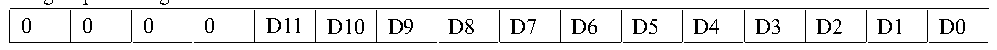

<!-- source-page: 132 -->

[← p.131](0131.md) · [index](../README.md) · [PDF p.132](https://ch32-riscv-ug.github.io/CH32X315/datasheet_en/CH32X315RM.PDF#page=132) · [p.133 →](0133.md)

<!-- header: CH32X315/X305 Reference Manual https://wch-ic.com -->

Figure 12-3 Data right alignment  
 <!-- rendered from the PDF; verify at https://ch32-riscv-ug.github.io/CH32X315/datasheet_en/CH32X315RM.PDF#page=132 -->

Rule group data register  

🖼 Text parsed from the figure above

0  0  0  0  D11  D10  D9  D8  D7  D6  D5  D4  D3  D2  D1  D0  

Injected group data register  

<!-- p132-table-002 (table-11-4@1) -->
<table><tr><th>SIGNB</th><th>SIGNB</th><th>SIGNB</th><th>SIGNB</th><th>D11</th><th>D10</th><th>D9</th><th>D8</th><th>D7</th><th>D6</th><th>D5</th><th>D4</th><th>D3</th><th>D2</th><th>D1</th><th>D0</th></tr></table>

### 12.2.3 External Trigger Source

The start event of an ADC transformation can be triggered by an external event. If the EXTTRIG or JEXTTRIG  
bit of the ADCx_CTLR2 register is set, the conversion of the rule group or injection group channel can be  
triggered by external events, respectively. At this point, the configuration of the EXTSEL[2:0] and JEXTSEL[2:0]  
bits determines the external event sources of the rule group and the injection group.  
<em>Note: When the external trigger signal is selected for ADC rule or injection conversion, only its rising edge can</em>  
<em>initiate conversion.</em>  

<!-- p132-table-003 (table-12-1@1) -->
<table><caption>Table 12-1 External trigger sources of regular group channel</caption><tr><th>EXTSEL[2:0]</th><th>Trigger source</th><th>Type</th></tr><tr><td>000</td><td>CC1 event of timer 1</td><td rowspan="6" style="text-align:left">Internal signal from on-chip timers</td></tr><tr><td>001</td><td>CC2 event of timer 1</td></tr><tr><td>010</td><td>CC3 event of timer 1</td></tr><tr><td>011</td><td>CC2 event of timer 2</td></tr><tr><td>100</td><td>TRGO event of timer 3</td></tr><tr><td>101</td><td>CC4 event of timer 4</td></tr><tr><td>110</td><td>EXTI line 12</td><td>From external pin</td></tr><tr><td>111</td><td>SWSTART position 1 software trigger</td><td>Software control bit</td></tr></table>

<!-- p132-table-004 (table-12-2@1) -->
<table><caption>Table 12-2 External trigger sources of injected group channel</caption><tr><th>JEXTSEL[2:0]</th><th>Trigger source</th><th>Type</th></tr><tr><td>000</td><td>TRGO event of timer 1</td><td rowspan="6" style="text-align:left">Internal signal from on-chip timers</td></tr><tr><td>001</td><td>CC4 event of timer 1</td></tr><tr><td>010</td><td>TRGO event of timer 2</td></tr><tr><td>011</td><td>CC1 event of timer 2</td></tr><tr><td>100</td><td>CC4 event of timer 3</td></tr><tr><td>101</td><td>TRGO event of timer 4</td></tr><tr><td>110</td><td>EXTI line 15</td><td>From external pin</td></tr><tr><td>111</td><td>JSWSTART position 1 software trigger</td><td>Software control bit</td></tr></table>

### 12.2.4 Conversion Mode

<!-- p132-table-005 (table-12-3@1) pages 132-134 -->
<table><caption>Table 12-3 Conversion mode combination</caption><tr><th colspan="5" style="text-align:left">ADCx_CTLR1 and ADCx_CTLR2 register control bits</th><th rowspan="2">ADC conversion mode</th></tr><tr><td>CONT</td><td>SCAN</td><td>DISCEN/JDISCEN</td><td>IAUTO</td><td>Start event</td></tr><tr><td rowspan="2">0</td><td rowspan="2">0</td><td rowspan="2">0</td><td rowspan="2">0</td><td style="text-align:left">ADON bit set to 1</td><td style="text-align:left">Single channel mode: A regular channel performs a single conversion.</td></tr><tr><td>External</td><td style="text-align:left">Single channel mode: A regular channel or a</td></tr><tr><td rowspan="6"></td><td></td><td></td><td></td><td>trigger mode</td><td style="text-align:left">channel of an injection channel performs a single conversion.</td></tr><tr><td rowspan="2">1</td><td rowspan="2">0</td><td>0</td><td style="text-align:left">ADON bit set to 1 or external trigger mode</td><td style="text-align:left">Single scan mode: performs a single conversion on all selected regular group channels (ADCx_RSQRx) or all injection group channels (ADCx_ISQR) one by one in sequence. Trigger injection method: during the rule group channel conversion, all the transformations of the injection group channel can be inserted, and then the rule group channel conversion can be continued; however, the rule group channel transformation will not be inserted when the conversion is injected into the group channel.</td></tr><tr><td>1</td><td style="text-align:left">ADON bit set to 1 or external trigger mode</td><td style="text-align:left">Single scan mode: performs a single conversion on all selected regular group channels (ADCx_RSQRx) or all injection group channels (ADCx_ISQR) one by one in sequence. Automatic injection mode: after the rule group channel is converted, the injection group channel is automatically converted. Note: the external trigger signal of the injection channel is not allowed during the conversion process.</td></tr><tr><td rowspan="2">0</td><td rowspan="2" style="text-align:left">1 (DISCEN and JDISCEN cannot be 1 at the same time)</td><td>0</td><td style="text-align:left">External trigger mode</td><td style="text-align:left">Single break mode: each time an event is started, a short sequence of channel number conversions (the number defined by DISCNUM [2:0]) is performed until all selected channel conversions are completed. Note: Rule group and injection group select this mode control bit as DISCEN and JDISCEN respectively. Discontinuous mode cannot be configured for both rule group and injection group. Discontinuous mode can only be used for one set of transformations.</td></tr><tr><td>1</td><td>-</td><td>Disable such mode.</td></tr><tr><td>1</td><td>1</td><td>X</td><td>-</td><td>No such mode.</td></tr><tr><td rowspan="3">1</td><td>0</td><td>0</td><td>0</td><td rowspan="3" style="text-align:left">ADON bit set to 1 or external</td><td rowspan="3" style="text-align:left">Continuous single channel / scan mode: repeat a new round of conversion at the end of each round until the CONT is cleared 0.</td></tr><tr><td rowspan="2">1</td><td rowspan="2">0</td><td>0</td></tr><tr><td>1</td></tr><tr><td></td><td></td><td></td><td></td><td>trigger mode</td><td></td></tr></table>

<!-- image: p132-draw-image-00001 bbox=[515.76, 783.48, 535.2, 793.8] -->
<!-- footer: V1.1 130 -->
