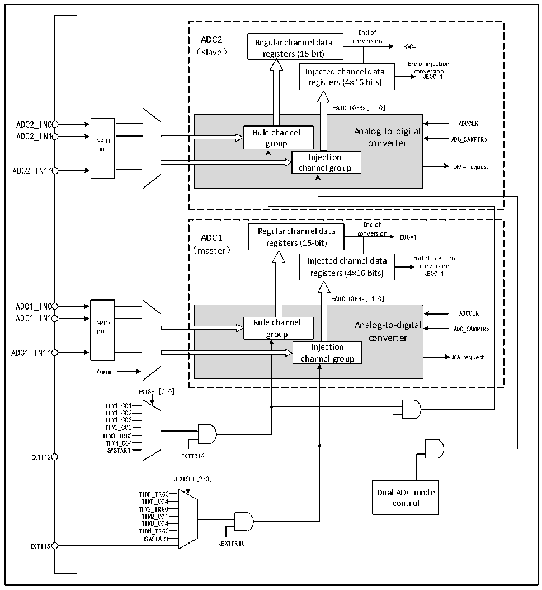

<!-- source-page: 138 -->

[← p.137](0137.md) · [index](../README.md) · [PDF p.138](https://ch32-riscv-ug.github.io/CH32X315/datasheet_en/CH32X315RM.PDF#page=138) · [p.139 →](0139.md)

<!-- header: CH32X315/X305 Reference Manual https://wch-ic.com -->

Figure 12-5 Dual ADC Block Diagram  
 <!-- rendered from the PDF; verify at https://ch32-riscv-ug.github.io/CH32X315/datasheet_en/CH32X315RM.PDF#page=138 -->

🖼 Text parsed from the figure above

End of  
ADC2 Regular channel data conversion  
EOC=1  
（slave） registers (16-bit)  
End of injection  
Injected channel data conJEOC=1version  
registers (4×16 bits)  
-ADC_IOFRx[11:0]  
GPIO port  
Rule channel Analog-to-digital group converter Injection channel group  
End of  
ADC1 Regular channel data conversion EOC=1  
registers (16-bit)  
（master）  
Injected channel data End of injection  
conversion  
registers (4×16 bits) JEOC=1  
-ADC_IOFRx[11:0]  
ADC1_IN0  
GPIO port  
Rule channel Analog-to-digital group converter Injection channel group  
ADCCLK  
ADC1_IN1  
ADC1_IN11  
VREFINT  
EXTSEL[2:0]  
TIM1_CC1  
TIM1_CC2  
TIM1_CC3  
TIM2_CC2  
TIM3_TRG0  
TIM4_CC4  
SWSTART  
EXTI12 EXTTRIG  
JEXTSEL[2:0]  
TIM1_TRG0 Dual ADC mode  
TIM1_CC4 control  
TIM2_TRG0  
TIM2_CC1  
TIM3_CC4  
TIM4_TRG0  
JSWSTART  
EXTI15 JEXTTRIG  

1) Independent mode  
In this mode, the dual ADCs work asynchronously and independently of each other.  
2) Synchronous injection mode  
This mode is used to convert an injection channel group, set JEXTSEL[2:0] in ADC1_CTLR2 to select the trigger  
source, and it will also be used to trigger ADC2 synchronously. When the conversion is completed, the converted  
data are stored in ADCx_IDATARx of ADCx respectively, and if any ADC interrupt is enabled, a JEOC interrupt  
will be generated after the conversion is completed.  
<!-- image: p138-draw-image-00001 bbox=[515.76, 783.48, 535.2, 793.8] -->
<!-- footer: V1.1 136 -->
