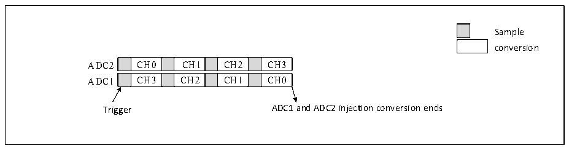
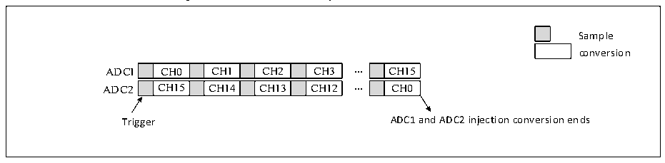

<!-- source-page: 139 -->

[← p.138](0138.md) · [index](../README.md) · [PDF p.139](https://ch32-riscv-ug.github.io/CH32X315/datasheet_en/CH32X315RM.PDF#page=139) · [p.140 →](0140.md)

<!-- header: CH32X315/X305 Reference Manual https://wch-ic.com -->

Figure 12-6 4-channel synchronous injection conversion  
 <!-- rendered from the PDF; verify at https://ch32-riscv-ug.github.io/CH32X315/datasheet_en/CH32X315RM.PDF#page=139 -->

🖼 Text parsed from the figure above

Sample  
conversion  
CH0  CH1  CH2  CH3  CH3  CH2  CH1  CH0  
Trigger ADC1 and ADC2 injection conversion ends  

<em>Note: 1. The conversion channels of ADC1 and ADC2 should not overlap at the same time.</em>  
<em>2. In synchronous mode, ADC1 and ADC2 should have conversion sequences of the same length or the</em>  
<em>length of the longer conversion sequence between the two should be less than the trigger time interval to ensure</em>  
<em>that the conversion of both sequences can be completed every time the trigger is triggered.</em>  
<strong>3) Synchronization rule mode</strong>  
This mode is used to convert the regular channel sequence. Set EXTSEL[2:0] in ADC1_CTLR2 to select the  
trigger source. It will also be used to trigger ADC2 synchronously. When the conversion is completed, a 32-bit  
DMA transfer request will be generated to transfer the contents of the data register ADC1_RDATAR to SRAM.  
The high 16 bits contain the ADC2 conversion data, and the low 16 bits contain the ADC1 conversion data. If  
either ADC interrupt is enabled, an EOC interrupt will be generated.  

Figure 12-7 16-channel synchronous rule conversion  
 <!-- rendered from the PDF; verify at https://ch32-riscv-ug.github.io/CH32X315/datasheet_en/CH32X315RM.PDF#page=139 -->

🖼 Text parsed from the figure above

Sample  
conversion  
CH0  CH1  CH2  CH3  CH15  CH14  CH13  CH12  
CH15  CH0  
Trigger ADC1 and ADC2 injection conversion ends  

<em>Note: 1. The conversion channels of ADC1 and ADC2 should not overlap at the same time.</em>  
<em>2. In synchronous mode, ADC1 and ADC2 should have conversion sequences of the same length or the</em>  
<em>length of the longer conversion sequence between the two should be less than the trigger time interval to ensure</em>  
<em>that the conversion of both sequences can be completed every time the trigger is triggered.</em>  
<strong>4) Fast alternating mode</strong>  
This mode is only applicable to rule channels (often only one channel). Set EXTSEL[2:0] in ADC1_CTLR2 to  
select the trigger source. When the trigger is generated, ADC2 will start conversion immediately, and ADC1 will  
start conversion after delaying 7 ADC clock cycles. If the continuous mode is enabled (CONT is set), the 2 ADCs  
will continuously convert the regular channels alternately. If the interrupt is enabled, ADC1 will generate an EOC  
interrupt. If DMA is enabled at the same time, a 32-bit DMA transfer request will be generated to transfer the  
contents of the data register ADC1_RDATAR to SRAM. The high 16 bits contain ADC2 conversion data, and the  
low 16 bits contain ADC1 conversion data.  
<!-- image: p139-draw-image-00001 bbox=[515.76, 783.48, 535.2, 793.8] -->
<!-- footer: V1.1 137 -->
