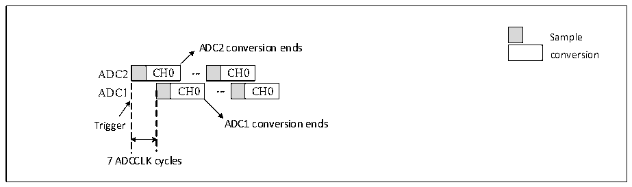
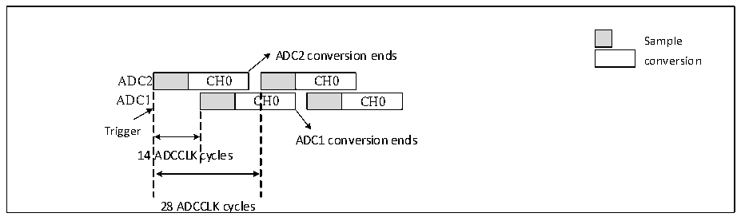

<!-- source-page: 140 -->

[← p.139](0139.md) · [index](../README.md) · [PDF p.140](https://ch32-riscv-ug.github.io/CH32X315/datasheet_en/CH32X315RM.PDF#page=140) · [p.141 →](0141.md)

<!-- header: CH32X315/X305 Reference Manual https://wch-ic.com -->

Figure 12-8 Single channel fast alternating continuous conversion  
 <!-- rendered from the PDF; verify at https://ch32-riscv-ug.github.io/CH32X315/datasheet_en/CH32X315RM.PDF#page=140 -->

🖼 Text parsed from the figure above

Sample  
ADC2 conversion ends  
conversion  
CH0  CH0  CH0  
CH0  
7 ADCCLK cycles  

<em>Note: The sampling time should be less than 7 ADC clock cycles to avoid the problem of overlapping sampling</em>  
<em>periods when ADC1 and ADC2 sample the same channel.</em>  
<strong>5) Slow alternating mode</strong>  
This mode is only available for rule channels and only one channel. Set EXTSEL[2:0] in ADC1_CTLR2 to select  
the trigger source. ADC2 will start conversion immediately after the trigger is generated. ADC1 will start  
conversion after delaying 14 ADC clock cycles. ADC2 will start again after another delay of 14 ADC clock cycles,  
and so on. If the interrupt is enabled, ADC1 will generate an EOC interrupt. If DMA is enabled at the same time, a  
32-bit DMA transfer request will be generated to transfer the contents of the data register ADC1_RDATAR to  
SRAM. The high 16 bits contain ADC2 conversion data, and the low 16 bits contain ADC1 conversion data.  

Figure 12-9 Single channel slow alternating continuous conversion  
 <!-- rendered from the PDF; verify at https://ch32-riscv-ug.github.io/CH32X315/datasheet_en/CH32X315RM.PDF#page=140 -->

🖼 Text parsed from the figure above

Sample  
ADC2 conversion ends  
conversion  
CH0  
CH0  C  CH0  
CH0  
Trigger  
ADC1 conversion ends  
14 ADCCLK cycles  
28 ADCCLK cycles  

<em>Note: 1. The sampling time should be less than 14 ADC clock cycles to avoid overlapping with the next sampling</em>  
<em>cycle;</em>  
<em>2. A new ADC2 conversion is automatically initiated after 28 ADC clock cycles;</em>  
<em>3. The CONT bit does not need to be set.</em>  
<strong>6) Alternate trigger mode</strong>  
This mode is only applicable to the injection channel group. Set JEXTSEL[2:0] in ADC1_CTLR2 to select the  
trigger source. When the first trigger event occurs, all injection channels on ADC1 are converted, and when the  
second trigger event occurs, all injection channels on ADC2 are converted. The cycle repeats in sequence. If the  
interrupt is enabled, a JEOC interrupt will be generated after the conversion of all injection channels of ADC1 is  
completed, and a JEOC interrupt will be generated after the conversion of all injection channels of ADC2 is  
completed.  
<!-- image: p140-draw-image-00001 bbox=[515.76, 783.48, 535.2, 793.8] -->
<!-- footer: V1.1 138 -->
