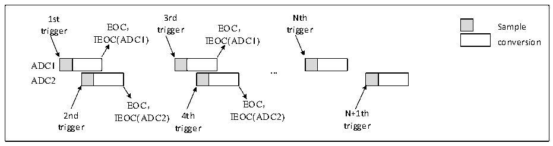
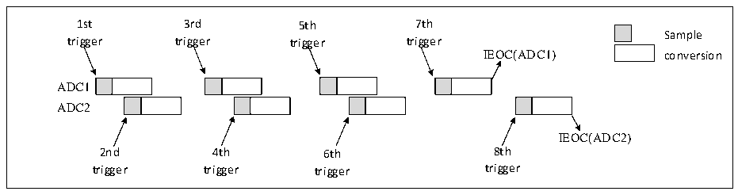

<!-- source-page: 141 -->

[← p.140](0140.md) · [index](../README.md) · [PDF p.141](https://ch32-riscv-ug.github.io/CH32X315/datasheet_en/CH32X315RM.PDF#page=141) · [p.142 →](0142.md)

<!-- header: CH32X315/X305 Reference Manual https://wch-ic.com -->

Figure 12-10 Each ADC injection channel group alternately triggers conversions  
 <!-- rendered from the PDF; verify at https://ch32-riscv-ug.github.io/CH32X315/datasheet_en/CH32X315RM.PDF#page=141 -->

🖼 Text parsed from the figure above

1st 3rd Nth  
trigger EOC， trigger EOC， trigger Sample  
IEOC(ADC1) IEOC(ADC1) conversion  
ADC1  
<strong>...</strong>  
ADC2  
EOC， EOC，  
2nd IEOC(ADC2) 4th IEOC(ADC2) N+1th  
trigger trigger trigger  

If the injection discontinuous mode is used at the same time, when the first trigger event occurs, the first injection  
channel on ADC1 is converted, and when the second trigger event occurs, the first injection channel on ADC2 is  
converted. And so on, back and forth. At the same time, if the interrupt is enabled, a JEOC interrupt will be  
generated when the conversion of all injection channels of ADC1 is completed, and a JEOC interrupt will be  
generated when the conversion of all injection channels of ADC2 is completed.  

Figure 12-11 Each ADC injection channel alternately triggers conversions in discontinuous mode  
 <!-- rendered from the PDF; verify at https://ch32-riscv-ug.github.io/CH32X315/datasheet_en/CH32X315RM.PDF#page=141 -->

🖼 Text parsed from the figure above

1st 3rd 5th 7th  
Sample  
trigger trigger trigger trigger  
IEOC(ADC1) conversion  
ADC1  
ADC2  
IEOC(ADC2)  
2nd 4th 6th 8th  
trigger trigger trigger trigger  

<strong>7) Synchronous rule mode + synchronous injection mode</strong>  
In this mode, the synchronous conversion of rule groups can be interrupted to initiate the synchronous conversion  
of injection groups. Additionally, in this mode, you must ensure that the conversion sequences have the same  
duration, or that the trigger interval is longer than the duration of the longer of the two sequences.  
<strong>8) Synchronous rule mode + alternate trigger mode</strong>  
In this mode, the synchronous transition of rule sets can be interrupted to initiate an alternate-triggered transition  
of the injection group. When an injection event occurs, the alternate-triggered transition begins immediately. If a  
synchronous rule transition is in progress, all ADC rule transitions are paused and resume synchronously once the  
injection transition is complete.  
<!-- image: p141-draw-image-00001 bbox=[515.76, 783.48, 535.2, 793.8] -->
<!-- footer: V1.1 139 -->
