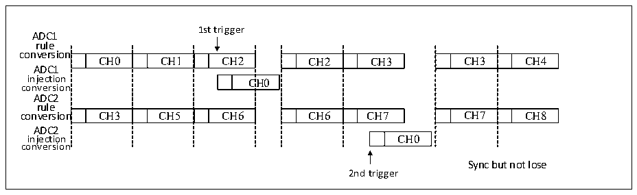
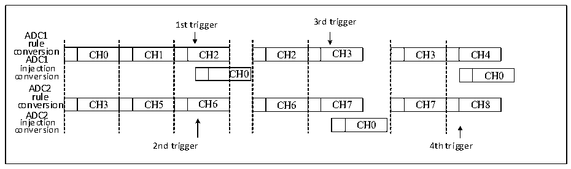
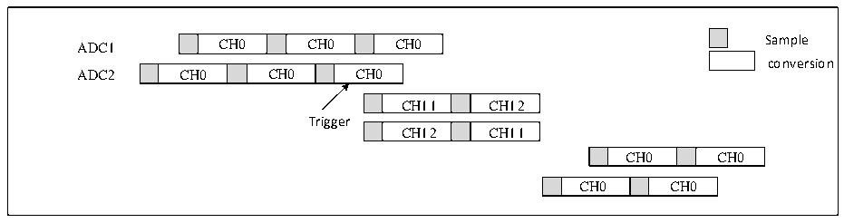

<!-- source-page: 142 -->

[← p.141](0141.md) · [index](../README.md) · [PDF p.142](https://ch32-riscv-ug.github.io/CH32X315/datasheet_en/CH32X315RM.PDF#page=142) · [p.143 →](0143.md)

<!-- header: CH32X315/X305 Reference Manual https://wch-ic.com -->

Figure 12-12 Alternate trigger injection channel conversion in synchronous rule mode  
 <!-- rendered from the PDF; verify at https://ch32-riscv-ug.github.io/CH32X315/datasheet_en/CH32X315RM.PDF#page=142 -->

🖼 Text parsed from the figure above

1st trigger  
ADC1  
rule  
conversion  
n  CH0  CH1  CH2  n  C  n  CH3  CH5  CH6  
CH2  CH3  CH6  CH7  
CH3  CH4  CH7  CH8  
ADC1  
C  CH0  
conversion  
ADC2  
rule  
ADC2  
CH0  
injection CH0  
conversion  
Sync but not lose  
2nd trigger  

<em>Note: In this mode, it is necessary to ensure that sequences with the same time length are converted accurately, or</em>  
<em>that the triggering time interval is longer than the longer of the two sequences.</em>  
If the injection trigger event occurs during the injection transition that interrupts the rule transition, the trigger  
event will be ignored, such as the second trigger described in the figure below.  

Figure 12-13 Trigger event occurs during the injection conversion  
 <!-- rendered from the PDF; verify at https://ch32-riscv-ug.github.io/CH32X315/datasheet_en/CH32X315RM.PDF#page=142 -->

🖼 Text parsed from the figure above

1st trigger 3rd trigger  
ADC1  
rule  
conversion CH0 CH1 CH2 CH2 CH3 CH3 CH4  
CH0  CH1  CH2  C  CH3  CH5  CH6  
CH2  CH3  CH6  CH7  
CH3  CH4  CH7  CH8  
ADC1  
injection  
C  
CH0  
ADC2  
rule  
conversion CH3 CH5 CH6 CH6 CH7 CH7 CH8  
ADC2  
injection CH0  
conversion  
2nd trigger 4th trigger  

<strong>9) Synchronous injection mode + alternating mode</strong>  
In this mode, injecting transitions can interrupt alternating transitions. When an injection event occurs, the  
alternation transition is interrupted, the injection transition is started, and after the injection transition ends, the  
alternation transition is resumed.  

Figure 12-14 Trigger injection group conversion under alternating conversion  
 <!-- rendered from the PDF; verify at https://ch32-riscv-ug.github.io/CH32X315/datasheet_en/CH32X315RM.PDF#page=142 -->

🖼 Text parsed from the figure above

CH0  CH0  CH0  
ADC1 CH0 CH0 CH0 Sample  
conversion  
CH0  CH0  CH0  
CH11  CH12  
Trigger  
CH12  CH11  
CH0  CH0  
CH0  CH0  

<em>Note: When the ADC prescaler coefficient is 4, the sampling interval after alternate conversion recovery is no</em>  
<em>longer a uniform 7 ADC clocks, but instead alternates between 8 and 6 clock cycles.</em>  

### 12.2.7 Low-speed High-performance Mode

ADC defaults to 12-bit mode. After turning on low-speed and high-performance mode, 13/14/15-bit mode can be  
<!-- image: p142-draw-image-00001 bbox=[515.76, 783.48, 535.2, 793.8] -->
<!-- footer: V1.1 140 -->
