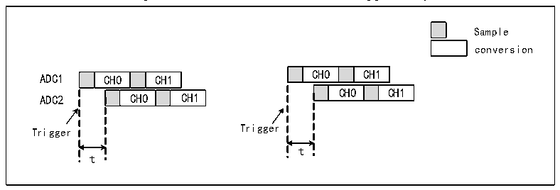

<!-- source-page: 143 -->

[← p.142](0142.md) · [index](../README.md) · [PDF p.143](https://ch32-riscv-ug.github.io/CH32X315/datasheet_en/CH32X315RM.PDF#page=143) · [p.144 →](0144.md)

<!-- header: CH32X315/X305 Reference Manual https://wch-ic.com -->
selected, that is, 13-bit/14-bit/15-bit conversion results can be obtained in one conversion.  
Notes on low speed and high-performance mode:  
1) After turning on the low-speed high-performance mode, the single ADC conversion cycle (sampling time +  
conversion time) will increase, that is:  
13-bit mode conversion cycle = 12-bit mode conversion cycle * 2;  
14-bit mode conversion cycle = 12-bit mode conversion cycle * 4;  
15-bit mode conversion cycle = 12-bit mode conversion cycle * 8.  
2) The use of low-speed high-performance mode is not restricted. No matter it is single mode, continuous mode,  
scan mode, intermittent mode and other working modes, low-speed high-performance mode is supported.  

### 12.2.8 ADC Cascade

All ADCs can be cascaded, and the cascading order is configurable. Between the cascaded ADCs, the conversion  
delay of each level of ADC can be configured. It can convert at the same time or delay the conversion in sequence;  
when used in groups, dual ADC mode is supported.  
<strong>ADC rule channel cascade configuration</strong>  
If the ADC uses rule channel cascading, you can enable regular channel cascading through the REGUCON bit in  
the ADCx_CTLR2 register, and set parameters for trigger delay through the REGUDLY[5:0] field in the  
ADCx_CONCFG register. If the ADC2 cascade front stage is set to ADC1, ADC1 needs to provide a trigger  
source. If the delay time is set to t, the corresponding conversion relationship is as shown in Figure 12-15:  

Figure 12-15 Rule channel cascade trigger delay  
 <!-- rendered from the PDF; verify at https://ch32-riscv-ug.github.io/CH32X315/datasheet_en/CH32X315RM.PDF#page=143 -->

🖼 Text parsed from the figure above

Sample  
conversion  
CH0  CH1  t  CH0  CH1  
CH0  CH1  CH0  CH1  
Trigger Trigger  
t  
t  

<strong>ADC injection channel cascade configuration</strong>  
If the ADC uses injection channel cascade, it can be used with the injection trigger alternating cycle. Enable the  
injection channel cascade through the INJECON bit of the ADCx_CTLR2 register, set the parameters for trigger  
delay through the REGUDLY[5:0] field of the ADCx_CONCFG register, set the injection trigger alternating cycle  
period through the INJENUM[1:0] bits of the ADCx_CONCFG register, and configure the INJENUM[1:0] bits of  
the ADCx_CONCFG register to set the effective injection trigger sequence number.  
If the ADC channels are cascaded and used in an alternating cycle of injection triggering, a multi-ADC alternating  
triggering mode can be achieved. If INJENUM[1:0]=11b and INJESEQ[1:0] are cascaded sequences in sequence,  
multi-ADC alternating triggering mode can be realized. The corresponding relationship is shown in Figure 12-16:  
<!-- image: p143-draw-image-00001 bbox=[515.76, 783.48, 535.2, 793.8] -->
<!-- footer: V1.1 141 -->
