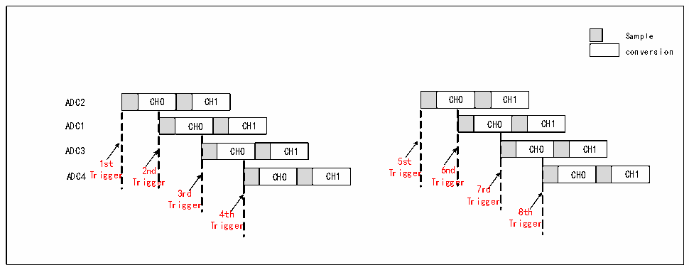
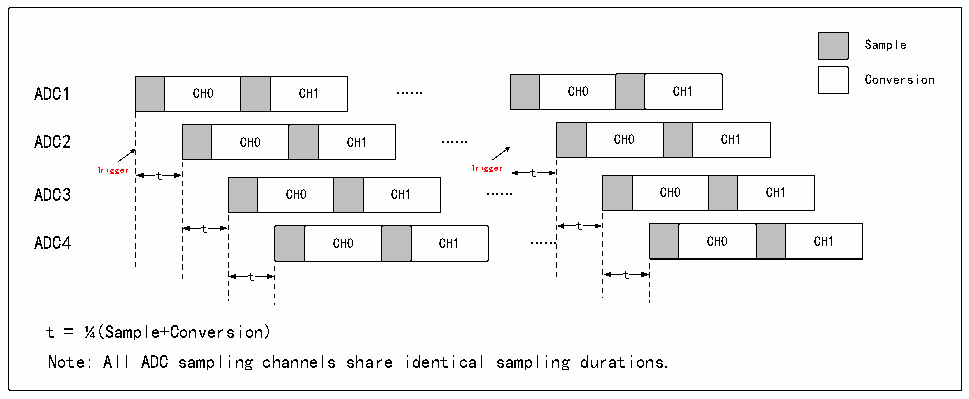

<!-- source-page: 144 -->

[← p.143](0143.md) · [index](../README.md) · [PDF p.144](https://ch32-riscv-ug.github.io/CH32X315/datasheet_en/CH32X315RM.PDF#page=144) · [p.145 →](0145.md)

<!-- header: CH32X315/X305 Reference Manual https://wch-ic.com -->

Figure 12-16 Multiple ADC alternate triggering  
 <!-- rendered from the PDF; verify at https://ch32-riscv-ug.github.io/CH32X315/datasheet_en/CH32X315RM.PDF#page=144 -->

🖼 Text parsed from the figure above

Sample  
conversion  
CH0  CH1  
CH0  CH1  
ADC2 CH0 CH1 CH0 CH1  
CH0  CH1  
CH0  CH1  
ADC1 CH0 CH1 CH0 CH1  
CH0  CH1  
CH0  CH1  
ADC3 CH0 CH1 CH0 CH1  
1st 5st  
ADC4Trigger 2nd CH0 CH1 Trigger 6nd CH0 CH1  
CH0  CH1  
CH0  CH1  
3rd 7rd  
Trigger Trigger  
4th 8th  
Trigger Trigger  

<strong>Application examples</strong>  
In cascade mode, when using 4 groups of ADCs, the trigger delay can be configured to perform alternate sampling.  
If the trigger delay is 25% of the ADC conversion cycle time, the sampling rate can be increased by 4 times. That  
is, when 5Msps is used for sampling, the sampling rate can be increased to an equivalent 20Msps through cascade  
mode.  

Figure 12-17 Increase sampling rate  
 <!-- rendered from the PDF; verify at https://ch32-riscv-ug.github.io/CH32X315/datasheet_en/CH32X315RM.PDF#page=144 -->

🖼 Text parsed from the figure above

Sample  
Conversion  
CH0  CH1  
CH0  CH1  
ADC1 CH0 CH1 …… CH0 CH1  
ADC2 CH0 CH1 …… CH0 CH1  
Trigger t Trigger t  
ADC3 CH0 CH1 …… CH0 CH1  
CH0  CH1  
CH0  CH1  
t t  
t = ¼(Sample+Conversion)  
Note: All ADC sampling channels share identical sampling durations.  

### 12.2.9 ADC Scan Output

ADC scan output needs to configure the SCSCFG bit of the ADCx_SCANCNT register to select the rule channel  
or the injection channel for scan channel source selection. After the ADC scan is completed, the round count can  
be selected by setting the ADC_SCAN_SEL[1:0] bits of the R32_EXTEN_CTR register to select the ADCx scan  
cycle count output to GPIO. If SCANOE0, SCANOE1, and SCANOE2 are enabled, the relationship between the  
number of scans and the level of the GPIO port is as shown in Table 12-5:  

<!-- p144-table-014 (table-12-5@1) pages 144-145 -->
<table><caption>Table 12-5 Relationship between ADC scan times and output level</caption><tr><th>Sequence</th><th>SCANOE0</th><th>SCANOE1</th><th>SCANOE2</th></tr><tr><td>0</td><td>Low level</td><td>Low level</td><td>Low level</td></tr><tr><td>1</td><td>High level</td><td>Low level</td><td>Low level</td></tr><tr><td>2</td><td>Low level</td><td>High level</td><td>Low level</td></tr><tr><td>3</td><td>High level</td><td>High level</td><td>Low level</td></tr><tr><td>4</td><td>Low level</td><td>Low level</td><td>High level</td></tr><tr><td>5</td><td>High level</td><td>Low level</td><td>High level</td></tr><tr><td>6</td><td>Low level</td><td>High level</td><td>High level</td></tr><tr><td>7</td><td>High level</td><td>High level</td><td>High level</td></tr><tr><td>8</td><td>Low level</td><td>Low level</td><td>Low level</td></tr></table>

<!-- image: p144-draw-image-00001 bbox=[515.76, 783.48, 535.2, 793.8] -->
<!-- footer: V1.1 142 -->
