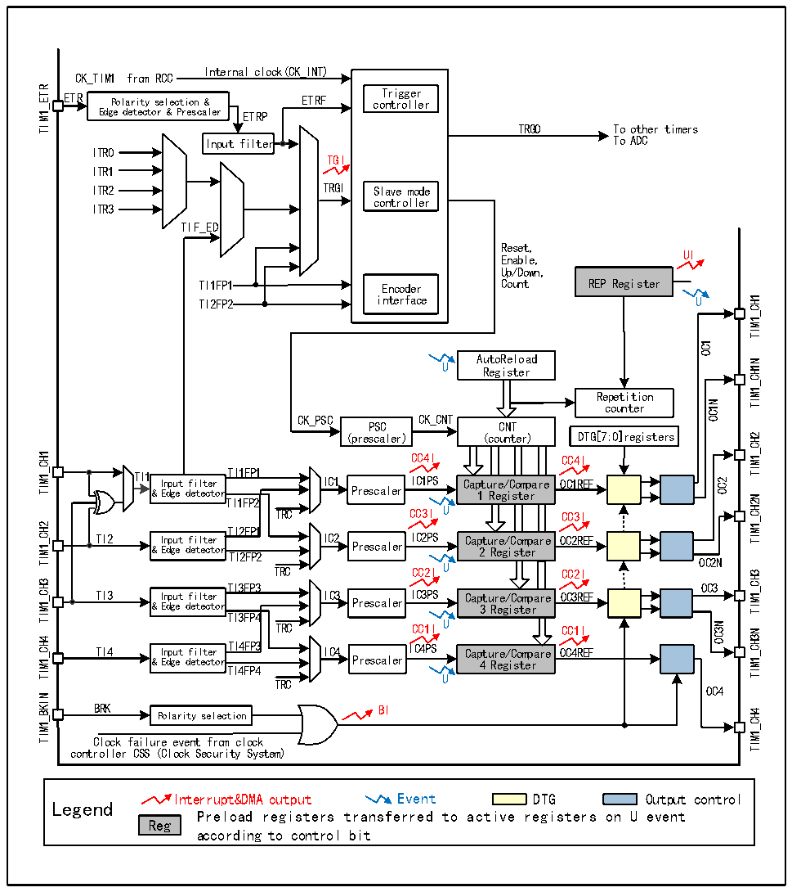

<!-- source-page: 163 -->

[← p.162](0162.md) · [index](../README.md) · [PDF p.163](https://ch32-riscv-ug.github.io/CH32X315/datasheet_en/CH32X315RM.PDF#page=163) · [p.164 →](0164.md)

<!-- header: CH32X315/X305 Reference Manual https://wch-ic.com -->
operations such as filtering, frequency division and edge detection, and supports mutual triggering between  
channels, and can also provide a clock for the core counter CNT. Each compare/capture channel has a set of  
compare/capture register (CHxCVR), which supports comparison with the main counter (CNT) so as to output  
pulse.  

Figure 13-1 Structure block diagram of advanced-control timer  
 <!-- rendered from the PDF; verify at https://ch32-riscv-ug.github.io/CH32X315/datasheet_en/CH32X315RM.PDF#page=163 -->

🖼 Text parsed from the figure above

Internal clock(CK_INT)  
CK_TIM1 from RCC  
TIM1_ETR  
ETR Polarity selection &amp; ETRF co T n r t i r g o g l e l r e r  
Polarity selection &amp; Edge detector &amp; Prescaler  
TRGO To other timers  
Input filter To ADC  
ITR0  
TGI  
ITR1  
ITR2 TRGI Slave mode  
controller  
ITR3  
TIF_ED  
Reset,  
Enable, UI  
Up/Down,  
TI1FP1 Encoder Count REP Register  
TI2FP2 interface U  
TIM1_CH1  
OC1  
AutoReload  
TIM1_CH1N  
U Register  
Repetition  
OC1N  
counter  
CK_PSC CK_CNT  
PSC CNT  
(prescaler) (counter) DTG[7:0]registers  
TIM1_CH2  
TIM1_CH1  
CC4I CC4I  
TI1 Input filter TI1FP1 IC1 IICC11PPSS Capture/Compare OC1REF  
OC2  
&amp; Edge detector Prescaler 1 Register TI1FP2  
TIM1_CH2N  
TRC CC3I U CC3I  
TIM1_CH2  
TI2FP1  
TI2 Input filter IC2 IC2PS Capture/Compare OC2REF  
&amp; Edge detector TI2FP2 Prescaler 2 Register TRC CC2I U CC2I  
OC2N  
TIM1_CH3  
TIM1_CH3  
TI3FP3  
OC3  
TI3 &amp; I E n d p g u e t d f e i t l e t c e t r o r IC3 Prescaler IC3PS Cap 3 t u R r e e g / i C s o t m e p r are OC3REF  
TI3FP4  
TRC CC1I U CC1I  
OC3N  
TIM1_CH3N  
TIM1_CH4  
TI4 Input filter TI4FP3 IC4 IC4PS Capture/Compare OC4REF  
&amp; Edge detector Prescaler 4 Register  
TI4FP4  
TRC U  
OC4  
TIM1_BKIN  
BRK BI Polarity selection  
TIM1_CH4  
Clock failure event from clock  
controller CSS (Clock Security System)  
Interrupt&amp;DMA output Event DTG Output control  
Legend  
Preload registers transferred to active registers on U event  
Reg  
according to control bit  

<!-- image: p163-draw-image-00001 bbox=[515.76, 783.48, 535.2, 793.8] -->
<!-- footer: V1.1 161 -->
