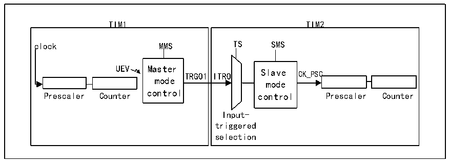

<!-- source-page: 173 -->

[← p.172](0172.md) · [index](../README.md) · [PDF p.173](https://ch32-riscv-ug.github.io/CH32X315/datasheet_en/CH32X315RM.PDF#page=173) · [p.174 →](0174.md)

<!-- header: CH32X315/X305 Reference Manual https://wch-ic.com -->

### 13.3.10 Encoder Mode

The encoder mode is a typical application of the timer. It can be used to access the dual-phase output of the  
encoder. The counting direction of the core counter is synchronized with the rotating shaft of the encoder. Each  
pulse outputted by the encoder will increase the core counter by adding one or subtracting one. The steps to use  
the encoder are: set the SMS field to 001b (counting only on TI2 edge), 010b (counting only on TI1 edge) or 011b  
(counting on both TI1 and TI2 edges), and connect the encoder to compare/capture channel 1, 2 input terminals,  
set a value for the reload value register and this value can be set to be greater. In the encoder mode, the internal  
compare/capture register of timer, prescaler, repeat count register, etc. all work normally. The following table  
shows the relationship between the counting direction and the encoder signal.  

<!-- p173-table-001 (table-13-1@1) -->
<table><caption>Table 13-1 Relationship between counting direction of timer encoder mode and encoder signal</caption><tr><th rowspan="2">Counting active edge</th><th rowspan="2" style="text-align:left">Relative signal level</th><th colspan="2">TI1FP1 signal edge</th><th colspan="2">TI2FP2 signal</th></tr><tr><td style="text-align:left">Rising edge</td><td style="text-align:left">Falling edge</td><td style="text-align:left">Rising edge</td><td style="text-align:left">Falling edge</td></tr><tr><td rowspan="2">Only count at TI1 edge</td><td>High</td><td>Downcount</td><td>Upcount</td><td rowspan="2" colspan="2">Not count</td></tr><tr><td>Low</td><td>Upcount</td><td>Downcount</td></tr><tr><td rowspan="2">Only count at TI2 edge</td><td>High</td><td rowspan="2" colspan="2">Not count</td><td>Upcount</td><td>Downcount</td></tr><tr><td>Low</td><td>Downcount</td><td>Upcount</td></tr><tr><td rowspan="2" style="text-align:left">Count on both edges of TI1 and TI2</td><td>High</td><td>Downcount</td><td>Upcount</td><td>Upcount</td><td>Downcount</td></tr><tr><td>Low</td><td>Upcount</td><td>Downcount</td><td>Downcount</td><td>Upcount</td></tr></table>

### 13.3.11 Timer Synchronization Mode

The TIMx timers are connected together from within to synchronize or cascade the timers. When a timer is  
configured in master mode, the counter of another timer configured in slave mode can be reset, started, stopped or  
clocked.  
<strong>Using one timer as a prescaler for another timer</strong>  

Figure 13-6 Master/slave timer example  
 <!-- rendered from the PDF; verify at https://ch32-riscv-ug.github.io/CH32X315/datasheet_en/CH32X315RM.PDF#page=173 -->

🖼 Text parsed from the figure above

TIM1 TIM2  
TIM1 clock MMS UEV Master TRGO1 mode control Prescaler Counter  TIM2 TS SMS ITRO Slave CK_PSC mode control Prescaler Counter Input- triggered selection  

For example, timer 1 can be configured as a prescaler for timer 2. To do this:  
1) Configure Timer 1 in Master mode to output a periodic trigger signal every time an update event UEV occurs.  
If MMS=010 is written to R16_TIM1_CTLR2, TRGO1 will output a rising edge whenever an update event is  
generated.  
2) To connect the TRGO1 output of Timer 1 to Timer 2, Timer 2 must be configured in slave mode, using ITR0 as  
the internal trigger. This can be selected via the TS bit in the R16_TIM2_SMCFGR register (write TS=000).  
<!-- image: p173-draw-image-00001 bbox=[515.76, 783.48, 535.2, 793.8] -->
<!-- footer: V1.1 171 -->
