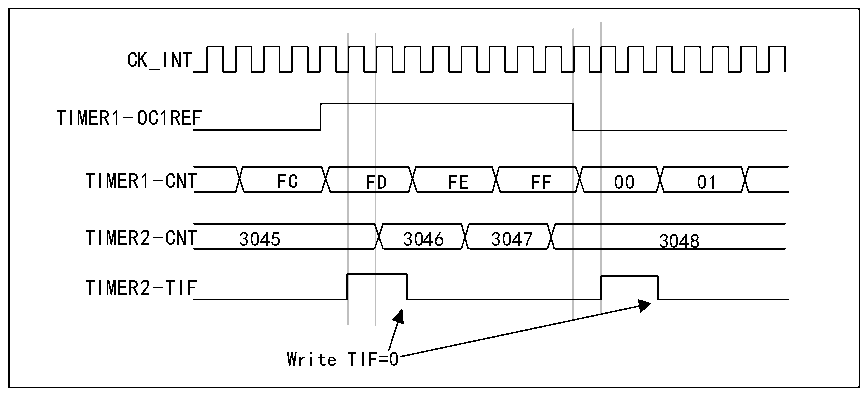

<!-- source-page: 174 -->

[← p.173](0173.md) · [index](../README.md) · [PDF p.174](https://ch32-riscv-ug.github.io/CH32X315/datasheet_en/CH32X315RM.PDF#page=174) · [p.175 →](0175.md)

<!-- header: CH32X315/X305 Reference Manual https://wch-ic.com -->
3) The slave mode controller is then set to external clock mode 1 (write SMS=111 in the R16_TIM2_SMCFGR  
register). In this way the clock for timer 2 will be supplied by the rising edge of the periodic trigger signal of timer  
1 (corresponding to the counter overflow of timer 1).  
4) Finally both timers must be enabled simultaneously by setting the corresponding CEN bits  
(R16_TIM1_CTLR1 register) of both timers to 1.  
<em>Note: If the OCx signal of timer 1 is selected as trigger output (MMS=1xx), the rising edge of this signal will be</em>  
<em>used to drive the counter of timer 2.</em>  
<strong>Using one timer to enable another timer</strong>  
In this example Timer 2 is enabled by comparing the output of Timer 1 with 1. Timer 2 counts according to the  
divided internal clock only when OC1REF of Timer 1 is high. The clock frequency of both counters is based on  
CK_INT by prescaler performing a 3-way frequency (fCK_CNT=fCK_INT/3).  
1) Configure timer 1 in main mode and send its output compare 1 reference signal (OC1REF) as trigger output  
(MMS=100 in R16_TIM1_CR2 register).  
2) Configure Timer 1 for OC1REF waveform (R16_TIM1_CCMR1 register).  
3) Configure Timer 2 to receive an input trigger from Timer 1 (TS=000 in R16_TIM2_SMCFGR register).  
4) Configure Timer 2 to gated mode (SMS=101 in the R16_TIM2_SMCFGR register).  
5) Enable Timer 2 by writing a &#x27;1&#x27; to the CEN bit (R16_TIM2_CTLR1 register).  
6) Enable Timer 1 by writing &#x27;1&#x27; to the CEN bit (R16_TIM1_CTLR1 register).  
<em>Note: The clock of Counter 2 is not synchronized with Counter 1, this mode only affects the counter enable signal</em>  
<em>of Timer 2.</em>  

Figure 13-7 Gating Timer 2 using OC1REF of Timer 1  
 <!-- rendered from the PDF; verify at https://ch32-riscv-ug.github.io/CH32X315/datasheet_en/CH32X315RM.PDF#page=174 -->

🖼 Text parsed from the figure above

CK_INT  
F  FD  F  
TIMER1-OC1REF  
TIMER2-TIF  
Write TIF=0  

The counter and prescaler of timer 2 are not initialized before start-up. Therefore counting starts from the  
respective current value. Before starting Timer 1, both timers can be counted from the specified value by resetting  
them. This makes it possible to write any desired value into the timer counter. Both timers can be easily reset by  
software using the UG bit in the R16_TIM1_SWEVGR register.  
In the next example, timer 1 is synchronized with timer 2. Timer 1 is in master mode and counts from 0. Timer 2  
is in slave mode and counts from 0xE7. The prescaler ratios of both timers are the same. When timer 1 is disabled  
by writing &quot;0&quot; to the CEN bit in the R16_TIM1_CTLR1 register, timer 2 will stop:  
1) Configure Timer 1 in main mode and send its output compare 1 reference signal (OC1REF) as the trigger  
<!-- image: p174-draw-image-00001 bbox=[515.76, 783.48, 535.2, 793.8] -->
<!-- footer: V1.1 172 -->
