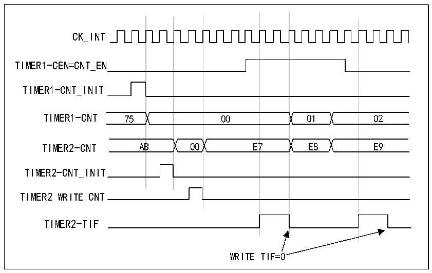

<!-- source-page: 175 -->

[← p.174](0174.md) · [index](../README.md) · [PDF p.175](https://ch32-riscv-ug.github.io/CH32X315/datasheet_en/CH32X315RM.PDF#page=175) · [p.176 →](0176.md)

<!-- header: CH32X315/X305 Reference Manual https://wch-ic.com -->
output (MMS=100 in the R16_TIM1_CTLR2 register).  
2) Configure Timer 1 for the OC1REF waveform (R16_TIM1_CHCTLR1 register).  
3) Configure Timer 2 to receive an input trigger from Timer 1 (TS=000 in R16_TIM2_SMCFGR register).  
4) Configure Timer 2 to gated mode (SMS=101 in the R16_TIM2_SMCFGR register).  
5) Reset Timer 1 by writing &#x27;1&#x27; to the UG bit (R16_TIM1_SWEVGR register).  
6) Reset Timer 2 by writing &#x27;1&#x27; to the UG bit (R16_TIM2_SWEVGR register).  
7) Initialize Timer 2 to 0xE7 by writing &#x27;0xE7&#x27; to Timer 2&#x27;s counter (R16_TIM2_CNTL).  
8) Enable Timer 2 by writing &#x27;1&#x27; to the CEN bit (R16_TIM2_CTLR1 register).  
9) Enable Timer 1 by writing &#x27;1&#x27; to the CEN bit (R16_TIM1_CTLR1 register).  
10) Stop Timer 1 by writing &#x27;0&#x27; to the CEN bit (R16_TIM1_CTLR1 register).  

Figure 13-8 Gating Timer 2 using Timer 1&#x27;s enable signal  
 <!-- rendered from the PDF; verify at https://ch32-riscv-ug.github.io/CH32X315/datasheet_en/CH32X315RM.PDF#page=175 -->

🖼 Text parsed from the figure above

CK_INT  
01E8  00  00  00E7  B  7  7  
TIMER1-CEN=CNT_EN  
TIMER1-CNT_INIT  
TIMER2-CNT_INIT  
TIMER2 WRITE CNT  
TIMER2-TIF  
WRITE TIF=0  

<strong>Using one timer to start another timer</strong>  
This example uses the update event of Timer 1 to enable Timer 2. As soon as Timer 1 generates an update event,  
Timer 2 starts counting from the current value (which may not be 0) according to the internal clock after dividing  
the frequency. When Timer 2 receives a trigger signal, its CEN bit is automatically set to 1 and the counter starts  
counting until a &quot;0&quot; is written to the CEN bit of the R16_TIM2_CTLR1 register and the counter stops counting.  
The clock frequency of both counters is based on CK_INT and is divided by 3 through a prescaler  
(fCK_CNT=fCK_INT/3).  
1) Configure timer 1 in main mode and send its update event (UEV) as trigger output (MMS=010 in  
R16_TIM1_CTLR2 register).  
2) Configure the period of timer 1 (R16_TIM1_ATRLR register).  
3) Configure Timer 2 to receive an input trigger from Timer 1 (TS=000 in the R16_TIM2_SMCFGR register).  
4) Configure Timer 2 to trigger mode (SMS=110 in the R16_TIM2_SMCFGR register).  
5) Start Timer 1 by writing &#x27;1&#x27; to the CEN bit (R16_TIM1_CTLR1 register).  
<!-- image: p175-draw-image-00001 bbox=[515.76, 783.48, 535.2, 793.8] -->
<!-- footer: V1.1 173 -->
