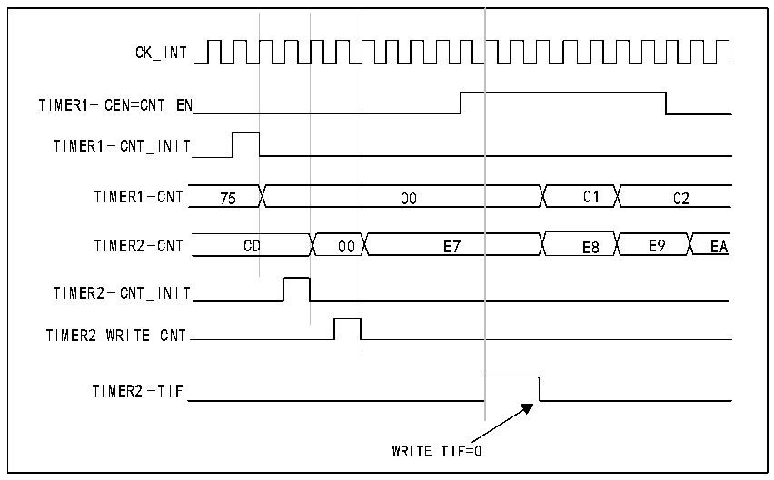

<!-- source-page: 176 -->

[← p.175](0175.md) · [index](../README.md) · [PDF p.176](https://ch32-riscv-ug.github.io/CH32X315/datasheet_en/CH32X315RM.PDF#page=176) · [p.177 →](0177.md)

<!-- header: CH32X315/X305 Reference Manual https://wch-ic.com -->

Figure 13-9 Triggering Timer 2 using Timer 1 update event  
 <!-- rendered from the PDF; verify at https://ch32-riscv-ug.github.io/CH32X315/datasheet_en/CH32X315RM.PDF#page=176 -->

🖼 Text parsed from the figure above

CK_INT  
TIMER1-UEV  
00  01  02  
TIMER1-CNT FD FE FF 00 01 02  
TIMER2-CNT 45 46 47 48  
TIMER2- CEN=CNT_EN  
TIMER2-TIF  
WRITE TIF=0  

As shown in the example above, the user can initialize both counters before starting to count. Figure 13-10 shows  
the same configuration as Figure 13-9, except that the counting behavior is in trigger mode (SMS = 110 in the  
R16_TIM2_SMCFGR register) rather than gate mode.  

Figure 13-10 Triggering Timer 2 using Timer 1&#x27;s enable signal  
 <!-- rendered from the PDF; verify at https://ch32-riscv-ug.github.io/CH32X315/datasheet_en/CH32X315RM.PDF#page=176 -->

🖼 Text parsed from the figure above

00  D  00  E7  
CK_INT  
TIMER1-CEN=CNT_EN  
TIMER1-CNT_INIT  
TIMER2-CNT_INIT  
TIMER2 WRITE CNT  
TIMER2-TIF  
WRITE TIF=0  

<strong>Using one timer as a prescaler for another timer</strong>  
For example, timer 1 can be configured as a prescaler for timer 2. To do this:  
1) Configure Timer 1 in main mode, sending its update event (UEV) as a trigger output (MMS=010 in the  
R16_TIM1_CTLR2 register). This will then output a periodic signal each time the counter overflows.  
2) Configure the period of timer 1 (R16_TIM1_ATRLR register).  
3) Configure Timer 2 to receive an input trigger from Timer 1 (TS=000 in the R16_TIM2_SMCFGR register).  
4) Configure Timer 2 for external clock mode (SMS=111 in the R16_TIM2_SMCFGR register).  
5) Start Timer 2 by writing a &#x27;1&#x27; to the CEN bit (R16_TIM2_CTLR1 register).  
<!-- image: p176-draw-image-00001 bbox=[515.76, 783.48, 535.2, 793.8] -->
<!-- footer: V1.1 174 -->
