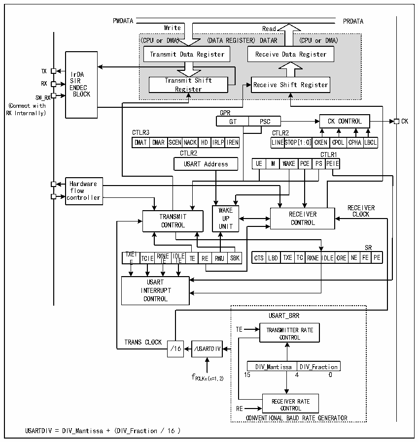

<!-- source-page: 231 -->

[← p.230](0230.md) · [index](../README.md) · [PDF p.231](https://ch32-riscv-ug.github.io/CH32X315/datasheet_en/CH32X315RM.PDF#page=231) · [p.232 →](0232.md)

<!-- header: CH32X315/X305 Reference Manual https://wch-ic.com -->

## 15.2 Overview

Figure 15-1 Structure block diagram of universal synchronous/asynchronous receiver-transmitter  
 <!-- rendered from the PDF; verify at https://ch32-riscv-ug.github.io/CH32X315/datasheet_en/CH32X315RM.PDF#page=231 -->

🖼 Text parsed from the figure above

PWDATA PRDATA  
<!-- image: p231-draw-image-00005 inside the figure -->
<!-- image: p231-draw-image-00004 inside the figure -->
Write Read  
(CPU or DMA) (DATA REGISTER) DATAR (CPU or DMA)  
Transmit Data Register  
Transmit Data Register Receive Data Register  
<!-- image: p231-draw-image-00006 inside the figure -->
<!-- image: p231-draw-image-00003 inside the figure -->
TX IrDA  
SIR Transmit Shift  
RX ENDEC Register Receive Shift Register  
BLOCK  
SW_RX  
(Connect with  
RX Internally) GPR  
GT PSC CK CONTROL CK  
CTLR3 CTLR2  
DMAT  DMAR  SCENNAC  ACK HD  IRLPI  
LINESTO  TOP[1:0]  CKEN  CPOL  CPHA  LBCL  
DMAT DMAR SCENNACK HD IRLPIREN LINESTOP[1:0]CKEN CPOL CPHALBCL  
CTLR2 CTLR1  
WAK  KE PCE  PSCTPLER  ERI1E  
Hardware  
flow  
<!-- image: p231-draw-image-00002 inside the figure -->
controller  
WWAAKKEE RECEIVER  
TRANSMIT UUPP RECEIVER CLOCK  
CONTROL UUNNIITT CONTROL  
TXEIE  TCIE  RXNEIIE  I I DL E E  TE RE  RWU  
SR  
CTS LBD  TXE  TC  RXNE  IDLE  ORE  NE  FE  PE  
USART  
INTERRUPT  
CONTROL  
USART_BRR  
TE TRANSMITTER RATE  
CONTROL  
TRANS CLOCK  
/16 /USARTDIV  
DIV_Mantissa  DIV_Fraction  
f 15 4 0  
PCLKx(x=1,2)  
RECEIVER RATE  
RE CONTROL  
CONVENTIONAL BAUD RATE GENERATOR  
USARTDIV = DIV_Mantissa + (DIV_Fraction / 16 )  

When TE (transmission enable bit) is set, the data in the transmitter shift register will be outputted on the TX pin,  
and the clock will be outputted on the CK pin. During transmission, the lowest significant bit is the first to be  
shifted out. Each data frame starts with a low-level start bit, and then the transmitter sends 8-bit data or 9-bit data  
according to the setting of the M (word length) bit, and finally a configurable number of stop bits. If there is a  
parity check bit, the last bit of the data word is the check bit. After TE is set, an idle frame is sent. The idle frame  
is 10-bit or 11-bit high level, including the stop bit. The break frame is a 10-bit or 11-bit low level, followed by a  
stop bit.  

## 15.3 Baud Rate Generator

The baud rate of the transceiver = FCLK/(16*USARTDIV); FCLK is the clock of HBx, i.e., HCLK. The value of  
USARTDIV is determined according to the 2 domains: DIV_M and DIV_F in USART_BRR. The specific  
calculation formula is:  
USARTDIV = DIV_M+(DIV_F/16)  
<!-- image: p231-draw-image-00001 bbox=[515.76, 783.48, 535.2, 793.8] -->
<!-- footer: V1.1 229 -->
