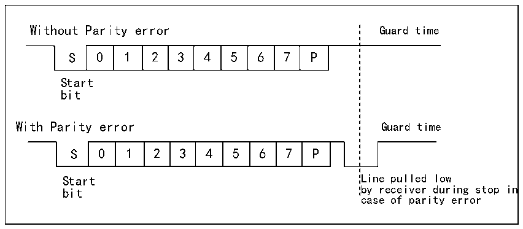

<!-- source-page: 234 -->

[← p.233](0233.md) · [index](../README.md) · [PDF p.234](https://ch32-riscv-ug.github.io/CH32X315/datasheet_en/CH32X315RM.PDF#page=234) · [p.235 →](0235.md)

<!-- header: CH32X315/X305 Reference Manual https://wch-ic.com -->
the fact that bus conflicts may occur when multiple devices use a single bus to transmit and receive in half-duplex  
mode. This requires users to avoid it by software.  

## 15.6 Smart Card

The smartcard mode supports ISO7816-3 protocol to access the smart card controller.  
To enable smartcard mode, set the SCEN bit in the control register 3 (R16_USARTx_CTLR3), but it is needed to  
disable LIN mode, half-duplex mode and infrared mode at the same time, i.e., to ensure that the LINEN, HDSEL  
and IREN bits are in the reset status, but CLKEN can be switched on to output the clock. These 3 bits are in the  
control register 2 and the control register 3 (R16_USARTx_CTLR2 and R16_USARTx_CTLR3).  
In order to support smartcard mode, USART shall be set to 8 data bits plus 1 check bit. It is recommended that the  
stop bit be configured to 1.5 bits for both sending and receiving. The smart card mode is a 1-wire half-duplex  
protocol, which uses TX line as the data communication and shall be configured as open drain output plus pull-up.  
When the receiver receives a frame of data and detects a parity check error, it will send a NACK signal at the stop  
bit, i.e., actively reducing a cycle of TX during the stop bit. After the sender detects the NACK signal, a frame  
error will be generated, and the application can resend accordingly. Figure 15-4 shows the waveforms on the TX  
pin under correct conditions and in the event of parity check errors. The TC flag (transmission completion flag) of  
the USART can delay the generation of GT (protection time) clocks, and the receiver will not recognize the  
NACK signal set by itself as the start bit.  

Figure 15-4 (No) parity check error  
 <!-- rendered from the PDF; verify at https://ch32-riscv-ug.github.io/CH32X315/datasheet_en/CH32X315RM.PDF#page=234 -->

🖼 Text parsed from the figure above

Without Parity error Guard time  
0  1  2  3  4  5  6  7  P  
Start  
bit  
With Parity error Guard time  
0  1  2  3  4  5  6  7  P  
Start Line pulled low  
bit by receiver during stop in  
case of parity error  

In smartcard mode, the output waveform after the CK pin is enabled has nothing to do with the communication. It  
only provides the clock for the smart card. Its value is the PB clock and then the 5-bit settable clock frequency  
division (the frequency division value is double of PSC, and the highest is frequency division 62).  

## 15.7 IrDA

USART module supports control IrDA infrared transceiver for physical layer communication. To use IrDA, the  
LINEN, STOP, CLKEN, SCEN and HDSEL bits must be cleared. NRZ (non-return-to-zero) coding is used  
between the USART module and the SIR physical layer (infrared transceiver), and the maximum support rate is  
115200bps.  
<!-- image: p234-draw-image-00001 bbox=[515.76, 783.48, 535.2, 793.8] -->
<!-- footer: V1.1 232 -->
