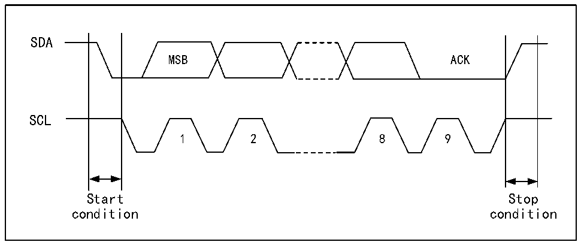

<!-- source-page: 247 -->

[← p.246](0246.md) · [index](../README.md) · [PDF p.247](https://ch32-riscv-ug.github.io/CH32X315/datasheet_en/CH32X315RM.PDF#page=247) · [p.248 →](0248.md)

<!-- header: CH32X315/X305 Reference Manual https://wch-ic.com -->

# Chapter 16 Inter-integrated Circuit (I2C) Interface

The internal integrated circuit bus (I2C) is widely used in the communication between microcontrollers, sensors  
and other off-chip modules. It supports multi-master and multi-slave mode, and can communicate at both 100KHz  
(standard) and 400KHz (fast) speeds using only 2 wires (SDA and SCL).  

## 16.1 Main Features

● Master mode and slave mode  
● 7-bit or 10-bit address  
● Slave device supports dual 7-bit address.  
● Two speed modes: 100KHz and 400KHz  
● Multiple status modes, multiple error flags  
● Optional clock stretching  
● 2 interrupt vectors  
● DMA capability  
● Support PEC  

## 16.2 Overview

I2C is a half-duplex bus, which can only run in one of the following 4 modes: master device sending mode, master  
device receiving mode, slave device sending mode and slave device receiving mode. The I2C module works in  
slave mode by default. After generating the starting condition, it will automatically switch to the master mode.  
When the arbitration is lost or a stop signal is generated, it will switch to the slave mode. The I2C module  
supports multi-host functions. When working in main mode, the I2C module will actively send out data and  
addresses. Data and addresses are transmitted in 8-bit units, with the high bit in front and the low bit in the back.  
After the start event is 1-byte (7-bit address mode) or 2-byte (10-bit address mode) address. Every time the host  
sends 8-bit data or address, the slave needs to reply a reply ACK, that is, pull down the SDA bus, as shown in  
figure 16-1.  

Figure 16-1 I2C timing diagram  
 <!-- rendered from the PDF; verify at https://ch32-riscv-ug.github.io/CH32X315/datasheet_en/CH32X315RM.PDF#page=247 -->

🖼 Text parsed from the figure above

SDA  
MSB ACK  
SCL  
1 2 8 9  
Start Stop  
condition condition  

<!-- image: p247-draw-image-00001 bbox=[515.76, 783.48, 535.2, 793.8] -->
<!-- footer: V1.1 245 -->
