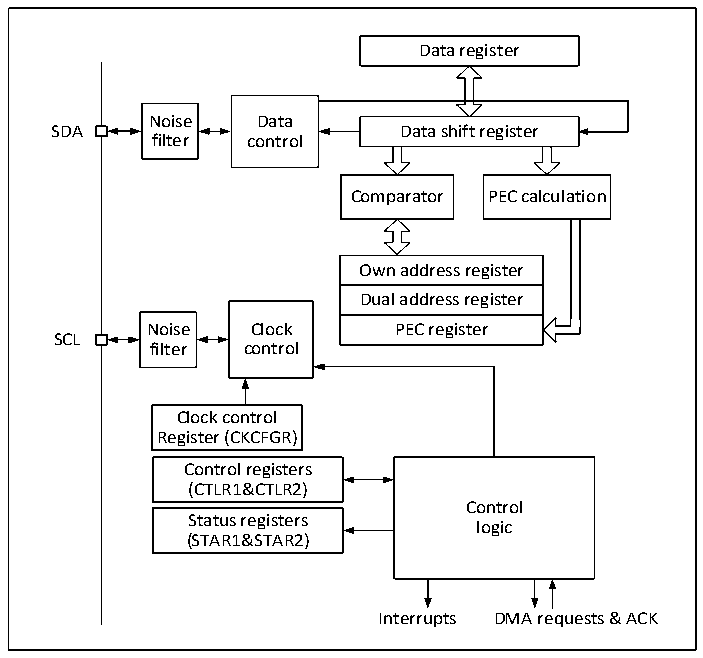

<!-- source-page: 248 -->

[← p.247](0247.md) · [index](../README.md) · [PDF p.248](https://ch32-riscv-ug.github.io/CH32X315/datasheet_en/CH32X315RM.PDF#page=248) · [p.249 →](0249.md)

<!-- header: CH32X315/X305 Reference Manual https://wch-ic.com -->
For normal use, the correct clock must be input to I2C. In the standard mode, the minimum input clock is 2MHz,  
while the minimum input clock is 4MHz in the fast mode.  
Figure 16-2 shows the block diagram of I2C.  

Figure 16-2 I2C block diagram  
 <!-- rendered from the PDF; verify at https://ch32-riscv-ug.github.io/CH32X315/datasheet_en/CH32X315RM.PDF#page=248 -->

🖼 Text parsed from the figure above

Data register  
Noise Data  
SDA Data shift register  
filter control  
Comparator PEC calculation  
Own address register  Dual address register  PEC register  
Noise Clock PEC register  
SCL  
filter control  
Clock control  
Register (CKCFGR)  
Control registers (CTLR1&amp;CTLR2)  Status registers (STAR1&amp;STAR2)  
Control  
logic  
Interrupts DMA requests &amp; ACK  

## 16.3 Master Mode

In master mode, the I2C module leads the data transmission and outputs the clock signal. The data transfer starts  
with a Start event and ends with a Stop event. The following is the required operations in master mode:  
Set the correct clock in the control register 2 (R16_I2Cx_CTLR2) and the clock control register  
(R16_I2Cx_CKCFGR).  
Set the PE bit in R16_I2Cx_CTLR1 to start the peripheral.  
Set the START bit in the control register (R16_I2Cx_CTLR1) to generate a start event. After the START bit is set,  
the I2C module automatically switches to master mode, the MSL bit is set, and a Start event is generated. After the  
start event is generated, the SB bit is set. If the ITEVTEN bit (in R16_I2Cx_CTLR2) is set, an interrupt is  
generated. In this case, it is needed to read the R16_I2Cx_STAR1 register. After the slave address is written to the  
data register, the SB bit is automatically cleared.  
If the 10-bit address mode is enabled, then write the data register to send the header sequence (the header  
sequence is 11110xx0b, of which the xx bits are the highest 2 bits of the 10-bit address).  
After the header sequence is transmitted, the ADD10 bit in the status register is set. If the ITEVTEN bit is already  
set, an interrupt will be generated. At this time, read the R16_I2Cx_STAR1 register and write the second address  
byte to the data register. Then, clear the ADD10 bit.  
<!-- image: p248-draw-image-00001 bbox=[515.76, 783.48, 535.2, 793.8] -->
<!-- footer: V1.1 246 -->
