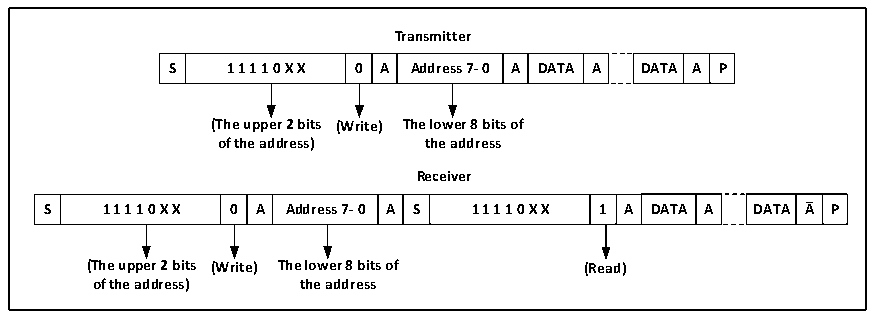

<!-- source-page: 249 -->

[← p.248](0248.md) · [index](../README.md) · [PDF p.249](https://ch32-riscv-ug.github.io/CH32X315/datasheet_en/CH32X315RM.PDF#page=249) · [p.250 →](0250.md)

<!-- header: CH32X315/X305 Reference Manual https://wch-ic.com -->
Then, write the data register to send the second address byte. After sending the second address byte, the ADDR bit  
in the status register is set. If the ITEVTEN bit has been set, an interrupt will be generated. Read the  
R16_I2Cx_STAR2 register at this time and then read R16_I2Cx_STAR1 register again to clear the ADDR bit;  
If the 7-bit address mode is enabled, the write data register transmit the address byte. After the address byte is sent,  
the ADDR bit in the status register is set. If the ITEVTEN bit has been set, an interrupt will be generated. Read  
the R16_I2Cx_STAR1 register and then read the R16_I2Cx_STAR2 register again to clear the ADDR bit.  
In the 7-bit address mode, the first byte sent is the address byte, the first 7 bits represent the address of the target  
slave device, the 8th bit determines the direction of the subsequent message, and &#x27;0&#x27; means the master device  
writes data to the slave device, &#x27;1&#x27; means that the master device reads information from the slave device.  
In the 10-bit address mode, as shown in Figure 16-3, the first byte is 11110xx0, xx are the highest 2 bits of the  
10-bit address, and the second byte is the lower 8 bits of the 10-bit address in the address transmission phase. If  
you subsequently enter the master transmitter mode, send data continuously. If the device enters the master  
receiver mode subsequently, a start event needs to be re-sent, and a byte of 11110xx1 will be sent together. Then,  
enter the master receiver mode.  

Figure 16-3 Master receive/transmits data in 10-bit address mode  
 <!-- rendered from the PDF; verify at https://ch32-riscv-ug.github.io/CH32X315/datasheet_en/CH32X315RM.PDF#page=249 -->

🖼 Text parsed from the figure above

<strong>Transmitter</strong>  
S  1 1 1 1 0 X X  0  A  Address 7- 0  A  DATA  A  DATA  A  P  
<strong>(The upper 2 bits (Write) The lower 8 bits of</strong>  
<strong>of the address) the address</strong>  
<strong>Receiver</strong>  
S  1 1 1 1 0 X X  0  A  Address 7- 0  A  S  1 1 1 1 0 X X  1  A  DATA  A  DATA  A  P  
<strong>(The upper 2 bits (Write) The lower 8 bits of (Read)</strong>  
<strong>of the address) the address</strong>  

When transmitting mode, the shift register inside the main device transmits data from the data register to the SDA  
line. When the main device receives the ACK, the TxE of the status register 1 (R16_I2Cx_STAR1) is set, and an  
interrupt occurs if the ITEVTEN and ITBUFEN are set. Writing data to the data register clears the TxE bit. If the  
TxE bit is set and no new data is written to the data register before the last data is sent, then the BTF bit will be set,  
the SCL will remain low until it is cleared, and after reading the R16_I2Cx_STAR1, writing data to the data  
register will clear the BTF bit.  
In the receiving mode, the I2C module receives data from the SDA line and writes it into the data register through  
the shift register. After each byte, if the ACK bit is set, the I2C module will issue a low level of reply, while the  
RxNe bit will be set, and if ITEVTEN and ITBUFEN are set, there will be an interruption. If the RxNE is set and  
the original data is not read before the new data is received, the BTF bit will be set, the SCL will remain low  
before clearing the BTF, and reading the R16_I2Cx_STAR1 and then reading the data register will clear the BTF  
bit.  
When the master device ends sending data, it will actively send an end event, that is, setting the STOP bit. In the  
receive mode, the master device needs to NAK at the answer location of the last data bit. Note that after the NAK  
is generated, the I2C module will switch to slave mode.  
<!-- image: p249-draw-image-00001 bbox=[515.76, 783.48, 535.2, 793.8] -->
<!-- footer: V1.1 247 -->
