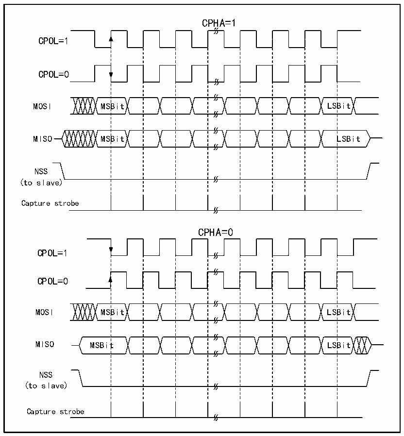

<!-- source-page: 264 -->

[← p.263](0263.md) · [index](../README.md) · [PDF p.264](https://ch32-riscv-ug.github.io/CH32X315/datasheet_en/CH32X315RM.PDF#page=264) · [p.265 →](0265.md)

<!-- header: CH32X315/X305 Reference Manual https://wch-ic.com -->

Figure 17-2 SPI mode  
 <!-- rendered from the PDF; verify at https://ch32-riscv-ug.github.io/CH32X315/datasheet_en/CH32X315RM.PDF#page=264 -->

🖼 Text parsed from the figure above

CPHA=1  
CPOL=1  
CPOL=0  
MOSI MSBit LSBit  
MISO MSBit LSBit  
NSS  
(to slave)  
Capture strobe  
CPHA=0  
CPOL=1  
CPOL=0  
MOSI MSBit LSBit  
MISO MSBit LSBit  
NSS  
(to slave)  
Capture strobe  

The host and device need to be set to the same SPI mode, and the SPE bit needs to be cleared before configuring  
SPI mode. The DEF bit can determine whether the single data length of the SP is 8 or 16 bits. LSBFIRST can  
control whether a single data word is high or low.  

### 17.2.2 Master Mode

When the SPI module works in master mode, the serial clock is generated by SCK. To configure into master mode  
do the following steps:  
Configure the BR[2:0] bits in the control register to determine the clock;  
Configure the CPOL and CPHA bits to determine the SPI mode;  
Configure DEF to determine the data word length;  
Configure LSBFIRST to determine the frame format;  
Configure the NSS pin, such as setting the SSOE bit to let the hardware reset NSS. You can also set the SSM bit  
and set the SSI bit high;  
To set the MSTR bit and the SPE bit, it is necessary to ensure that NSS is already high at this time.  
<!-- image: p264-draw-image-00001 bbox=[515.76, 783.48, 535.2, 793.8] -->
<!-- footer: V1.1 262 -->
