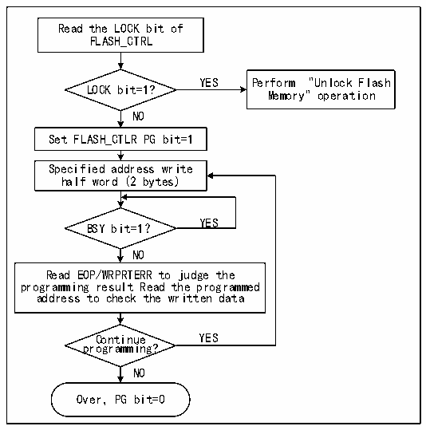

<!-- source-page: 357 -->

[← p.356](0356.md) · [index](../README.md) · [PDF p.357](https://ch32-riscv-ug.github.io/CH32X315/datasheet_en/CH32X315RM.PDF#page=357) · [p.358 →](0358.md)

<!-- header: CH32X315/X305 Reference Manual https://wch-ic.com -->

Figure 23-1 FLASH program  
 <!-- rendered from the PDF; verify at https://ch32-riscv-ug.github.io/CH32X315/datasheet_en/CH32X315RM.PDF#page=357 -->

🖼 Text parsed from the figure above

Read the LOCK bit of  
FLASH_CTRL  
YES Perform &quot;Unlock Flash  
LOCK bit=1?  
Memory&quot; operation  
NO  
Set FLASH_CTLR PG bit=1  
Specified address write  
half word (2 bytes)  
YES  
BSY bit=1？  
NO  
Read EOP/WRPRTERR to judge the  
programming result Read the programmed  
address to check the written data  
Continue YES  
programming?  
NO  
Over，PG bit=0  

1) Check the LOCK bit in the FLASH_CTLR register. If it is 1, you need to perform the &quot;Release Flash Memory  
Lock&quot; operation.  
2) Set the PEG bit in the FLASH_CTLR register to ‘1’ to enable the standard page erasure mode.  
3) Write the half-word to be programmed to the specified flash memory address (even address).  
4) Wait for the BSY bit to become ‘0’ or for the EOP bit in the R32_FLASH_STATR register to become ‘1’,  
indicating programming completion. Then clear the EOP bit to ‘0’.  
5) Check the R32_FLASH_STATR register for errors, or read the programmed address data for verification.  
6) To continue programming, repeat steps 3-5. To end programming, clear the PG bit.  

### 23.5.4 Main Memory Standard Erase

Flash memory can be erased by sectors (4K bytes) or in its entirety.  
<!-- image: p357-draw-image-00001 bbox=[515.76, 783.48, 535.2, 793.8] -->
<!-- footer: V1.1 355 -->
