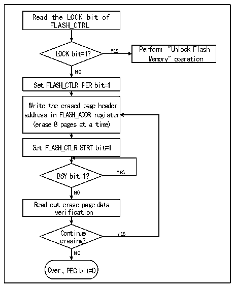

<!-- source-page: 358 -->

[← p.357](0357.md) · [index](../README.md) · [PDF p.358](https://ch32-riscv-ug.github.io/CH32X315/datasheet_en/CH32X315RM.PDF#page=358) · [p.359 →](0359.md)

<!-- header: CH32X315/X305 Reference Manual https://wch-ic.com -->

Figure 23-2 FLASH page erasure  
 <!-- rendered from the PDF; verify at https://ch32-riscv-ug.github.io/CH32X315/datasheet_en/CH32X315RM.PDF#page=358 -->

🖼 Text parsed from the figure above

Read the LOCK bit of  
FLASH_CTRL  
LOCK bit=1? YES Perform &quot;Unlock Flash  
Memory&quot; operation  
NO  
Set FLASH_CTLR PER bit=1  
Write the erased page header  
address in FLASH_ADDR register  
(erase 8 pages at a time)  
Set FLASH_CTLR STRT bit=1  
BSY bit=1？ YES  
NO  
Read out erase page data  
verification  
Continue YES  
erasing?  
NO  
Over，PEG bit=0  

1) Check the LOCK bit in the FLASH_CTLR register. If it is 1, you need to perform the &quot;Release Flash Memory  
Lock&quot; operation.  
2) Set the PEG bit in the FLASH_CTLR register to ‘1’ to enable the sector erasure mode.  
3) Write the page heading address of the page to be erased to the FLASH_ADDR register.  
4) Set the STAT bit in the FLASH_CTLR register to ‘1’ to start an erase action.  
5) When the BYS bit changes to &#x27;0&#x27; or the EOP bit in the FLASH_STATR register to be &#x27;1&#x27;, it indicates the end of  
erasure. Clear the EOP bit to 0.  
6) Read the page of erasure page for verification.  
7) To erase the sector continuously, you can repeat steps 3-5 to end erasing and clear the PEG bit to 0.  
<em>Note: After successful erasure, words read -0xe339e339, half words read -0xe339, even address bytes read -0x39,</em>  
<em>and odd addresses read 0xe3.</em>  
<!-- image: p358-draw-image-00001 bbox=[515.76, 783.48, 535.2, 793.8] -->
<!-- footer: V1.1 356 -->
