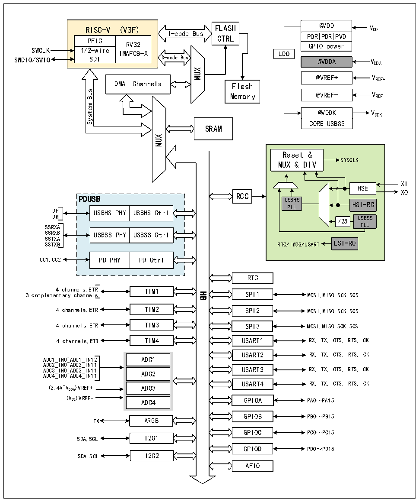

<!-- source-page: 3 -->

[← p.2](0002.md) · [index](../README.md) · [PDF p.3](https://ch32-riscv-ug.github.io/CH32X315/datasheet_zh/CH32X315RM.PDF#page=3) · [p.4 →](0004.md)

<!-- header: CH32X315、X305应用手册 https://wch.cn -->

# 第 1 章 存储器和总线架构

## 1.1 总线架构

该系列芯片是基于青稞RISC-V3F内核设计的工业级通用微控制器，其架构中的内核、仲裁单元、  
DMA模块、SRAM存储等部分通过多组总线实现交互。其系统框图见图1-1-1和图1-1-2。  

图1-1-1 CH32X315系统框图  
 <!-- rendered from the PDF; verify at https://ch32-riscv-ug.github.io/CH32X315/datasheet_zh/CH32X315RM.PDF#page=3 -->

🖼 Text parsed from the figure above

@VDD V DD  
RISC-V (V3F) FLASH  
RISC-V (V3F) PFICRV321/2-wire IMAFCB-XSDI  1/2-wire SDI  
POR PDR PVD  GPIO power  
I-code Bus  
CTRL  
SWCLK  
LDO  
SWDIO/SWIO  
@VDDA V DDA  
MUX  
@VREF+ V REF+  
DMA Channels  
Flash  
Bus  
@VREF- V REF-  
Memory  
System  
@VDDK  CORE  USBSS  
SRAM  
<!-- image: p3-draw-image-00002 inside the figure -->
MUX  
Reset &amp;  
SYSCLK  
MUX &amp; DIV  
HSE  
XI  
XO  
RCC  
PDUSB USBHS  
HSI-RC  
PLL  
USBHS PHY  USBHS Ctrl  
/25  USBSSPLL  
DM USBSS  
SSRXA PLL  
USBSS PHY  USBSS Ctrl  
SSTXA  
SSTXB RTC/IWDG/USART LSI-RC  
PD PHY  PD Ctrl  
RTC  
4 channels,ETR TIM1  
3 complementary channelsHB SPI1  
MOSI,MISO,SCK,SCS  
4 channels,ETR TIM2 SPI2 MOSI,MISO,SCK,SCS  
4 channels,ETR TIM3 SPI3 MOSI,MISO,SCK,SCS  
4 channels,ETR TIM4 USART1 RX, TX, CTS, RTS, CK  
USART2 RX, TX, CTS, RTS, CK  
ADC1_IN0~ADC1_IN12 ADC1  
ADC2_IN0~ADC2_IN11  
ADC3_IN0~ADC3_IN11 USART3 RX, TX, CTS, RTS, CK  
ADC4_IN0~ADC4_IN11 ADC2  
USART4 RX, TX, CTS, RTS, CK  
(2.4V~VDDA)VREF+ ADC3  
(VSS)VREF- ADC4  
GPIOA PA0～PA15  
GPIOB  
PB0～PB15  
TX ARGB  
GPIOC PC0～PC15  
SDA,SCL I2C1  
GPIOD PD0～PD15  
SDA,SCL I2C2  
AFIO  

<!-- image: p3-draw-image-00001 bbox=[507.84, 786.36, 527.28, 796.68] -->
<!-- footer: V1.2 1 -->
