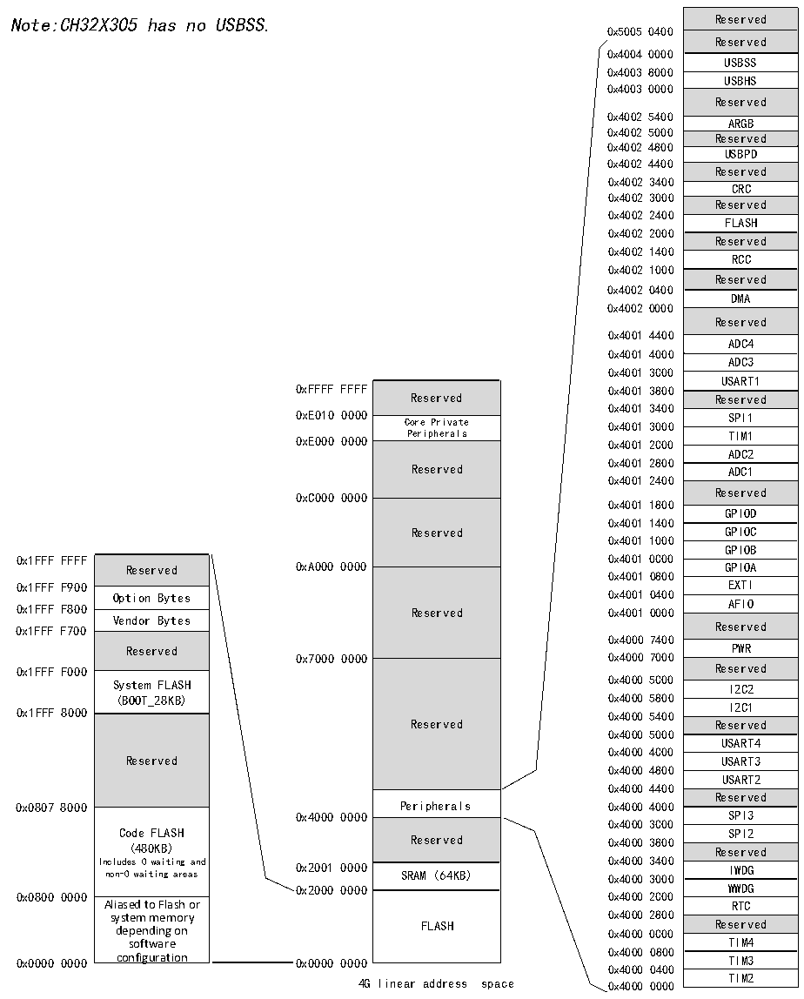

<!-- source-page: 5 -->

[← p.4](0004.md) · [index](../README.md) · [PDF p.5](https://ch32-riscv-ug.github.io/CH32X315/datasheet_zh/CH32X315RM.PDF#page=5) · [p.6 →](0006.md)

<!-- header: CH32X315、X305应用手册 https://wch.cn -->

## 1.2 存储器映像

该芯片包含了程序存储器、数据存储器、内核寄存器和外设寄存器等等，它们都在一个4GB的  
线性空间寻址。  
系统存储以小端格式存放数据，即低字节存放在低地址，高字节存放在高地址。  

图1-2 存储映像  
 <!-- rendered from the PDF; verify at https://ch32-riscv-ug.github.io/CH32X315/datasheet_zh/CH32X315RM.PDF#page=5 -->

🖼 Text parsed from the figure above

Reserved  Reserved  USBSS  USBHS  Reserved  ARGB  Reserved  USBPD  Reserved  CRC  Reserved  FLASH  Reserved  RCC  Reserved  DMA  Reserved  ADC4ADC3  USART1  Reserved  SPI1  TIM1  TAIDMC12  ADC1  Reserved  GPIOD  GPIOC  GPIOB  GGPPIIOOAB  EXTI  AFIO  Reserved  PWR  Reserved  I2C2  I2C1  Reserved  USART4  USART3  USART2  Reserved  SPI3  SPI2  Reserved  IWDG  WWDG  RTC  Reserved  TIM4  TIM3  TIM2  
Note:CH32X305 has no USBSS.0x50050400 Reserved  
0x4004 0000  
0x4003 8000  
0x4003 0000  
0x4002 5400  
0x4002 5000  
0x4002 4800  
0x4002 4400  
0x4002 3400  
0x4002 3000  
0x4002 2400  
0x4002 2000  
0x4002 1400  
0x4002 1000  
0x4002 0400  
0x4002 0000  
0x4001 4400  
0x4001 4000  
0x4001 3C00  
Reserved  Core Private Peripherals  Reserved  Reserved  Reserved  Reserved  Peripherals  Reserved  SRAM (64KB)  FLASH  
Reserved Reserved  
0x4001 3400  
0xE010 0000 SPI1  
Core Private 0x4001 3000  
0xE000 0000 Peripherals 0x4001 2C00 TIM1  
ADC2  
0x4001 2800  
Reserved ADC1  
0x4001 2400  
0xC000 0000 Reserved  
0x4001 1800  
0x4001 1400  
Reserved GPIOC  
0x4001 1000  
0x1FFF FFFF 0x4001 0C00  
Reserved  Option Bytes  Vendor Bytes  Reserved  System FLASH (BOOT_28KB)  Reserved  Code FLASH (480KB) Includes 0 waiting and non-0 waiting areas  Aliased to Flash or system memory depending on software configuration  
0x4001 0800  
0x4000 7400  
0x1FFF 8000 0x4000 5400  
Reserved Reserved  
0x4000 5000  
0x4000 4C00  
0x4000 4800  
0x4000 4400  
0x0807 8000 Peripherals 0x4000 4000  
0x4000 0000 SPI3  
0x4000 3C00  
0x2000 0000 WWDG  
0x0800 0000 0x4000 2C00  
0x4000 0800  
0x4000 0400  
4G linear address space 0x4000 0000 TIM2  

### 1.2.1 存储器分配

内置64K字节SRAM区，用于存放数据，掉电后数据丢失。  

# 内置480K字节程序闪存存储区（Code FLASH），即用户区，用于用户的应用程序和常量数据存

<!-- image: p5-draw-image-00001 bbox=[507.84, 786.36, 527.28, 796.68] -->
<!-- footer: V1.2 3 -->
