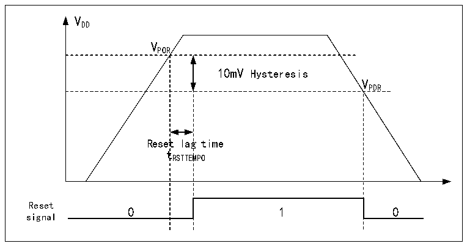

<!-- source-page: 7 -->

[← p.6](0006.md) · [index](../README.md) · [PDF p.7](https://ch32-riscv-ug.github.io/CH32X315/datasheet_zh/CH32X315RM.PDF#page=7) · [p.8 →](0008.md)

<!-- header: CH32X315、X305应用手册 https://wch.cn -->

# 第 2 章 电源控制（PWR）

## 2.1 概述

系统工作电压VDD 范围为2.8～3.6V，为I/O引脚、系统电压调节器LDO及内置的USB 2.0 PHY  
供电。正常工作时，VDD 通过向内置的系统电压调节器LDO供电，在VDDK 引脚上输出稳压电源。  
VDDK 为内核电路以及内置的USB 3.0 PHY供电。  
VDDA 为高频RC振荡器、ADC及PLL的模拟部分供电。VDDA 电压必须和VDD 电压相同。  
VREF+ 和VREF- 分别作为ADC的正、负参考电压，且VREF+ 不得高于VDDA 电压。  

## 2.2 电源管理

2.2.1上电复位和掉电复位  
系统内部集成了上电复位POR和掉电复位PDR电路，当芯片供电电压VDD 低于对应门限电压时，  
系统被相关电路复位，无需外置额外的复位电路。上电门限电压VPOR 和掉电门限电压VPDR 的参数请参  
考对应的数据手册。  

图2-1 POR和PDR的工作示意图  
 <!-- rendered from the PDF; verify at https://ch32-riscv-ug.github.io/CH32X315/datasheet_zh/CH32X315RM.PDF#page=7 -->

🖼 Text parsed from the figure above

VDD  
VPOR  
10mV Hysteresis  Reset  lag t RSTTEM  g time MPO  
VPDR  
tRSTTEMPO  
Reset  
signal  

### 2.2.2 可编程电压监测器

可编程电压监测器 PVD，主要被用于监控系统主电源的变化，与电源控制寄存器 PWR_CTLR 的  
PLS[1:0]所设置的门槛电压相比较，可产生状态标志，以便及时通知系统进行数据保存等掉电前操  
作。  
具体配置如下：  
1） 设置PWR_CTLR寄存器的PLS[1:0]域，选择要监控电压阈值。  
2） 设置PWR_CTLR寄存器的PVDE位来开启PVD功能。  
3） 读取PWR_CSR状态寄存器的PVDO位可获取当前系统主电源与PLS[1:0]设置阈值关系，执行相应  
软处理。当VDD 电压高于PLS[1:0]设置阈值，PVDO位置0；当VDD 电压低于PLS[1:0]设置阈值，  
PVDO位置1。  
<!-- image: p7-draw-image-00001 bbox=[507.84, 786.36, 527.28, 796.68] -->
<!-- footer: V1.2 5 -->
