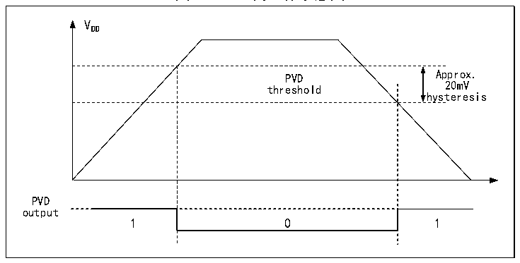

<!-- source-page: 8 -->

[← p.7](0007.md) · [index](../README.md) · [PDF p.8](https://ch32-riscv-ug.github.io/CH32X315/datasheet_zh/CH32X315RM.PDF#page=8) · [p.9 →](0009.md)

<!-- header: CH32X315、X305应用手册 https://wch.cn -->

图2-2 PVD的工作示意图  
 <!-- rendered from the PDF; verify at https://ch32-riscv-ug.github.io/CH32X315/datasheet_zh/CH32X315RM.PDF#page=8 -->

🖼 Text parsed from the figure above

VDD  
PVD threshold  0  
hysteresis  
PVD  
output  

## 2.3 低功耗模式

在系统复位后，微控制器处于正常工作状态（运行模式），此时可以通过降低系统主频或者关  
闭不用外设时钟或者降低工作外设时钟来节省系统功耗。如果系统不需要工作，可设置系统进入低  
功耗模式，并通过特定事件让系统跳出此状态。  
微控制器目前提供了2种低功耗模式，从处理器、外设、电压调节器等的工作差异上分为：  
● 睡眠模式：内核停止运行，所有外设（包含内核私有外设）仍在运行。  
● 停止模式：停止所有时钟，唤醒后系统继续运行。  

<!-- p8-table-002 (table-2-1@1) -->
<table><caption>表2-1 低功耗模式一览</caption><tr><th>模式</th><th>进入</th><th>唤醒源</th><th>对时钟的影响</th><th>电压调节器</th></tr><tr><td rowspan="2">睡眠</td><td>WFI</td><td>任意中断唤醒</td><td rowspan="2" style="text-align:left">内核时钟关闭，其他时钟无影响</td><td rowspan="2">正常</td></tr><tr><td>WFE</td><td>唤醒事件唤醒</td></tr><tr><td>停止</td><td style="text-align:left">SLEEPDEEP置1WFI或WFE</td><td style="text-align:left">任意外部中断/事件（EXTI信号）、NRST上的外部复位信号、IWDG复位，其中EXTI信号包括64个外部I/O口之一、 PVD的输出、RTC闹钟、USBPD的唤醒信号、USART的唤醒信号或USB的唤醒信号。</td><td style="text-align:left">关闭HSE、HSI、 PLL和外设时钟。</td><td style="text-align:left">正常：LPDS=0或低功耗：LPDS=1</td></tr></table>

### 2.3.1 低功耗配置选项

● WFI和WFE方式  
WFI：微控制器被具有中断控制器响应的中断源唤醒，系统唤醒后，将最先执行中断服务函数（微  
控制器复位除外）。  
WFE：唤醒事件触发微控制器将退出低功耗模式。唤醒事件包括：  
1） 配置一个外部或内部的EXTI线为事件模式，此时无需配置中断控制器；  
2） 中断响应和中断退出标记作为事件，保持在中断控制器中；  
3） 或者配置SEVONPEND位，开启外设中断使能，但不开启中断控制器中的中断使能，系统唤醒后  
需要清除中断挂起位。  
4） 调试器的调试请求。  
● SLEEPONEXIT  
启用：执行WFI或WFE指令后，微控制器确保所有待处理的中断服务退出后进入低功耗模式。  
不启用：执行WFI或WFE指令后，微控制器立即进入低功耗模式。  
● SEVONPEND  
<!-- image: p8-draw-image-00001 bbox=[507.84, 786.36, 527.28, 796.68] -->
<!-- footer: V1.2 6 -->
