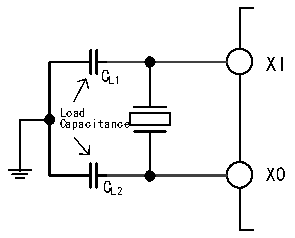
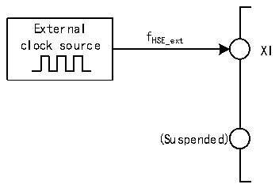

<!-- source-page: 14 -->

[← p.13](0013.md) · [index](../README.md) · [PDF p.14](https://ch32-riscv-ug.github.io/CH32X315/datasheet_zh/CH32X315RM.PDF#page=14) · [p.15 →](0015.md)

<!-- header: CH32X315、X305应用手册 https://wch.cn -->
置1（建议不要关闭）。如果设置了RCC_INTR寄存器的HSIRDYIE位，将产生相应中断。  
注：如果HSE晶体振荡器失效，HSI时钟会被作为备用时钟源（时钟安全系统）。  
HSE是外部的高速时钟信号，包括外部晶体/陶瓷谐振器产生或者外部高速时钟送入。  
● 外部晶体/陶瓷谐振器（HSE晶体）：外接外部振荡器为系统提供更为精确的时钟源。进一步信  
息可参考数据手册的电气特性部分。HSE晶体可以通过设置RCC_CTLR寄存器中的HSEON位被启  
动和关闭，HSERDY位指示HSE晶体振荡是否稳定，硬件在HSERDY位置1后才将时钟送入系统。  
如果设置了RCC_INTR寄存器的HSERDYIE位，将产生相应中断。  

图3-3 高速外部晶体电路  
 <!-- rendered from the PDF; verify at https://ch32-riscv-ug.github.io/CH32X315/datasheet_zh/CH32X315RM.PDF#page=14 -->

🖼 Text parsed from the figure above

XI  
CL1  
Load  
Capacitance  
XO  
CL2  

注：负载电容需要尽可能地靠近振荡器引脚，并根据晶体厂家参数选择容值。  
● 外部高速时钟源（HSE旁路）：此模式从外部直接送入时钟源到XI引脚，XO引脚悬空。最高支  
持25MHz频率。应用程序需在HSEON位为0情况下，置位HSEBYP位，打开HSE旁路功能，然后  
再置位HSEON位。  

图3-4 高速时钟源电路  
 <!-- rendered from the PDF; verify at https://ch32-riscv-ug.github.io/CH32X315/datasheet_zh/CH32X315RM.PDF#page=14 -->

🖼 Text parsed from the figure above

External  
f  
clock source HSE_ext  
XI  
(Suspended)  

### 3.3.3 低速时钟（LSI）

LSI是系统内部的RC振荡器产生的低速时钟信号。它可以在停止模式下保持运行，为RTC时钟、  
独立看门狗和唤醒单元提供时钟基准。进一步信息可参考数据手册的电气特性部分。LSI 可以通过  
设置RCC_RSTSCKR寄存器中的LSION位被启动和关闭，然后通过查询LSIRDY位检测LSI RC振荡是  
否稳定，硬件在LSIRDY位置1后才将时钟送入。如果设置了RCC_INTR寄存器的LSIRDYIE位，将产  
生相应中断。  

### 3.3.4 PLL时钟

通过配置RCC_CFGR0寄存器，内部PLL时钟可以选择5种时钟来源和倍频系数，这些设置必须  
在每个PLL被开启前完成，一旦PLL被启动，这些参数就不能被改动。  
设置RCC_CTLR寄存器中的USBHS_PLLON位被启动和关闭，USBHS_PLLRDY位指示USBHS_PLL时  
钟是否稳定，硬件在 USBHS_PLLRDY 位置 1 后才将时钟送入系统。设置 RCC_CFGR2 寄存器中的  
USBHSPLLRDYCFG位配置时钟稳定时间。  
设置RCC_CTLR寄存器中的USBSS_PLLON位被启动和关闭，USBSS_PLLRDY位指示USBSS_PLL时  
钟是否稳定，硬件在 USBSS_PLLRDY 位置 1 后才将时钟送入系统。设置 RCC_CFGR2 寄存器中的  
USBSSPLLRDYCFG位配置时钟稳定时间。  
<!-- image: p14-draw-image-00001 bbox=[507.84, 786.36, 527.28, 796.68] -->
<!-- footer: V1.2 12 -->
