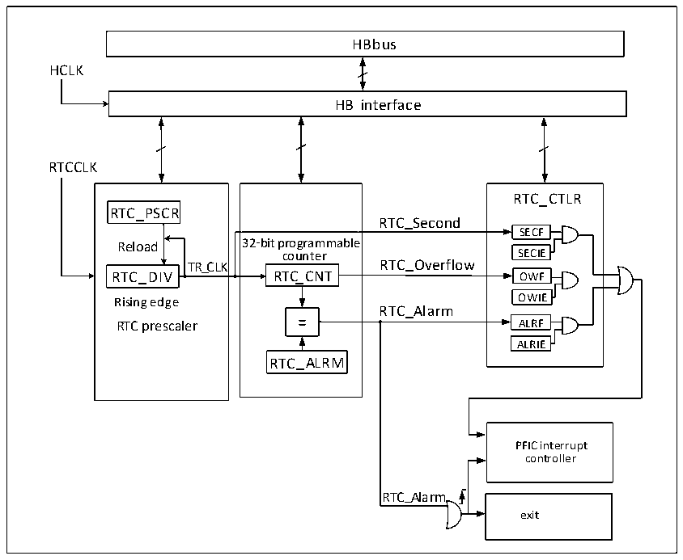

<!-- source-page: 38 -->

[← p.37](0037.md) · [index](../README.md) · [PDF p.38](https://ch32-riscv-ug.github.io/CH32X315/datasheet_zh/CH32X315RM.PDF#page=38) · [p.39 →](0039.md)

<!-- header: CH32X315、X305应用手册 https://wch.cn -->

# 第 6 章 实时时钟（RTC）

实时时钟（RTC）是一个独立的定时器模块，其可编程计数器最大可达到32位，配合软件即可  
以实现实时时钟功能，并且可以修改计数器的值来重新配置系统的当前时间和日期。  

## 6.1 主要特征

● 最高为220的预分频系数  
● 32位可编程计数器  
● 多种时钟源，中断  
● 独立复位  

## 6.2 功能描述

### 6.2.1 概述

图6-1 RTC结构框图  
 <!-- rendered from the PDF; verify at https://ch32-riscv-ug.github.io/CH32X315/datasheet_zh/CH32X315RM.PDF#page=38 -->

🖼 Text parsed from the figure above

HBbus  
HCLK  
HB interface  
RTCCLK  
-  32-bit programmable counter RTC_CNTRTC_ALRM  
RTC_CTLR  
RTC_PSCR  
RTC_Second  
SECF  
counter SECIE  
Rising edge OWIE  
RTC_Alarm  
ALRIE  
PFIC interrupt  
controller  
RTC_Alarm  
exit  

由图6-1所示，RTC模块主要是HB总线接口、分频器和计数器、控制和状态寄存器三部分组成。  
RTCCK输入分频器（RTC_DIV）之后，被分频成TR_CLK。值得注意的是，分频器（RTC_DIV）的内部  
是一个自减计数器，自减到溢出就会输出一个TR_CLK，然后从重装值寄存器（RTC_PSCR）里取出预  
设值重装到分频器里，读分频器实际上是读取它的实时值（read only），写分频系数应该写到重装  
值寄存器（RTC_PSCR）里。一般 TR_CLK的周期被设置为 1 秒，TR_CLK 会触发秒事件，同时会使主  
计数器（RTC_CNT）自增1；当主计数器增加到和闹钟寄存器的值一致时，会触发闹钟事件；当主计  
数器自增到溢出时，会触发溢出事件。以上三种事件都可以触发中断，并对应相应中断使能位控制。  
<!-- image: p38-draw-image-00001 bbox=[507.84, 786.36, 527.28, 796.68] -->
<!-- footer: V1.2 36 -->
