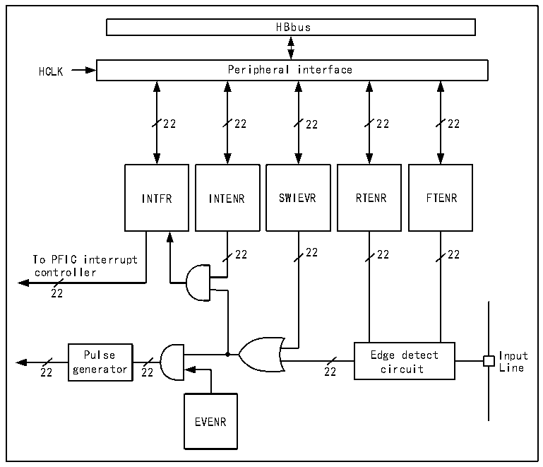

<!-- source-page: 53 -->

[← p.52](0052.md) · [index](../README.md) · [PDF p.53](https://ch32-riscv-ug.github.io/CH32X315/datasheet_zh/CH32X315RM.PDF#page=53) · [p.54 →](0054.md)

<!-- header: CH32X315、X305应用手册 https://wch.cn -->

## 9.4 外部中断和事件控制器（EXTI）

### 9.4.1 概述

图9-1 外部中断(EXTI)接口框图  
 <!-- rendered from the PDF; verify at https://ch32-riscv-ug.github.io/CH32X315/datasheet_zh/CH32X315RM.PDF#page=53 -->

🖼 Text parsed from the figure above

HBbus  
HCLK Peripheral interface  
22 22 22 22 22  
INTFR INTENR SWIEVR RTENR FTENR  
22 22 22 22  
To PFIC interrupt  
controller  
22  
Pulse Edge detect Input  
22 generator 22 22 circuit Line  
EVENR  

由图9-1可以看出，外部中断的触发源既可以是软件中断（SWIEVR）也可以是实际的外部中断  
通道，外部中断通道的信号会先经过边沿检测电路（edge detect circuit）的筛选。只要产生软件  
中断或外部中断信号其一，就会通过图中的或门电路输出给事件使能和中断使能两个与门电路，只  
要有中断被使能或事件被使能，就会产生中断或事件。EXTI 的六个寄存器由处理器通过 HB 接口访  
问。  

### 9.4.2 唤醒事件说明

系统可以通过唤醒事件来唤醒由WFE指令引起的睡眠模式。唤醒事件通过以下两种配置产生：  
● 在外设的寄存器里使能一个中断，但不在内核的 PFIC 里使能这个中断，同时在内核里使能  
SEVONPEND位。体现在EXTI中，就是使能EXTI中断，但不在PFIC中使能EXTI中断，同时使  
能SEVONPEND位。当CPU从WFE中唤醒后，需要清除EXTI的中断标志位和PFIC挂起位。  
● 使能一个EXTI通道为事件通道，CPU从WFE唤醒后无需清除中断标志位和PFIC挂起位的操作。  

### 9.4.3 说明

使用外部中断需要配置相应外部中断通道，即选择相应触发沿，使能相应中断。当外部中断通  
道上出现了设定的触发沿时，将产生一个中断请求，对应的中断标志位也会被置位。对标志位写 1  
可以清除该标志位。  
使用外部硬件中断步骤：  
1） 配置GPIO操作；  
2） 配置对应的外部中断通道的中断使能位（EXTI_INTENR）；  
3） 配置触发沿（EXTI_RTENR或EXTI_FTENR），选择上升沿触发、下降沿触发或双边沿触发；  
4） 在内核的PFIC中配置EXTI中断，以保证其可以正确响应。  
<!-- image: p53-draw-image-00001 bbox=[507.84, 786.36, 527.28, 796.68] -->
<!-- footer: V1.2 51 -->
