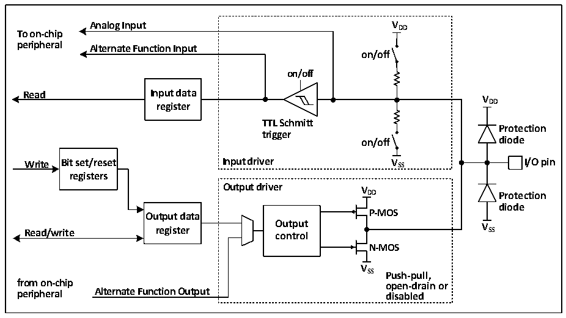

<!-- source-page: 86 -->

[← p.85](0085.md) · [index](../README.md) · [PDF p.86](https://ch32-riscv-ug.github.io/CH32X315/datasheet_zh/CH32X315RM.PDF#page=86) · [p.87 →](0087.md)

<!-- header: CH32X315、X305应用手册 https://wch.cn -->

# 第 10 章 GPIO 及其复用功能（GPIO/AFIO）

芯片内置 4 组 GPIO 端口（PA0～PA15、PB0～PB15、PC0～PC15、PD0～PD15），共 64 个 GPIO  
引脚。每个引脚都可以由软件配置成输出（推挽或开漏）、输入（带或不带上拉或下拉）或复用的  
外设功能端口。  
所有GPIO引脚支持可控上拉和下拉电阻。  
PD4和PD5引脚提供兼容USB PD和Type-C规范的上拉电流，由PD控制器独立控制。PD4/CC1R  
和PD5/CC2R引脚内置Type-C规范定义的可控Rd下拉电阻，作为GPIO推挽输出时建议关闭下拉。  
系统中所有I/O引脚都由VDD 额定3.3V供电，与数字或模拟的复用外设共用，部分引脚耐受5V  
信号输入，通过改变VDD 供电将改变I/O引脚输出电平高值来适配外部通讯接口电平。  

## 10.1 主要特征

端口的每个引脚可以配置成以下的多种模式之一：  
● 浮空输入 ● 开漏输出  
● 上拉输入 ● 推挽输出  
● 下拉输入 ● 复用功能的输入和输出  
● 模拟输入  
许多引脚拥有复用功能，很多其他的外设把自己的输出和输入通道映射到这些引脚上，这些复  
用引脚具体用法需要参照各个外设，而对这些引脚是否复用和是否重映射的内容由本章说明。  

## 10.2 功能描述

### 10.2.1 概述

图10-1 GPIO模块基本结构框图  
 <!-- rendered from the PDF; verify at https://ch32-riscv-ug.github.io/CH32X315/datasheet_zh/CH32X315RM.PDF#page=86 -->

🖼 Text parsed from the figure above

<strong>Analog Input V DD</strong>  
<strong>To on-chip</strong>  
<strong>peripheral Alternate Function Input</strong>  
<strong>on/off</strong>  
<strong>on/off</strong>  
<strong>Read Input data</strong>  
<strong>V</strong>  
<strong>register DD</strong>  
<strong>TTL Schmitt</strong>  
<strong>Protection</strong>  
<strong>trigger</strong>  
<strong>on/off diode</strong>  
<strong>Write Bit set/reset Input driver V SS I/O pin</strong>  
<strong>registers</strong>  
<strong>Output driver V</strong>  
<strong>DD Protection</strong>  
<strong>diode</strong>  
<strong>Output data P-MOS</strong>  
<strong>Read/write register O co u n t t p r u o t l V SS</strong>  
<strong>N-MOS</strong>  
<strong>V</strong>  
<strong>SS Push-pull,</strong>  
<strong>from on-chip open-drain or</strong>  
<strong>peripheral Alternate Function Output disabled</strong>  

如图10-1所示IO口结构，每个引脚在芯片内部都有两只保护二极管，IO口内部可分为输入和  
输出驱动模块。其中输入驱动有弱上下拉电阻可选，可连接到AD等模拟输入的外设；如果输入到数  
字外设，就需要经过一个TTL施密特触发器，再连接到GPIO输入寄存器或其他复用外设。而输出驱  
动有一对MOS管，可通过配置上下的MOS管是否使能来将IO口配置成开漏或推挽输出；输出驱动内  
部也可以配置成由GPIO控制输出还是由复用的其他外设控制输出。  
<!-- image: p86-draw-image-00001 bbox=[507.84, 786.36, 527.28, 796.68] -->
<!-- footer: V1.2 84 -->
