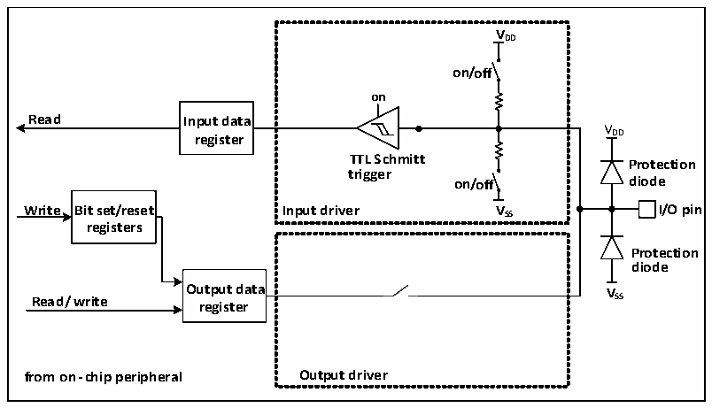
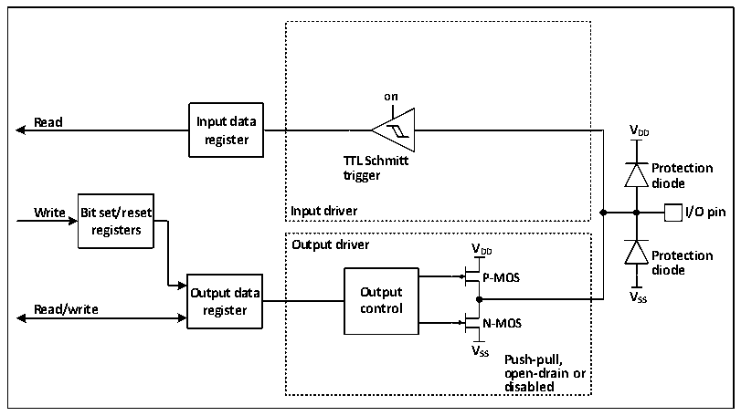

<!-- source-page: 88 -->

[← p.87](0087.md) · [index](../README.md) · [PDF p.88](https://ch32-riscv-ug.github.io/CH32X315/datasheet_zh/CH32X315RM.PDF#page=88) · [p.89 →](0089.md)

<!-- header: CH32X315、X305应用手册 https://wch.cn -->

### 10.2.6 输入配置

图10-2 GPIO模块输入配置结构框图  
 <!-- rendered from the PDF; verify at https://ch32-riscv-ug.github.io/CH32X315/datasheet_zh/CH32X315RM.PDF#page=88 -->

🖼 Text parsed from the figure above

VDD on/off on  TTL Schmitt trigger on/off Input driver VSS  
<strong>VDD</strong>  
<strong>Read Input data</strong>  
V  
<strong>registers</strong>  
<strong>Protection</strong>  
<strong>diode</strong>  
<strong>Output data V</strong>  
<strong>Read/write register SS</strong>  
<strong>from on-chip peripheral Output driver</strong>  

当IO口配置成输入模式时，输出驱动断开，输入上下拉可选，不连接复用功能和模拟输入。在  
每个IO口上的数据在每个HB时钟被采样到输入数据寄存器，读取输入数据寄存器对应位即获取了  
对应引脚的电平状态。  

### 10.2.7 输出配置

图10-3 GPIO模块输出配置结构框图  
 <!-- rendered from the PDF; verify at https://ch32-riscv-ug.github.io/CH32X315/datasheet_zh/CH32X315RM.PDF#page=88 -->

🖼 Text parsed from the figure above

<strong>on</strong>  
<strong>Read Input data</strong>  
<strong>V</strong>  
<strong>register DD</strong>  
<strong>TTL Schmitt</strong>  
<strong>Protection</strong>  
<strong>trigger</strong>  
<strong>diode</strong>  
<strong>Write Bit set/reset Input driver I/O pin</strong>  
<strong>registers</strong>  
<strong>Output driver V</strong>  
<strong>DD Protection</strong>  
<strong>diode</strong>  
<strong>P-MOS</strong>  
<strong>Output data Output VSS</strong>  
<strong>Read/write register control</strong>  
<strong>N-MOS</strong>  
<strong>V</strong>  
<strong>SS Push-pull,</strong>  
<strong>open-drain or</strong>  
<strong>disabled</strong>  

当IO口配置成输出模式时，输出驱动器中的一对MOS可根据需要被配置成推挽或开漏模式，不  
使用复用功能。输入驱动的上下拉电阻被禁用，TTL施密特触发器被激活，出现在IO引脚上的电平  
将会在每个HB时钟被采样到输入数据寄存器，所以读取输入数据寄存器将会得到IO状态，在推挽  
输出模式时，对输出数据寄存器的访问就会得到最后一次写入的值。  
<!-- image: p88-draw-image-00001 bbox=[507.84, 786.36, 527.28, 796.68] -->
<!-- footer: V1.2 86 -->
