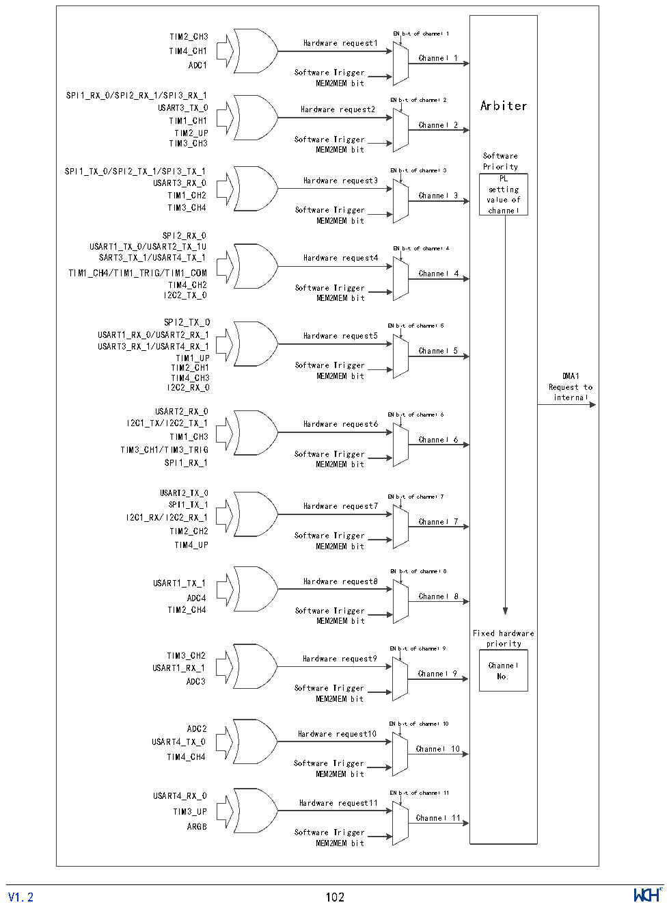

<!-- source-page: 104 -->

[← p.103](0103.md) · [index](../README.md) · [PDF p.104](https://ch32-riscv-ug.github.io/CH32X315/datasheet_zh/CH32X315RM.PDF#page=104) · [p.105 →](0105.md)

<!-- header: CH32X315、X305应用手册 https://wch.cn -->

### 11.2.4 DMA请求映射

DMA控制器提供11个通道，每个通道对应多个外设请求，通过设置相应外设寄存器中对应DMA  
控制位，可以独立的开启或关闭各个外设的DMA功能，具体对应关系如图11-1所示。  
其中，可通过 R32_EXTEN_CTR 寄存器的配置位对外设 DMA 通道进行重映射，xx_TX_0/xx_RX_0  
格式的为默认映射，xx_TX_1/xx_RX_1格式的为重映射。  

图11-1 DMA1请求映像  
 <!-- rendered from the PDF; verify at https://ch32-riscv-ug.github.io/CH32X315/datasheet_zh/CH32X315RM.PDF#page=104 -->

🖼 Text parsed from the figure above

TIM2_CH3 EN bit of channel 1  
Hardware request1  
TIM4_CH1  
Channel 1  
ADC1  
Software Trigger  
MEM2MEM bit  
SPI1_RX_0/SPI2_RX_1/SPI3_RX_1  
EN bit of channel 2 Arbiter  
USART3_TX_0 Hardware request2  
TIM1_CH1  
Channel 2  
TIM2_UP  
TIM3_CH3 Software Trigger  
MEM2MEM bit  
Software  
SPI1_TX_0/SPI2_TX_1/SPI3_TX_1 EN bit of channel 3 Priority  
USART3_RX_0 Hardware request3 PL  
setting  
TIM1_CH2 Channel 3 value of  
TIM3_CH4 Software Trigger channel  
MEM2MEM bit  
SPI2_RX_0  
USART1_TX_0/USART2_TX_1U EN bit of channel 4  
SART3_TX_1/USART4_TX_1 Hardware request4  
TIM1_CH4/TIM1_TRIG/TIM1_COM Channel 4  
TIM4_CH2 Software Trigger  
I2C2_TX_0 MEM2MEM bit  
SPI2_TX_0  
EN bit of channel 5  
USART1_RX_0/USART2_RX_1 Hardware request5  
USART3_RX_1/USART4_RX_1  
Channel 5  
TIM1_UP  
TIM2_CH1 Software Trigger  
TIM4_CH3 MEM2MEM bit DMA1  
I2C2_RX_0 Request to  
internal  
USART2_RX_0  
EN bit of channel 6  
I2C1_TX/I2C2_TX_1 Hardware request6  
TIM1_CH3 Channel 6  
TIM3_CH1/TIM3_TRIG Software Trigger  
SPI1_RX_1 MEM2MEM bit  
USART2_TX_0  
EN bit of channel 7  
SPI1_TX_1 Hardware request7  
I2C1_RX/I2C2_RX_1  
Channel 7  
TIM2_CH2  
Software Trigger  
TIM4_UP MEM2MEM bit  
EN bit of channel 8  
USART1_TX_1 Hardware request8  
ADC4 Channel 8  
TIM2_CH4 Software Trigger  
MEM2MEM bit  
Fixed hardware  
priority  
EN bit of channel 9  
TIM3_CH2 Hardware request9  
USART1_RX_1 Channel  
Channel 9 No.  
ADC3  
Software Trigger  
MEM2MEM bit  
ADC2 EN bit of channel 10  
Hardware request10  
USART4_TX_0  
Channel 10  
TIM4_CH4  
Software Trigger  
MEM2MEM bit  
USART4_RX_0 EN bit of channel 11  
Hardware request11  
TIM3_UP  
Channel 11  
ARGB  
Software Trigger  
MEM2MEM bit  
<!-- image: p104-draw-image-00001 inside the figure -->
<!-- footer: V1.2 102 -->

