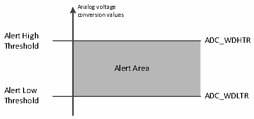

<!-- source-page: 119 -->

[← p.118](0118.md) · [index](../README.md) · [PDF p.119](https://ch32-riscv-ug.github.io/CH32X315/datasheet_zh/CH32X315RM.PDF#page=119) · [p.120 →](0120.md)

<!-- header: CH32X315、X305应用手册 https://wch.cn -->
第2次外部触发：转换序列为：5，8，4，同时产生EOC事件  
第3次外部触发：转换序列为：10，6，同时产生EOC事件  
第4次外部触发：转换序列为：1，3，2，同时产生EOC事件  
注入组间断模式举例：  
JDISCEN=1，JL[1:0]=3，待转换通道=1，3，2  
第1次外部触发：转换序列为：1  
第2次外部触发：转换序列为：3  
第3次外部触发：转换序列为：2，同时产生EOC和JEOC事件  
第4次外部触发：转换序列为：1  
注：1.当以间断模式转换一个规则组或注入组时，转换序列结束后不自动从头开始。当所有子组被  
转换完成，下一次触发事件启动第一个子组的转换。  
2.不能同时使用自动注入（JAUTO=1）和间断模式。  
3.不能同时为规则组和注入组设置间断模式，间断模式只能用于一组转换。  
4.注入组的间断模式下，外部触发后要转换的注入通道数目为1。  
4）连续转换  
在连续转换模式中，当前面ADC转换一结束马上就启动另一次转换，转换不会在选择组的最后  
一个通道上停止，而是再次从选择组的第一个通道继续转换。此模式的启动事件包括外部触发事件  
和ADON位置1，设置启动后，需将CONT位置1。  
如果一个规则通道被转换，转换数据被存储于ADCx_RDATAR寄存器中，转换结束标志EOC被置  
位，如果设置了EOCIE，则产生中断。  
如果一个注入通道被转换，转换数据被存储于ADCx_IDATARx寄存器中，注入转换结束标志JEOC  
被置位，如果设置了JEOCIE，则产生中断。  

### 12.2.5 模拟看门狗

如果被 ADC 转换的模拟电压低于低阈值或高于高阈值，AWD 模拟看门狗状态位被设置。阈值设  
置位于 ADCx_WDHTR 和 ADCx_WDLTR 寄存器的最低 12 个有效位中。通过设置 ADCx_CTLR1 寄存器的  
AWDIE位以允许产生相应中断。  

图12-4 模拟看门狗阈值区  
 <!-- rendered from the PDF; verify at https://ch32-riscv-ug.github.io/CH32X315/datasheet_zh/CH32X315RM.PDF#page=119 -->

🖼 Text parsed from the figure above

Analog voltage  
conversion values  
Alert High  
ADC_WDHTR  
<!-- image: p119-draw-image-00002 inside the figure -->
Threshold  
Alert Area  
Alert Low  
ADC_WDLTR  
Threshold  

配置ADCx_CTLR1寄存器的AWDSGL、AWDEN、JAWDEN及AWDCH[4:0]位选择模拟看门狗警戒的通道，  
具体关系见下表：  

<!-- p119-table-001 (table-12-4@1) pages 119-120 -->
<table><caption>表12-4 模拟看门狗通道选择</caption><tr><th rowspan="2">模拟看门狗警戒通道</th><th colspan="4">ADCx_CTLR1寄存器控制位</th></tr><tr><td>AWDSGL</td><td>AWDEN</td><td>JAWDEN</td><td>AWDCH[4:0]</td></tr><tr><td>不警戒</td><td>忽略</td><td>0</td><td>0</td><td>忽略</td></tr><tr><td>所有注入通道</td><td>0</td><td>0</td><td>1</td><td>忽略</td></tr><tr><td>所有规则通道</td><td>0</td><td>1</td><td>0</td><td>忽略</td></tr><tr><td>所有注入和规则通道</td><td>0</td><td>1</td><td>1</td><td>忽略</td></tr><tr><td>单一注入通道</td><td>1</td><td>0</td><td>1</td><td>决定通道编号</td></tr><tr><td>单一规则通道</td><td>1</td><td>1</td><td>0</td><td>决定通道编号</td></tr><tr><td>单一注入和规则通道</td><td>1</td><td>1</td><td>1</td><td>决定通道编号</td></tr></table>

<!-- image: p119-draw-image-00001 bbox=[507.84, 786.36, 527.28, 796.68] -->
<!-- footer: V1.2 117 -->
