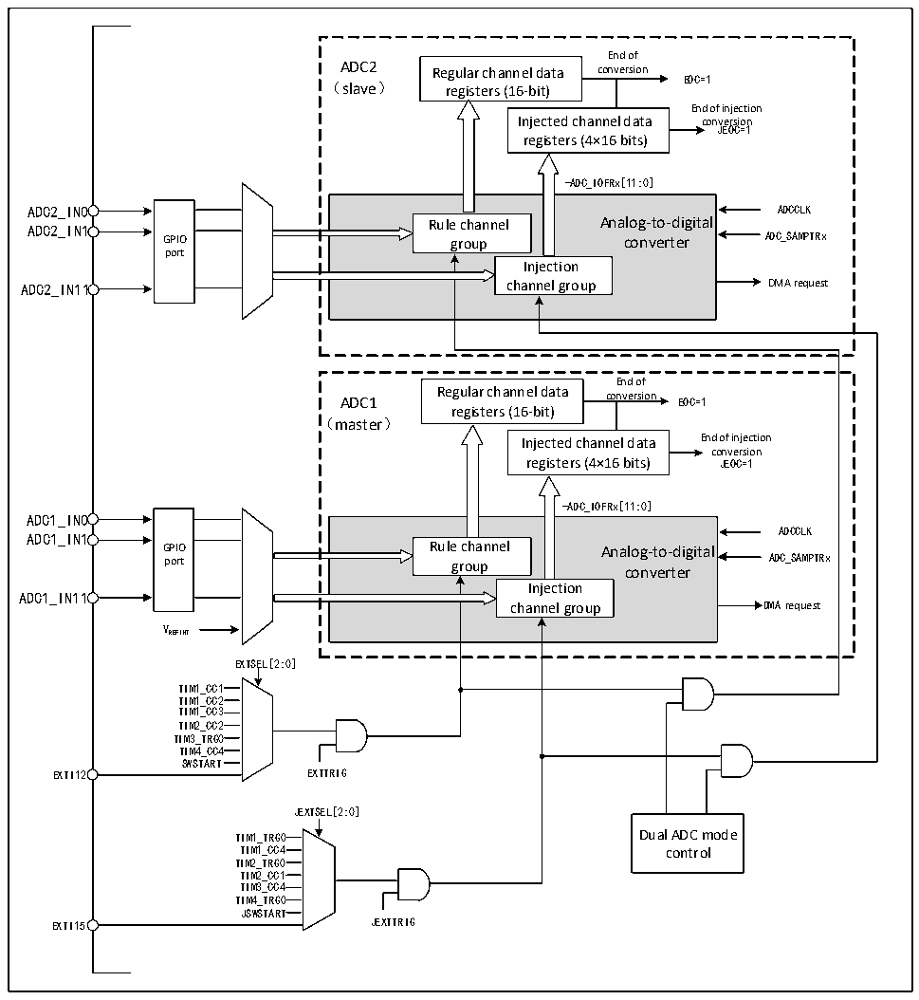

<!-- source-page: 121 -->

[← p.120](0120.md) · [index](../README.md) · [PDF p.121](https://ch32-riscv-ug.github.io/CH32X315/datasheet_zh/CH32X315RM.PDF#page=121) · [p.122 →](0122.md)

<!-- header: CH32X315、X305应用手册 https://wch.cn -->

图12-5 双ADC框图  
 <!-- rendered from the PDF; verify at https://ch32-riscv-ug.github.io/CH32X315/datasheet_zh/CH32X315RM.PDF#page=121 -->

🖼 Text parsed from the figure above

End of  
ADC2 Regular channel data conversion  
EOC=1  
（slave） registers (16-bit)  
End of injection  
Injected channel data conJEOC=1version  
registers (4×16 bits)  
-ADC_IOFRx[11:0]  
GPIO port  
Rule channel Analog-to-digital group converter Injection channel group  
End of  
ADC1 Regular channel data conversion EOC=1  
registers (16-bit)  
（master）  
Injected channel data End of injection  
conversion  
registers (4×16 bits) JEOC=1  
-ADC_IOFRx[11:0]  
ADC1_IN0  
GPIO port  
Rule channel Analog-to-digital group converter Injection channel group  
ADCCLK  
ADC1_IN1  
ADC1_IN11  
VREFINT  
EXTSEL[2:0]  
TIM1_CC1  
TIM1_CC2  
TIM1_CC3  
TIM2_CC2  
TIM3_TRG0  
TIM4_CC4  
SWSTART  
EXTI12 EXTTRIG  
JEXTSEL[2:0]  
TIM1_TRG0 Dual ADC mode  
TIM1_CC4 control  
TIM2_TRG0  
TIM2_CC1  
TIM3_CC4  
TIM4_TRG0  
JSWSTART  
EXTI15 JEXTTRIG  

1）独立模式  
此模式下，双ADC不同步工作，相互之间独立工作。  
2）同步注入模式  
此模式下用于转换一个注入通道组，设置 ADC1_CTLR2 中 JEXTSEL[2:0]，以选择触发源，同时  
它也将用于同步触发ADC2。转换完成时，转换后的数据分别存储在ADCx的ADCx_IDATARx中，且若  
使能任一ADC中断，转换结束后将产生JEOC中断。  
<!-- image: p121-draw-image-00001 bbox=[507.84, 786.36, 527.28, 796.68] -->
<!-- footer: V1.2 119 -->
