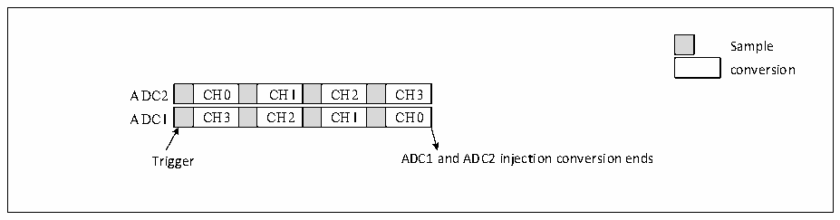
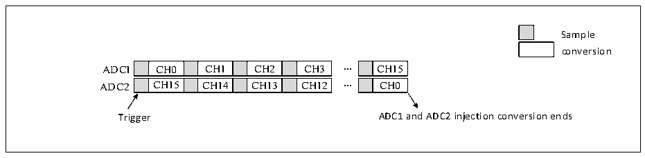
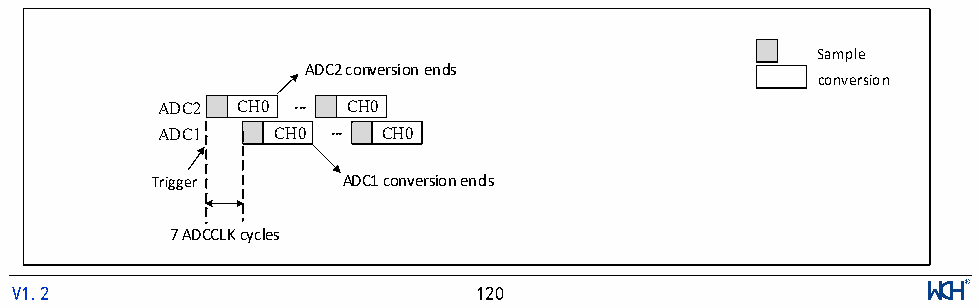

<!-- source-page: 122 -->

[← p.121](0121.md) · [index](../README.md) · [PDF p.122](https://ch32-riscv-ug.github.io/CH32X315/datasheet_zh/CH32X315RM.PDF#page=122) · [p.123 →](0123.md)

<!-- header: CH32X315、X305应用手册 https://wch.cn -->

图12-6 4通道同步注入转换  
 <!-- rendered from the PDF; verify at https://ch32-riscv-ug.github.io/CH32X315/datasheet_zh/CH32X315RM.PDF#page=122 -->

🖼 Text parsed from the figure above

Sample  
conversion  
CH0  CH1  CH2  CH3  CH3  CH2  CH1  CH0  
Trigger ADC1 and ADC2 injection conversion ends  

注：1.同一时刻ADC1和ADC2的转换通道不应重合。  
2.同步模式下，ADC1和ADC2应有相同时间长度的转换序列或两者之中较长的转换序列的时长  
小于触发时间间隔，以保证每次触发两个序列均能转换完成。  
3）同步规则模式  
此模式下用于转换规则通道序列，设置ADC1_CTLR2中EXTSEL[2:0]，以选择触发源，同时它也  
将用于同步触发 ADC2。转换完成时，将产生一个 32 位 DMA 传输请求，将数据寄存器 ADC1_RDATAR  
的内容传输到SRAM中，高16位包含ADC2转换数据，低16位包含ADC1转换数据。若使能任一ADC  
中断，将产生EOC中断。  

图12-7 16通道同步规则转换  
 <!-- rendered from the PDF; verify at https://ch32-riscv-ug.github.io/CH32X315/datasheet_zh/CH32X315RM.PDF#page=122 -->

🖼 Text parsed from the figure above

Sample  
conversion  
CH0  CH1  CH2  CH3  CH15  CH14  CH13  CH12  
CH15  CH0  
Trigger ADC1 and ADC2 injection conversion ends  

注：1.同一时刻ADC1和ADC2的转换通道不应重合；  
2.同步模式下，ADC1和ADC2应有相同时间长度的转换序列或两者之中较长的转换序列的时长  
小于触发时间间隔，以保证每次触发两个序列均能转换完成。  
4）快速交替模式  
此模式仅适用于规则通道（往往只有一个通道），设置ADC1_CTLR2中EXTSEL[2:0]，以选择触  
发源，当触发产生后ADC2将立即启动转换，ADC1在延迟7个ADC时钟周期后启动转换。如果均开  
启连续模式（CONT 被置位），两个 ADC 将对规则通道连续交替转换。如果使能中断，ADC1 将产生  
EOC中断，若同时使能DMA，则将产生一个32位的DMA传输请求，将数据寄存器ADC1_RDATAR的内  
容传输到SRAM中，高16位包含ADC2转换数据，低16位包含ADC1转换数据。  

图12-8 单通道快速交替连续转换  
 <!-- rendered from the PDF; verify at https://ch32-riscv-ug.github.io/CH32X315/datasheet_zh/CH32X315RM.PDF#page=122 -->

🖼 Text parsed from the figure above

Sample  
ADC2 conversion ends  
conversion  
CH0  CH0  CH0  
CH0  
7 ADCCLK cycles  
<!-- image: p122-draw-image-00001 inside the figure -->
<!-- footer: V1.2 120 -->

