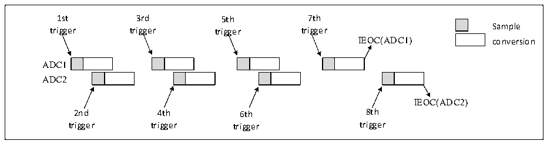
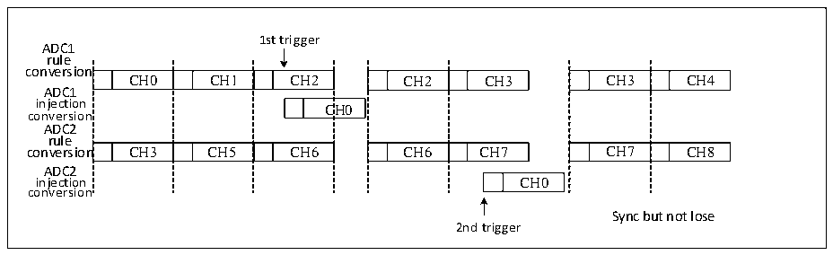
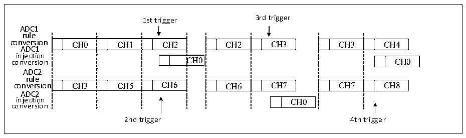

<!-- source-page: 124 -->

[← p.123](0123.md) · [index](../README.md) · [PDF p.124](https://ch32-riscv-ug.github.io/CH32X315/datasheet_zh/CH32X315RM.PDF#page=124) · [p.125 →](0125.md)

<!-- header: CH32X315、X305应用手册 https://wch.cn -->

图12-11 间断模式下每个ADC注入通道交替触发转换  
 <!-- rendered from the PDF; verify at https://ch32-riscv-ug.github.io/CH32X315/datasheet_zh/CH32X315RM.PDF#page=124 -->

🖼 Text parsed from the figure above

1st 3rd 5th 7th  
Sample  
trigger trigger trigger trigger  
IEOC(ADC1) conversion  
ADC1  
ADC2  
IEOC(ADC2)  
2nd 4th 6th 8th  
trigger trigger trigger trigger  

7）同步规则模式+同步注入模式  
此模式下规则组的同步转换可以打断，以启动注入组的同步转换。同时此模式下需要保证转换  
具有相同时间长度的序列，或保证触发时间间隔比两个序列中较长序列的时间长。  
8）同步规则模式+交替触发模式  
此模式下规则组的同步转换可以被打断，以启动注入组的交替触发转换。当发生注入事件时，  
交替触发转换立即启动。如果同步规则正在转换，则所有ADC的规则转换被停止，在注入转换结束  
后同步恢复。  

图12-12同步规则模式下交替触发注入通道转换  
 <!-- rendered from the PDF; verify at https://ch32-riscv-ug.github.io/CH32X315/datasheet_zh/CH32X315RM.PDF#page=124 -->

🖼 Text parsed from the figure above

1st trigger  
ADC1  
rule  
conversion  
n  CH0  CH1  CH2  n  C  n  CH3  CH5  CH6  
CH2  CH3  CH6  CH7  
CH3  CH4  CH7  CH8  
ADC1  
C  CH0  
conversion  
ADC2  
rule  
ADC2  
CH0  
injection CH0  
conversion  
Sync but not lose  
2nd trigger  

注：此模式下需要保证转换具有相同时间长度的序列，或者保证触发时间间隔比两个序列中较长序  
列的时间长。  
如果注入触发事件发生在中断了规则转换的注入转换期间，则这个触发事件将会被忽略，例如  
下图描述的第2次触发的情况。  

图12-13 触发事件发生在注入转换期间  
 <!-- rendered from the PDF; verify at https://ch32-riscv-ug.github.io/CH32X315/datasheet_zh/CH32X315RM.PDF#page=124 -->

🖼 Text parsed from the figure above

1st trigger 3rd trigger  
ADC1  
rule  
conversion CH0 CH1 CH2 CH2 CH3 CH3 CH4  
CH0  CH1  CH2  C  CH3  CH5  CH6  
CH2  CH3  CH6  CH7  
CH3  CH4  CH7  CH8  
ADC1  
injection  
C  CH0  
CH0  
ADC2  
rule  
conversion CH3 CH5 CH6 CH6 CH7 CH7 CH8  
ADC2  
injection CH0  
conversion  
2nd trigger 4th trigger  

9）同步注入模式+交替模式  
此模式下，注入转换可以打断交替转换。发生注入事件时，交替转换被打断，注入转换启动，  
<!-- image: p124-draw-image-00001 bbox=[507.84, 786.36, 527.28, 796.68] -->
<!-- footer: V1.2 122 -->
