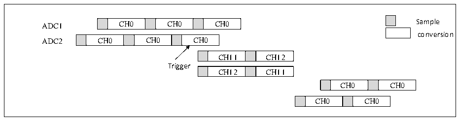
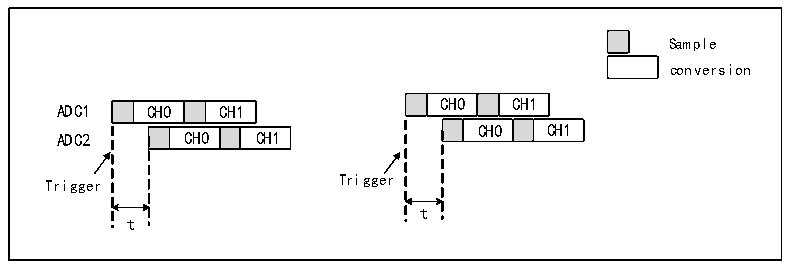

<!-- source-page: 125 -->

[← p.124](0124.md) · [index](../README.md) · [PDF p.125](https://ch32-riscv-ug.github.io/CH32X315/datasheet_zh/CH32X315RM.PDF#page=125) · [p.126 →](0126.md)

<!-- header: CH32X315、X305应用手册 https://wch.cn -->
在注入转换结束后，交替转换被恢复。  

图12-14 交替转换下触发注入组转换  
 <!-- rendered from the PDF; verify at https://ch32-riscv-ug.github.io/CH32X315/datasheet_zh/CH32X315RM.PDF#page=125 -->

🖼 Text parsed from the figure above

CH0  CH0  
ADC1 CH0 CH0 CH0 Sample  
conversion  
CH0  CH0  CH0  
CH11  CH12  
Trigger  
CH12  CH11  
CH0  CH0  
CH0  CH0  

注：当ADC的预分频系数为4时，交替转换恢复后采样间隔不再是均匀的7个ADC时钟，改为8个  
和6个时钟周期交替。  

### 12.2.7 低速高性能模式

ADC默认是12位模式，开启低速高性能模式后，可选13/14/15位模式，即一次转换可获得13  
位/14位/15位转换结果。  
低速高性能模式注意事项：  
1) 开启低速高性能模式后，单次的ADC转换周期（采样时间+转换时间）会增加，即：  
13位模式转换周期= 12位模式转换周期*2；  
14位模式转换周期= 12位模式转换周期*4；  
15位模式转换周期= 12位模式转换周期*8。  
2) 低速高性能模式的使用不受限制，无论是单次模式、连续模式、扫描模式、间断模式等工作模  
式均支持低速高性能模式。  

### 12.2.8 ADC级联

所有ADC可级联，级联顺序可配置，级联的ADC之间，各级ADC的转换延迟可配置，既可以同时转  
换，也可以依次延迟转换；分组使用时，支持双ADC模式。  
通过配置ADCx_CTLR2寄存器CONTS[1:0]位选择前级ADC。  
ADC规则通道级联配置  
若ADC使用规则通道级联，可通过ADCx_CTLR2寄存器REGUCON位使能规则通道级联，并通过  
ADCx_CONCFG寄存器REGUDLY[5:0]域设置参数作触发延时。如果设置ADC2级联前级为ADC1，就需要ADC1  
给出触发源，如果延时时长设置为t，则对应转换关系如图12-15所示：  

图12-15 规则通道级联触发延时  
 <!-- rendered from the PDF; verify at https://ch32-riscv-ug.github.io/CH32X315/datasheet_zh/CH32X315RM.PDF#page=125 -->

🖼 Text parsed from the figure above

Sample  
conversion  
CH0  CH1  t  CH0  CH1  
CH0  CH1  CH0  CH1  
t  
t  

ADC注入通道级联配置  
若ADC使用注入通道级联，可配合注入触发交替循环进行使用。通过ADCx_CTLR2寄存器INJECON  
位使能注入通道级联，并通过ADCx_CONCFG寄存器REGUDLY[5:0]域设置参数作触发延时，并通过  
<!-- image: p125-draw-image-00001 bbox=[507.84, 786.36, 527.28, 796.68] -->
<!-- footer: V1.2 123 -->
