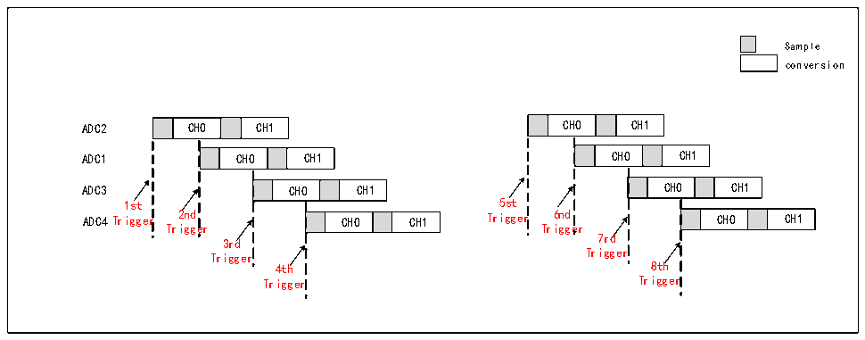
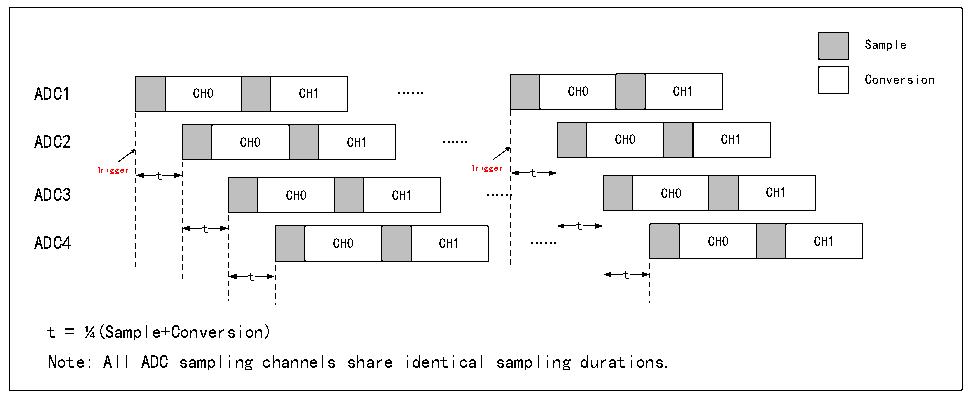

<!-- source-page: 126 -->

[← p.125](0125.md) · [index](../README.md) · [PDF p.126](https://ch32-riscv-ug.github.io/CH32X315/datasheet_zh/CH32X315RM.PDF#page=126) · [p.127 →](0127.md)

<!-- header: CH32X315、X305应用手册 https://wch.cn -->
ADCx_CONCFG寄存器INJENUM[1:0]位设置注入触发交替循环周期，以及配置ADCx_CONCFG寄存器  
INJENUM[1:0]位设置有效注入触发序号。  
若ADC通道级联配合注入触发交替循环使用，可实现多ADC交替触发模式。若INJENUM[1:0]=11b、  
INJESEQ[1:0]则依次为级联数列，可实现多ADC交替触发模式，其对应关系如图12-16所示：  

图12-16 多ADC交替触发  
 <!-- rendered from the PDF; verify at https://ch32-riscv-ug.github.io/CH32X315/datasheet_zh/CH32X315RM.PDF#page=126 -->

🖼 Text parsed from the figure above

Sample  
conversion  
CH0  CH1  
CH0  CH1  
ADC2 CH0 CH1 CH0 CH1  
CH0  CH1  
CH0  CH1  
ADC1 CH0 CH1 CH0 CH1  
CH0  CH1  
CH0  CH1  
ADC3 CH0 CH1 CH0 CH1  
1st 5st  
ADC4Trigger 2nd CH0 CH1 Trigger 6nd CH0 CH1  
CH0  CH1  
CH0  CH1  
3rd 7rd  
Trigger Trigger  
4th 8th  
Trigger Trigger  

应用示例  
级联模式下，使用4组ADC时，可配置触发延时，进行交替采样。若触发延时为25%的ADC转换周期  
时间，可使采样率提高4倍，即当使用5Msps进行采样时，可通过级联模式将采样率提升至等效20Msps。  

图12-17 提升采样率  
 <!-- rendered from the PDF; verify at https://ch32-riscv-ug.github.io/CH32X315/datasheet_zh/CH32X315RM.PDF#page=126 -->

🖼 Text parsed from the figure above

Sample  
Conversion  
CH0  CH1  
CH0  CH1  
ADC1 CH0 CH1 …… CH0 CH1  
ADC2 CH0 CH1 …… CH0 CH1  
Trigger t Trigger t  
ADC3 CH0 CH1 …… CH0 CH1  
CH0  CH1  
CH0  CH1  
t t  
t = ¼(Sample+Conversion)  
Note: All ADC sampling channels share identical sampling durations.  

### 12.2.9 ADC扫描输出

ADC 扫描输出需要配置 ADCx_SCANCNT 寄存器 SCSCFG位选择规则通道或注入通道进行扫描通道  
源选择，ADC扫描完成后轮次计数可通过设置R32_EXTEN_CTR寄存器ADC_SCAN_SEL[1:0]位选择ADCx  
扫描周期计数输出至GPIO。若使能SCANOE0、SCANOE1、SCANOE2，其扫描次数对应GPIO口电平关系  
如表12-5所示：  

<!-- p126-table-014 (table-12-5@1) pages 126-127 -->
<table><caption>表12-5 ADC扫描次数与输出电平关系</caption><tr><th>序列</th><th>SCANOE0</th><th>SCANOE1</th><th>SCANOE2</th></tr><tr><td>0</td><td>低电平</td><td>低电平</td><td>低电平</td></tr><tr><td>1</td><td>高电平</td><td>低电平</td><td>低电平</td></tr><tr><td>2</td><td>低电平</td><td>高电平</td><td>低电平</td></tr><tr><td>3</td><td>高电平</td><td>高电平</td><td>低电平</td></tr><tr><td>4</td><td>低电平</td><td>低电平</td><td>高电平</td></tr><tr><td>5</td><td>高电平</td><td>低电平</td><td>高电平</td></tr><tr><td>6</td><td>低电平</td><td>高电平</td><td>高电平</td></tr><tr><td>7</td><td>高电平</td><td>高电平</td><td>高电平</td></tr><tr><td>8</td><td>低电平</td><td>低电平</td><td>低电平</td></tr></table>

<!-- image: p126-draw-image-00001 bbox=[507.84, 786.36, 527.28, 796.68] -->
<!-- footer: V1.2 124 -->
