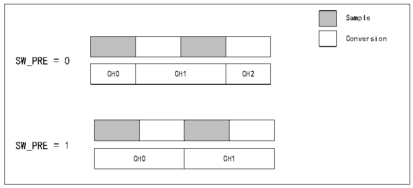

<!-- source-page: 127 -->

[← p.126](0126.md) · [index](../README.md) · [PDF p.127](https://ch32-riscv-ug.github.io/CH32X315/datasheet_zh/CH32X315RM.PDF#page=127) · [p.128 →](0128.md)

<!-- header: CH32X315、X305应用手册 https://wch.cn -->

> ⬆ **Table continued** — rendered in full at [page 126](0126.md). <!-- p127-table-001 -->

在该模式下产生的信号可外加八选一模拟开关芯片CH448实现8倍数量的ADC通道扩展，支持  
最多8*48=384个ADC通道全自动切换。  

### 12.2.10 通道预切换

ADC包含信号采样和A/D模数转换两个主要步骤。CH32X315/X305的ADC单元在上一通道的采样  
步骤完成后，可以设置由硬件预先切换下一通道，在上一通道的A/D转换过程中，下一通道完成“切  
换—切换瞬间振铃—信号稳定”的过程。这种两级流水线的交替并行处理方法使得下一通道采样时，  
提前切换的信号电压已足够稳定，从而缩短采样时间。  
通道预切换功能由ADCx_CTLR1寄存器SW_PRE位控制，具体如图12-18所示。  

图12-18 通道预切换功能  
 <!-- rendered from the PDF; verify at https://ch32-riscv-ug.github.io/CH32X315/datasheet_zh/CH32X315RM.PDF#page=127 -->

🖼 Text parsed from the figure above

Sample  
Conversion  
SW_PRE = 0  
CH0  CH1  CH2  
SW_PRE = 1  
CH0  CH1  

## 12.3 寄存器描述

<!-- p127-table-006 (table-12-6@1) pages 127-128 -->
<table><caption>表12-6 ADC1相关寄存器列表</caption><tr><th>名称</th><th>访问地址</th><th>描述</th><th>复位值</th></tr><tr><td>R32_ADC1_STATR</td><td>0x40012400</td><td>ADC1状态寄存器</td><td>0x00000000</td></tr><tr><td>R32_ADC1_CTLR1</td><td>0x40012404</td><td>ADC1控制寄存器1</td><td>0x00000000</td></tr><tr><td>R32_ADC1_CTLR2</td><td>0x40012408</td><td>ADC1控制寄存器2</td><td>0x00000020</td></tr><tr><td>R32_ADC1_SAMPTR1</td><td>0x4001240C</td><td>ADC1采样时间配置寄存器1</td><td>0x00000000</td></tr><tr><td>R32_ADC1_SAMPTR2</td><td>0x40012410</td><td>ADC1采样时间配置寄存器2</td><td>0x00000000</td></tr><tr><td>R32_ADC1_IOFR1</td><td>0x40012414</td><td>ADC1注入通道数据偏移寄存器1</td><td>0x00000000</td></tr><tr><td>R32_ADC1_IOFR2</td><td>0x40012418</td><td>ADC1注入通道数据偏移寄存器2</td><td>0x00000000</td></tr><tr><td>R32_ADC1_IOFR3</td><td>0x4001241C</td><td>ADC1注入通道数据偏移寄存器3</td><td>0x00000000</td></tr><tr><td>R32_ADC1_IOFR4</td><td>0x40012420</td><td>ADC1注入通道数据偏移寄存器4</td><td>0x00000000</td></tr><tr><td>R32_ADC1_WDHTR</td><td>0x40012424</td><td>ADC1看门狗高阈值寄存器</td><td>0x00000FFF</td></tr><tr><td>R32_ADC1_WDLTR</td><td>0x40012428</td><td>ADC1看门狗低阈值寄存器</td><td>0x00000000</td></tr><tr><td>R32_ADC1_RSQR1</td><td>0x4001242C</td><td>ADC1规则通道序列寄存器1</td><td>0x00000000</td></tr><tr><td>R32_ADC1_RSQR2</td><td>0x40012430</td><td>ADC1规则通道序列寄存器2</td><td>0x00000000</td></tr><tr><td>R32_ADC1_RSQR3</td><td>0x40012434</td><td>ADC1规则通道序列寄存器3</td><td>0x00000000</td></tr><tr><td>R32_ADC1_ISQR</td><td>0x40012438</td><td>ADC1注入通道序列寄存器</td><td>0x00000000</td></tr><tr><td>R32_ADC1_IDATAR1</td><td>0x4001243C</td><td>ADC1注入数据寄存器1</td><td>0x00000000</td></tr><tr><td>R32_ADC1_IDATAR2</td><td>0x40012440</td><td>ADC1注入数据寄存器2</td><td>0x00000000</td></tr><tr><td>R32_ADC1_IDATAR3</td><td>0x40012444</td><td>ADC1注入数据寄存器3</td><td>0x00000000</td></tr><tr><td>R32_ADC1_IDATAR4</td><td>0x40012448</td><td>ADC1注入数据寄存器4</td><td>0x00000000</td></tr><tr><td>R32_ADC1_RDATAR</td><td>0x4001244C</td><td>ADC1规则数据寄存器</td><td>0x00000000</td></tr><tr><td>R32_ADC1_SMPMD</td><td>0x40012450</td><td>ADC1采样模式控制寄存器</td><td>0x00000000</td></tr><tr><td>R32_ADC1_UDP</td><td>0x40012454</td><td>ADC1可编程采样时间寄存器</td><td>0x0000FF10</td></tr><tr><td>R32_ADC1_CONCFG</td><td>0x40012458</td><td>ADC1级联配置寄存器</td><td>0x00000000</td></tr><tr><td>R32_ADC1_SCANCNT</td><td>0x4001245C</td><td>ADC1扫描计数配置寄存器</td><td>0x00000000</td></tr></table>

<!-- image: p127-draw-image-00001 bbox=[507.84, 786.36, 527.28, 796.68] -->
<!-- footer: V1.2 125 -->
