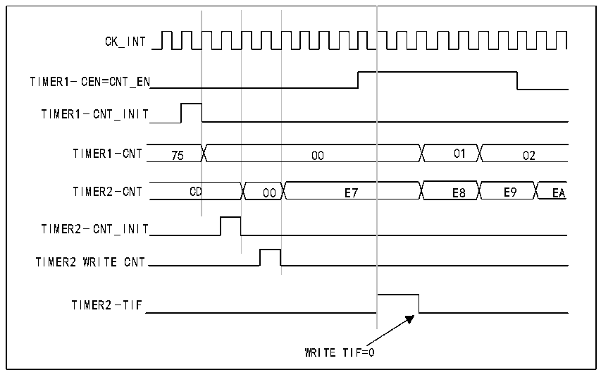

<!-- source-page: 155 -->

[← p.154](0154.md) · [index](../README.md) · [PDF p.155](https://ch32-riscv-ug.github.io/CH32X315/datasheet_zh/CH32X315RM.PDF#page=155) · [p.156 →](0156.md)

<!-- header: CH32X315、X305应用手册 https://wch.cn -->
相同配置，只不过处于触发模式（R16_TIM2_SMCFGR寄存器中的SMS=110）而非门控模式的计数行为。  

图13-10 使用定时器1的使能信号触发定时器2  
 <!-- rendered from the PDF; verify at https://ch32-riscv-ug.github.io/CH32X315/datasheet_zh/CH32X315RM.PDF#page=155 -->

🖼 Text parsed from the figure above

00  00  E7  D  
CK_INT  
TIMER1-CEN=CNT_EN  
TIMER1-CNT_INIT  
TIMER2-CNT_INIT  
TIMER2 WRITE CNT  
TIMER2-TIF  
WRITE TIF=0  

将一个定时器用作另一个定时器的预分频器  
例如，可以将定时器1配置为定时器2的预分频器。为此：  
1) 将定时器 1 配置为主模式，发送其更新事件(UEV)作为触发输出（R16_TIM1_CTLR2 寄存器  
中的MMS=010）。这样便会在计数器每次发生上溢时输出一个周期性信号。  
2) 配置定时器1的周期（R16_TIM1_ATRLR寄存器）。  
3) 配置定时器2以接收来自定时器1的输入触发（R16_TIM2_SMCFGR寄存器中的TS=000）。  
4) 将定时器2配置为外部时钟模式（R16_TIM2_SMCFGR寄存器中的SMS=111）。  
5) 通过向CEN位（R16_TIM2_CTLR1寄存器）写入“1”启动定时器2。  
6) 通过向CEN位（R16_TIM1_CTLR1寄存器）写入“1”启动定时器1。  
使用一个外部触发同步的启动2个定时器  
本例中，定时器1的TI1输入出现上升沿时使能定时器1，使能定时器1的同时使能定时器2。  
要确保两个计数器对齐，定时器1必须配置为主/从模式（对应的TI1为从，对应定时器2为主）：  
1) 将定时器 1 配置为主模式，发送其使能信号作为触发输出（R16_TIM1_CTLR2 寄存器中的  
MMS=001）。  
2) 将定时器 1 配置为从模式以接收来自 TI1 的输入触发（R16_TIM1_SMCFGR 寄存器中的  
TS=100）。  
3) 将定时器1配置为触发模式（R16_TIM1_SMCFGR寄存器中的SMS=110）。  
4) 通过写入MSM=1（R16_TIM1_SMCR寄存器）将定时器1配置为主/从模式。  
5) 配置定时器2以接收来自定时器1的输入触发（R16_TIM2_SMCFGR寄存器中的TS=000）。  
6) 将定时器2配置为触发模式（R16_TIM2_SMCFGR寄存器中的SMS=110）。  
当TI1（定时器1）出现上升沿时，两个计数器开始根据内部时钟同步计数，并且两个TIF标志  
都置1。  
注：本例中，两个定时器都在启动之前进行了初始化（通过将各自的UG位置1）。两个计数器都从  
0 开始计数，但可以通过对任意一个计数器寄存器(R16_TIM1_CNT)进行写操作，在二者之间轻松插  
入一个偏移量。可注意到主/从模式在定时器1的CNT_EN与CK_PSC之间产生了延迟。  
<!-- image: p155-draw-image-00001 bbox=[507.84, 786.36, 527.28, 796.68] -->
<!-- footer: V1.2 153 -->
