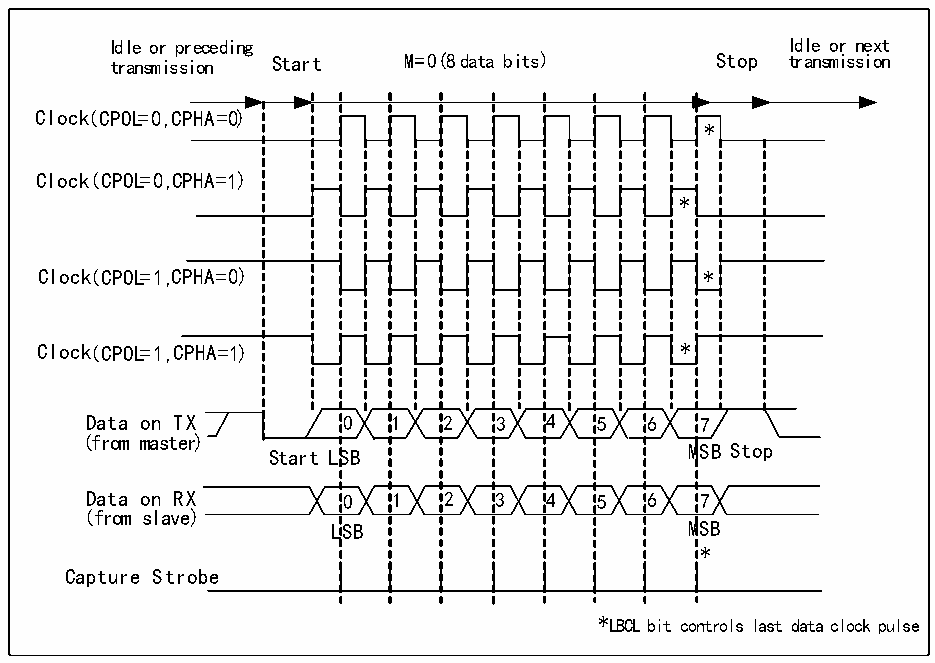
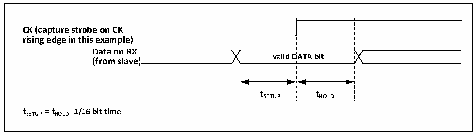

<!-- source-page: 203 -->

[← p.202](0202.md) · [index](../README.md) · [PDF p.203](https://ch32-riscv-ug.github.io/CH32X315/datasheet_zh/CH32X315RM.PDF#page=203) · [p.204 →](0204.md)

<!-- header: CH32X315、X305应用手册 https://wch.cn -->

图15-2 USART时钟时序示例(M=0)  
 <!-- rendered from the PDF; verify at https://ch32-riscv-ug.github.io/CH32X315/datasheet_zh/CH32X315RM.PDF#page=203 -->

🖼 Text parsed from the figure above

Idle or preceding Idle or next  
transmission Start M=0( 8 data bits) Stop transmission  
0SB0LSB  11  22  33  44  55  * * 6M6M  
Clock( CPOL=0 ,C PHA=0)  
*  *  7  
Clock(( CCPPOOLL==00 ,,C PHA=1))  
(from master)  
(from slave)  
*  
Capture Strobe  
*LBCL bit controls last data clock pulse  

图15-3 数据采样保持时间  
 <!-- rendered from the PDF; verify at https://ch32-riscv-ug.github.io/CH32X315/datasheet_zh/CH32X315RM.PDF#page=203 -->

🖼 Text parsed from the figure above

<strong>CK (capture strobe on CK</strong>  
<strong>rising edge in this example)</strong>  
valid  DATA bit  
<strong>Data on RX</strong>  
<strong>(from slave)</strong>  
<strong>tSETUP tHOLD</strong>  
<strong>tSETUP= tHOLD 1/16 bit time</strong>  

## 15.5 单线半双工模式

半双工模式支持使用单个引脚（只使用TX引脚）来接收和发送，TX引脚和RX引脚在芯片内部  
连接。  
开启半双工模式的方式是对控制寄存器 3（R16_USARTx_CTLR3）的 HDSEL 位置位，但同时需要  
关闭LIN模式、智能卡模式、红外模式和同步模式，即保证SCEN、CLKEN和IREN位处于复位状态，  
这三位在控制寄存器2和3（R16_USARTx_CTLR2和R16_USARTx_CTLR3）中。  
设置成半双工模式之后，需要把TX的IO口设置成开漏输出高模式。在TE置位的情况下，只要  
将数据写到数据寄存器上，就会发送出去。特别要注意的是，半双工模式可能会出现多设备使用单  
总线收发时的总线冲突，这需要用户用软件自行避免。  

## 15.6 智能卡

智能卡模式支持ISO7816-3协议访问智能卡控制器。  
<!-- image: p203-draw-image-00001 bbox=[507.84, 786.36, 527.28, 796.68] -->
<!-- footer: V1.2 201 -->
