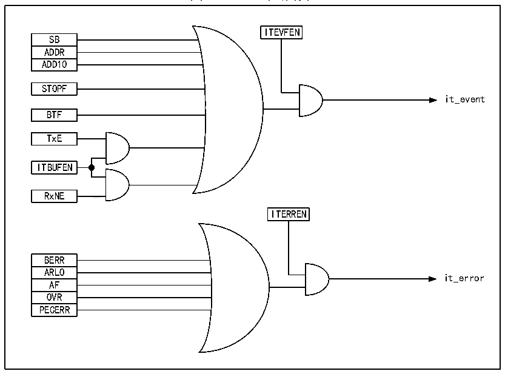

<!-- source-page: 218 -->

[← p.217](0217.md) · [index](../README.md) · [PDF p.218](https://ch32-riscv-ug.github.io/CH32X315/datasheet_zh/CH32X315RM.PDF#page=218) · [p.219 →](0219.md)

<!-- header: CH32X315、X305应用手册 https://wch.cn -->

## 16.7 中断

每个I2C模块都有两种中断向量，分别是事件中断和错误中断。两种中断支持图16-4的中断源。  

图16-4 I2C中断请求  
 <!-- rendered from the PDF; verify at https://ch32-riscv-ug.github.io/CH32X315/datasheet_zh/CH32X315RM.PDF#page=218 -->

🖼 Text parsed from the figure above

ITEVFEN  
SB  ADDR  ADD10  
STOPF  
it_event  
BTF  
TxE  
ITBUFEN  
RxNE  
<!-- image: p218-draw-image-00002 inside the figure -->
ITERREN  
BERR  ARLO  AF  OVR  PECERR  
it_error  

## 16.8 DMA

可以使用DMA来进行批量数据的收发。使用DMA时不能对控制寄存器的ITBUFEN位进行置位。  
● 利用DMA发送  
通过将CTLR2寄存器的DMAEN位置位可以激活DMA模式。只要TxE位被置位，数据将由DMA从  
设定的内存装载进I2C的数据寄存器。需要进行以下设定来为I2C分配通道。  
1） 向DMA1_PADDRx寄存器设置R16_I2Cx_DATAR寄存器地址，DMA1_MADDRx寄存器中设置存储器地  
址，这样在每个TxE事件后，数据将从存储器送至R16_I2Cx_DATAR寄存器。  
2） 在DMA1_CNTRx寄存器中设置所需的传输字节数。在每个TxE事件后，此值将被递减。  
3） 利用DMA1_CFGRx寄存器中的PL[0:1]位配置通道优先级。  
4） 设置DMA1_CFGRx寄存器中的DIR位，并根据应用要求可以配置在整个传输完成一半或全部完成  
时发出中断请求。  
5） 通过设置DMA1_CFGRx寄存器上的EN位激活通道。  
当DMA控制器中设置的数据传输数目已经完成时，DMA控制器给I2C接口发送一个传输结束的  
EOT/EOT_1信号。在中断允许的情况下，将产生一个DMA中断。  
● 利用DMA接收  
置位CTLR2寄存器的DMAEN后即可进行DMA接收模式。使用DMA接收时，DMA将数据寄存器里  
的数据传送到预设的内存区域。需要以下步骤来为I2C分配通道。  
1） 向DMA1_PADDRx寄存器设置R16_I2Cx_DATAR寄存器地址，DMA1_MADDRx寄存器中设置存储器地  
址，这样在每个RxNE事件后，数据将从R16_I2Cx_DATAR寄存器写入存储器。  
2） 在DMA1_CNTRx寄存器中设置所需的传输字节数。在每个RxNE事件后，此值将被递减。  
3） 用DMA1_CFGRx寄存器中的PL[0:1]配置通道优先级。  
<!-- image: p218-draw-image-00001 bbox=[507.84, 786.36, 527.28, 796.68] -->
<!-- footer: V1.2 216 -->
