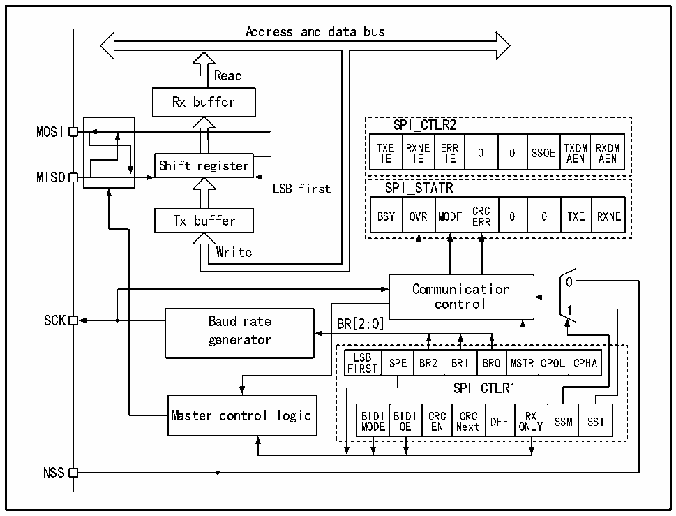

<!-- source-page: 226 -->

[← p.225](0225.md) · [index](../README.md) · [PDF p.226](https://ch32-riscv-ug.github.io/CH32X315/datasheet_zh/CH32X315RM.PDF#page=226) · [p.227 →](0227.md)

<!-- header: CH32X315、X305应用手册 https://wch.cn -->

# 第 17 章 串行外设接口（SPI）

SPI 支持以三线同步串行模式进行数据交互，加上片选线支持硬件切换主从模式，支持以单根  
数据线通讯。  

## 17.1 主要特征

### 17.1.1 SPI特征

● 支持全双工同步串行模式  
● 支持单线半双工模式  
● 支持主模式和从模式，多从模式  
● 支持8位或16位数据结构  
● 最高时钟频率支持到Fhclk的一半  
● 数据顺序支持MSB或LSB在前  
● 支持硬件或软件控制NSS引脚  
● 收发支持硬件CRC校验  
● 收发缓冲器支持DMA传输  
● 支持修改时钟相位和极性  

## 17.2 SPI 功能描述

### 17.2.1 概述

图17-1 SPI结构框图  
 <!-- rendered from the PDF; verify at https://ch32-riscv-ug.github.io/CH32X315/datasheet_zh/CH32X315RM.PDF#page=226 -->

🖼 Text parsed from the figure above

Address and data bus  
<!-- image: p226-draw-image-00004 inside the figure -->
Read  
Rx buffer  
SPI_CTLR2  
MOSI  
TXE RXNE ERR TXDM RXDM  
0 0 SSOE  
IE IE IE AEN AEN  
Shift register  
MISO  
LSB first SPI_STATR  
OVR  MODF  CRCERR  0  0  TXE  
Tx buffer BSY OVR MODF ERR 0 0 TXE RXNE  
Write  
<!-- image: p226-draw-image-00002 inside the figure -->
<!-- image: p226-draw-image-00003 inside the figure -->
0  
Communication  
control  
1  
SCK Baud rate BR[2:0]  
generator  
LSB  
SPE BR2 BR1 BR0 MSTR CPOL CPHA  
FIRST  
SPI_CTLR1  
Master control logic BIDI BIDI CRC CRC RX  
DFF SSM SSI  
MODE OE EN Next ONLY  
NSS  

<!-- image: p226-draw-image-00001 bbox=[507.84, 786.36, 527.28, 796.68] -->
<!-- footer: V1.2 224 -->
