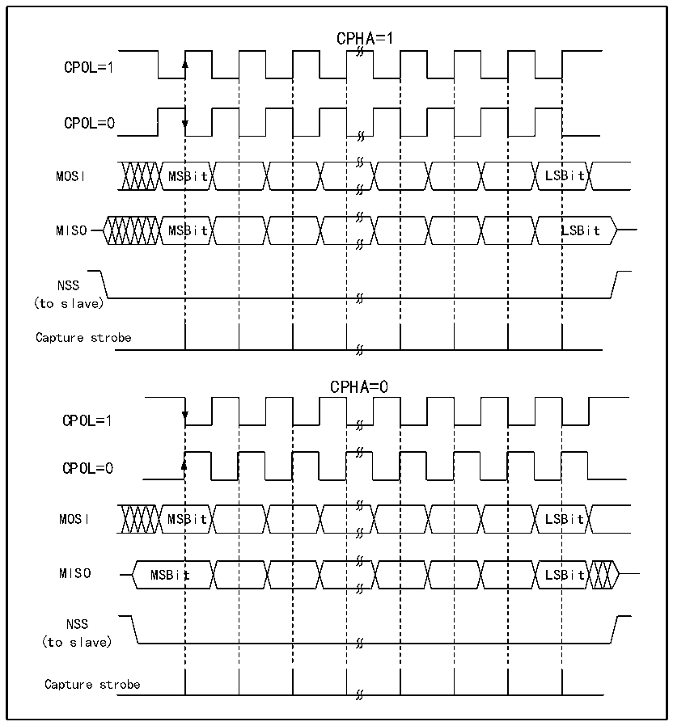

<!-- source-page: 227 -->

[← p.226](0226.md) · [index](../README.md) · [PDF p.227](https://ch32-riscv-ug.github.io/CH32X315/datasheet_zh/CH32X315RM.PDF#page=227) · [p.228 →](0228.md)

<!-- header: CH32X315、X305应用手册 https://wch.cn -->
由图17-1可以看出，与SPI相关的主要是MISO、MOSI、SCK和NSS四个引脚。其中MISO引脚  
在SPI模块工作在主模式下时，是数据输入引脚；工作在从模式下时，是数据输出引脚。MOSI引脚  
工作在主模式下时，是数据输出引脚；工作在从模式时，是数据输入引脚。SCK 是时钟引脚，时钟  
信号一直由主机输出，从机接收时钟信号并同步数据收发。NSS引脚是片选引脚，有以下用法：  
1） NSS由软件控制：此时SSM被置位，内部NSS信号由SSI决定输出高还是低，这种情况一般用  
于SPI主模式；  
2） NSS由硬件控制：在NSS输出使能时，即SSOE置位时，在SPI主机向外发送输出时会主动拉低  
NSS 引脚，如果不能成功拉低 NSS 脚，说明主线上还有其他主设备正在通信，则会产生一个硬  
件错误；SSOE 不置位，则可以用于多主机模式，如果它被拉低则会强行进入从机模式，MSTR  
位会被自动清除。  
可以通过CPHA和CPOL配置SPI的工作模式。CPHA置位表示模块在时钟的第二个边沿进行数据  
采样，数据被锁存，CPHA 不置位表示 SPI 模块在时钟的第一个边沿进行采样，数据被锁存。CPOL  
则表示无数据时时钟保持高电平还是低电平。具体见下图17-2。  

图17-2 SPI模式  
 <!-- rendered from the PDF; verify at https://ch32-riscv-ug.github.io/CH32X315/datasheet_zh/CH32X315RM.PDF#page=227 -->

🖼 Text parsed from the figure above

CPHA=1  
CPOL=1  
CPOL=0  
MOSI MSBit LSBit  
MISO MSBit LSBit  
NSS  
(to slave)  
Capture strobe  
CPHA=0  
CPOL=1  
CPOL=0  
MOSI MSBit LSBit  
MISO MSBit LSBit  
NSS  
(to slave)  
Capture strobe  

主机和设备需要设置为相同的SPI模式，在配置SPI模式前，需要清除SPE位。DEF位可以决  
定SP的单个数据长度是8位还是16位。LSBFIRST可以控制单个数据字是高位在前还是低位在前。  
<!-- image: p227-draw-image-00001 bbox=[507.84, 786.36, 527.28, 796.68] -->
<!-- footer: V1.2 225 -->
